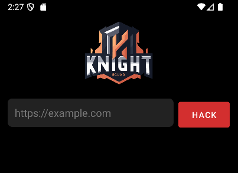
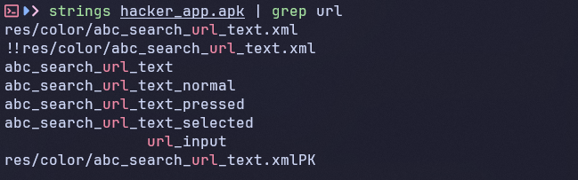
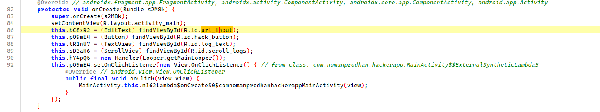
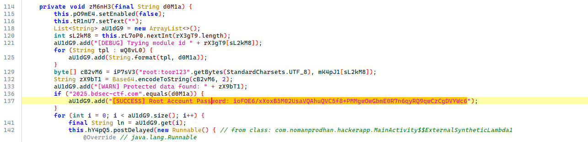
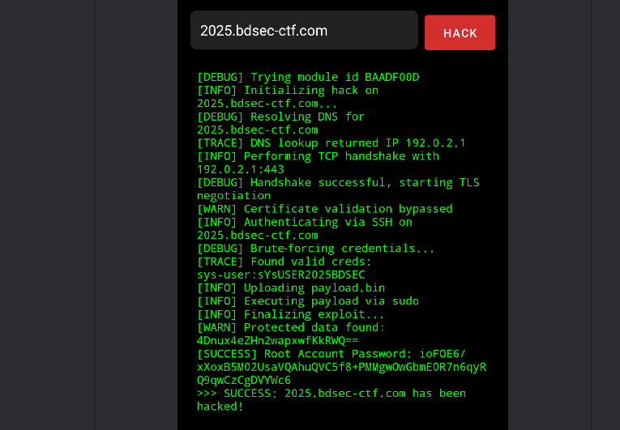

# Hacker App

- Tôi sử dụng jadx để xem code file apk của bài này
- Sau khi mở jadx thì tôi cũng chưa có manh mối gì cả
- Nên tôi quyết định mở Android Studio lên để test file trước đã


- Sau khi mở app chúng ta thấy ta cần phải nhập vào một url nào đó, khi không phải url thì app sẽ báo lỗi
- Vấn đề ở đây là ta không hề biết url cần nhập là gì


- Tôi thử lọc string của file apk xem có manh mối gì về url này không thì tôi nhập được một đoạn string là `url_input`
- Tôi tìm nó trong jadx để xem nó đang làm gì


- Đây là nơi chứa nó
- Kéo xuống một xíu


- Ở đây ta thấy nó đang so sánh giá trị nhập vào (url_input) với cả một chuỗi là `2025.bdsec-ctf.com` và nếu đúng là in ra đoạn `[SUCCESS]...`
- Tôi thử lại với url này trên app xem sẽ có được gì


- Tuyệt, chúng ta biết chúng ta đang đi đúng hướng
- Điều quan trọng bây giờ là làm sao ta biết được liệu Root Password kia để làm gì
- Tôi tiến hành đọc lại source code và thấy rằng đoạn code đang mã hóa `root:toor123` và in nó ra ở dạng mã hóa chỗ `[WARN] Protected data...`
- Tôi thấy nó khá giống với Password, nghi ngờ nó cùng được mã hóa theo một kiểu nên tôi thử viết một đoạn python để mã hóa theo đúng quy trình của bài xem như nào

``` python
import base64
import struct

rX3gT9 = ["4AC93E17", "DE9A3214", "D2C3E1F0", "BEEFCAFE", "C0FFEE01", "BAADF00D", "CAFEBABE", "8BADF00D"]
mK4pJ1 = [int(hex_str, 16) for hex_str in rX3gT9]
vY7kD3 = [253635900, 1264216440, -2053724232, -908399620]
jN5fC2 = [(((i * 73) + 41) & 255) for i in range(256)]


def yW0qH1(data):
    output = bytearray(len(data))
    for i in range(len(data)):
        x = jN5fC2[data[i] & 255]
        output[i] = ((x << 5) & 255) | (x >> 3)
    return bytes(output)


def bytes_to_int(byte_data):
    return struct.unpack('>I', byte_data)[0]

def int_to_bytes(byte_array, offset, value):
    byte_array[offset] = (value >> 24) & 0xFF
    byte_array[offset + 1] = (value >> 16) & 0xFF
    byte_array[offset + 2] = (value >> 8) & 0xFF
    byte_array[offset + 3] = value & 0xFF

def uE9rC5(data):
    pad = 8 - (len(data) % 8)
    padded_length = len(data) + pad
    padded_data = bytearray(data)
    padded_data.extend([pad] * pad)
    output = bytearray(padded_length)
    
    for offset in range(0, padded_length, 8):
        v0 = bytes_to_int(padded_data[offset:offset+4])
        v1 = bytes_to_int(padded_data[offset+4:offset+8])
        sum_val = 0
        
        for r in range(16):
            sum_val = (sum_val - 1640531527) & 0xFFFFFFFF
            temp = (((v1 << 4) ^ (v1 >> 5)) + v1) & 0xFFFFFFFF
            temp = (temp ^ (vY7kD3[sum_val & 3] + sum_val)) & 0xFFFFFFFF
            v0 = (v0 + temp) & 0xFFFFFFFF
            temp = (((v0 << 4) ^ (v0 >> 5)) + v0) & 0xFFFFFFFF
            temp = (temp ^ (vY7kD3[(sum_val >> 11) & 3] + sum_val)) & 0xFFFFFFFF
            v1 = (v1 + temp) & 0xFFFFFFFF

        int_to_bytes(output, offset, v0)
        int_to_bytes(output, offset + 4, v1)
    return output


def oX8jZ6(data, k):
    n = len(data)
    tmp = bytearray(data)

    for i in range(n // 2):
        tmp[i], tmp[n - 1 - i] = tmp[n - 1 - i], tmp[i]

    for i in range(n):
        s = (i % 4) * 8
        key_byte = (k >> s) & 255
        tmp[i] ^= key_byte
    return tmp


def iP7sV3(data, k1):
    step1 = oX8jZ6(data, k1)
    step2 = uE9rC5(step1)
    step3 = yW0qH1(step2)
    return step3


plaintext = "root:toor123"
for i, module_id in enumerate(rX3gT9):
    encrypted = iP7sV3(plaintext.encode('utf-8'), mK4pJ1[i])
    base64_result = base64.b64encode(encrypted).decode('utf-8')
    print(f"ID: {module_id}")
    print(f"Encrypted: {base64_result}")
    print("-----")
```

- Tôi có đoạn python để encypt giống như code gốc như trên
- Và nó thật sự có được đoạn mã hóa của chuỗi `root:toor123` giống như trong app
- Vậy nên tôi tiến hành reverse lại quy trình mã hóa của bài và có được đoạn python dưới đây

``` python
import base64
import struct


rX3gT9 = ["4AC93E17", "DE9A3214", "D2C3E1F0", "BEEFCAFE", "C0FFEE01", "BAADF00D", "CAFEBABE", "8BADF00D"]
mK4pJ1 = [int(hex_str, 16) for hex_str in rX3gT9]
vY7kD3 = [253635900, 1264216440, -2053724232, -908399620]
jN5fC2 = [(((i * 73) + 41) & 255) for i in range(256)]
reverse_jN5fC2 = [0] * 256
for i in range(256):
    reverse_jN5fC2[jN5fC2[i]] = i


def reverse_oX8jZ6(data, k):
    n = len(data)
    tmp = bytearray(data)

    for i in range(n):
        s = (i % 4) * 8
        key_byte = (k >> s) & 255
        tmp[i] ^= key_byte

    for i in range(n // 2):
        tmp[i], tmp[n - 1 - i] = tmp[n - 1 - i], tmp[i]

    return tmp


def bytes_to_int(byte_data):
    return struct.unpack('>I', byte_data)[0]


def int_to_bytes(byte_array, offset, value):
    byte_array[offset] = (value >> 24) & 0xFF
    byte_array[offset + 1] = (value >> 16) & 0xFF
    byte_array[offset + 2] = (value >> 8) & 0xFF
    byte_array[offset + 3] = value & 0xFF


def reverse_uE9rC5(data):
    output = bytearray(len(data))

    for offset in range(0, len(data), 8):
        v0 = bytes_to_int(data[offset:offset+4])
        v1 = bytes_to_int(data[offset+4:offset+8])
        sum_val = (16 * -1640531527) & 0xFFFFFFFF

        for r in range(16):
            temp = (((v0 << 4) ^ (v0 >> 5)) + v0) & 0xFFFFFFFF
            temp = (temp ^ (vY7kD3[(sum_val >> 11) & 3] + sum_val)) & 0xFFFFFFFF
            v1 = (v1 - temp) & 0xFFFFFFFF
            temp = (((v1 << 4) ^ (v1 >> 5)) + v1) & 0xFFFFFFFF
            temp = (temp ^ (vY7kD3[sum_val & 3] + sum_val)) & 0xFFFFFFFF
            v0 = (v0 - temp) & 0xFFFFFFFF
            sum_val = (sum_val + 1640531527) & 0xFFFFFFFF

        int_to_bytes(output, offset, v0)
        int_to_bytes(output, offset + 4, v1)

    if len(output) > 0:
        pad_length = output[-1]
        if 1 <= pad_length <= 8:
            valid_padding = all(output[-(i+1)] == pad_length for i in range(pad_length))
            if valid_padding:
                output = output[:-pad_length]
    return output


def reverse_yW0qH1(data):
    output = bytearray(len(data))

    for i in range(len(data)):
        rotated = data[i]
        x = ((rotated >> 5) & 0x07) | ((rotated << 3) & 0xF8)
        output[i] = reverse_jN5fC2[x & 0xFF]

    return output


def decrypt(data, key):
    step1 = reverse_yW0qH1(data)
    step2 = reverse_uE9rC5(step1)
    step3 = reverse_oX8jZ6(step2, key)
    return step3


def decrypt_base64(encrypted_b64):
    encrypted_data = base64.b64decode(encrypted_b64)
    for i in range(8):
        decrypted = decrypt(encrypted_data, mK4pJ1[i])
        print(decrypted)
        print("------")


encrypted_string = "ioFOE6/xXoxB5M02UsaVQAhuQVC5f8+PMMgwOwGbmE0R7n6qyRQ9qwCzCgDVYWc6"
decrypt_base64(encrypted_string)
```

- Sau khi chạy đoạn python này với cả `Root Account Password` mà bài có cho thì tôi đã có được flag

<details>
<summary style="cursor: pointer">Flag</summary>

```
BDSEC{h4cK3r_aPP_t0_HACK_THE_PLANET_bdSECctf}
```
</details>
