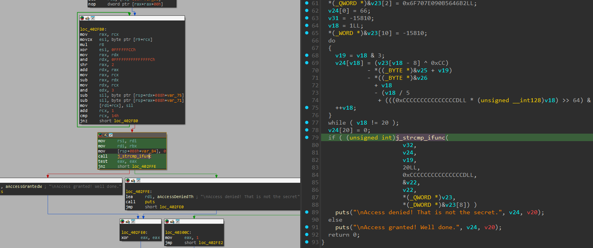
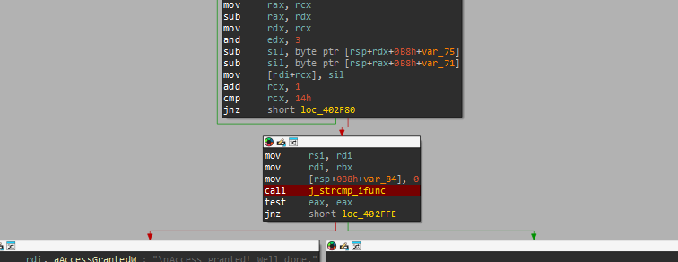
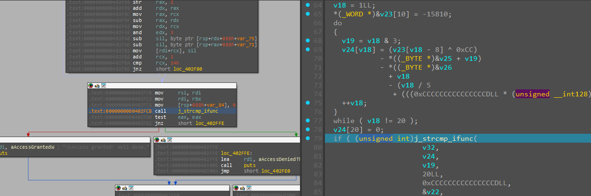
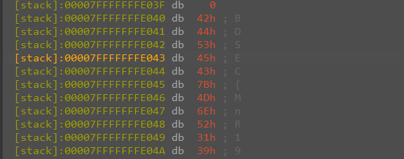

# Minar ’52 Enigma

- Tôi mở file bằng IDA để dịch mã của bài này
- Sau khi đọc hàm main thì tôi có chú ý đến hàm `j_strcmp_ifunc`


- Nó chỉ đơn giản là so sánh input nhập vào với cả v24
- Từ đó tôi nghĩ chạy debug và xem biến v24 lưu giá trị như nào


- Tôi đặt breakpoint ngay tại hàm `j_strcmp_ifunc` để check giá trị v24
- Sau khi debug tôi nhập bừa 1 giá trị input vào


- Tôi đã dừng lại ở đây, tôi sẽ check v24


- Tuyệt vời flag đây rồi

<details>
<summary style="cursor: pointer">Flag</summary>

```
BDSEC{MnR1952C1ph3r}
```
</details>