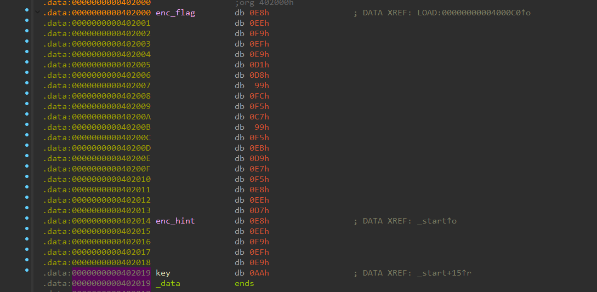

# revME

- Tôi mở file bằng IDA để dịch mã của bài


- Tôi vào check dữ liệu và thấy như này, kết hợp với hàm start đang có một vòng for xor
- Tôi tiến hành viết một script python
``` python
enc_flag = [
    0xE8, 0xEE, 0xF9, 0xEF, 0xE9,
    0xD1, 0xD8, 0x99, 0xFC, 0xF5,
    0xC7, 0x99, 0xF5, 0xEB, 0xD9,
    0xE7, 0xF5, 0xE8, 0xEE, 0xD7
]
key = 0xAA

print("".join([chr(b) for b in [b ^ key for b in enc_flag]]))
```
- Và tôi đã có được flag


<details>
<summary style="cursor: pointer">Flag</summary>

```
BDSEC{r3V_m3_AsM_BD}
```
</details>
