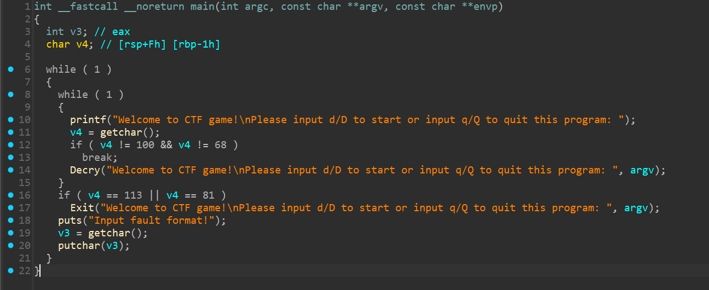
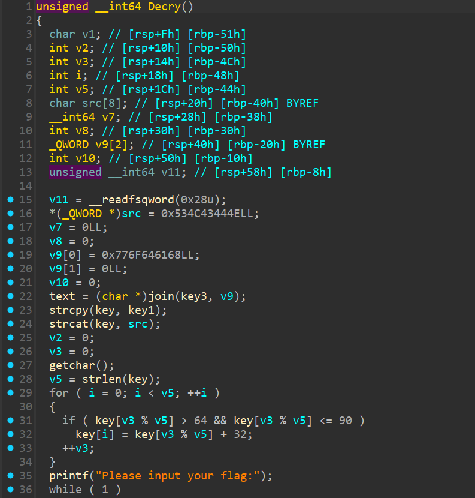
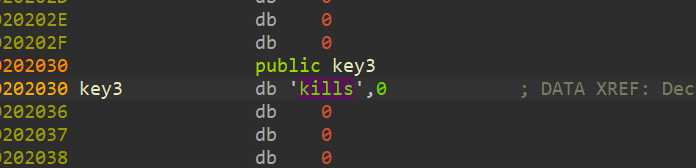
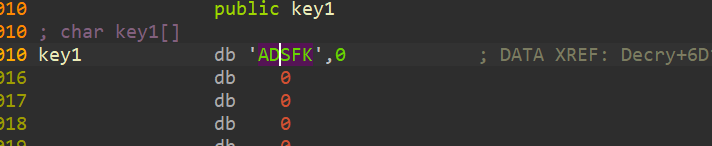
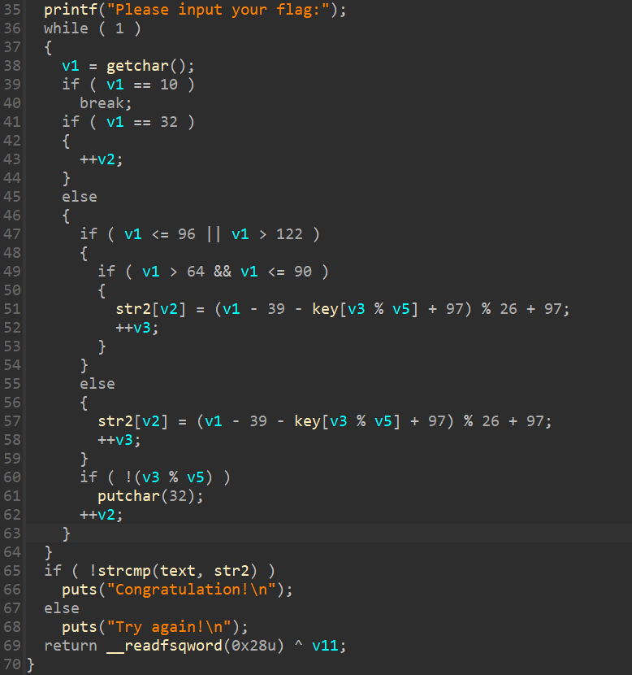

# SimpleRev

- Tôi sử dụng IDA để có thể dịch mã



- Ngoài hàm Decry ra thì có vẻ mọi thứ khá bình thường



- Vào bên trong hàm Decry thì thấy có hai biến là src và v9 có khởi tạo giá trị hex, lật lại thì được src được gán là NDCLS và v9 là hadow



- Có key3 là kills



- Cos key1 là ADSFK
- Từ đó có thể suy ra được text = killshadow và key = ADSFKNDCLS
- Sau đó ta thấy đoạn giá trị của key sẽ được đổi về chữ thường nên key = adsfkndcls



- Đây là đoạn mã chúng ta cần phân tích

``` python
alphabet = "ABCDEFGHIJKLMNOPQRSTUVWXYZabcdefghijklmnopqrstuvwxyz"

text = "killshadow"
key = "adsfkndcls"
v3 = v5 = len(key)
strres = ""

for i in range(10):
    for i in alphabet:
        temp = chr((ord(i) - 39 - ord(key[v3 % v5]) + 97) % 26 + 97)
        if (temp == text[len(strres)]):
            strres += i
            v3 += 1
            break

print(strres)
```
- Tôi có viết lại đoạn giải bằng python như trên và nhận được flag

<details>
<summary style="cursor: pointer">FLAG</summary>

```
flag{KLDQCUDFZO}
```
</details>
