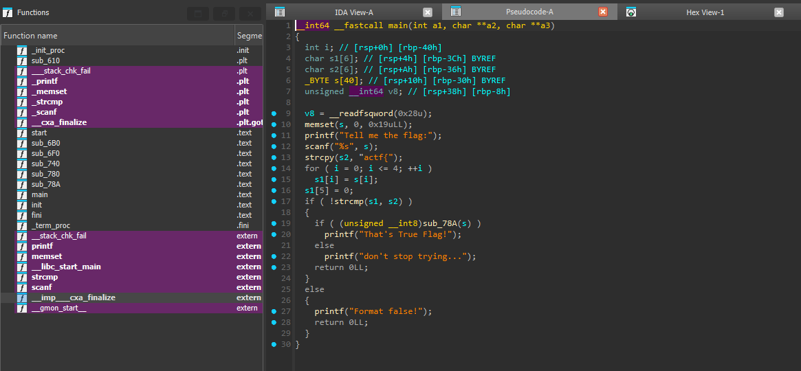
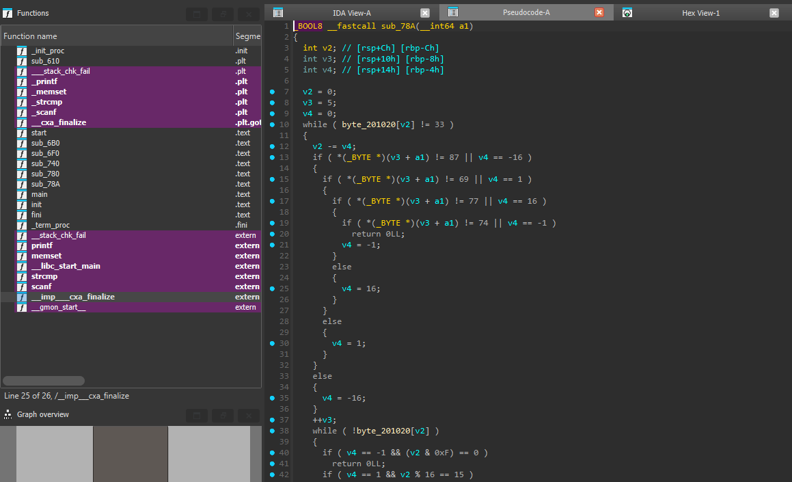
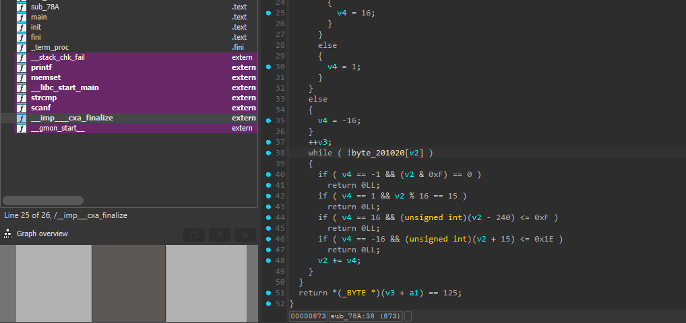
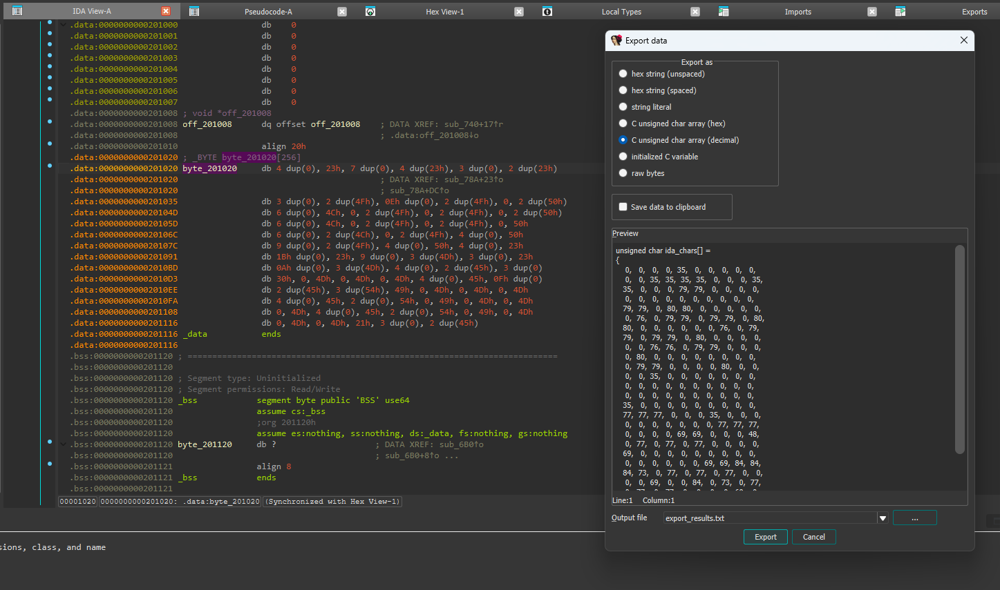
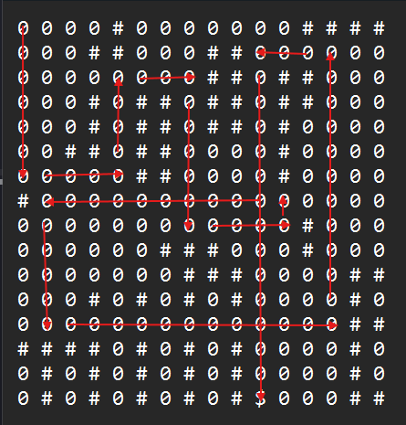

# [ACTF新生赛2020]Oruga

- Tôi sử dụng IDA để có thể dịch mã


- Đọc trong hàm main thì không có gì đặc biệt ngoài hàm sub_78A



- Đọc qua hàm sub_78A thì thấy có byte_201020 có sẵn và cần khai thác, cùng với các giá trị so sánh có sẵn 87, 69, 77, 74


- Đọc và xuất dữ liệu của byte_201020
- Tôi tiến hành tạo lại một ma trận dựa trên dữ liệu của byte_201020
- Dưới đây là một script python của tôi để vẽ ra ma trận đó

``` python
lst = [0, 0, 0, 0, 35, 0, 0, 0, 0, 0, 0, 0, 35, 35, 35, 35, 0, 0, 0, 35, 35, 0, 0, 0, 79, 79, 0, 0, 0, 0, 0, 0, 0, 0, 0, 0, 0, 0, 0, 0, 79, 79, 0, 80, 80, 0, 0, 0, 0, 0, 0, 76, 0, 79, 79, 0, 79, 79, 0, 80, 80, 0, 0, 0, 0, 0, 0, 76, 0, 79, 79, 0, 79, 79, 0, 80, 0, 0, 0, 0, 0, 0, 76, 76, 0, 79, 79, 0, 0, 0, 0, 80, 0, 0, 0, 0, 0, 0, 0, 0, 0, 79, 79, 0, 0, 0, 0, 80, 0, 0, 0, 0, 35, 0, 0, 0, 0, 0, 0, 0, 0, 0, 0, 0, 0, 0, 0, 0, 0, 0, 0, 0, 0, 0, 0, 0, 0, 0, 0, 0, 35, 0, 0, 0, 0, 0, 0, 0, 0, 0, 77, 77, 77, 0, 0, 0, 35, 0, 0, 0, 0, 0, 0, 0, 0, 0, 0, 77, 77, 77, 0, 0, 0, 0, 69, 69, 0, 0, 0, 48, 0, 77, 0, 77, 0, 77, 0, 0, 0, 0, 69, 0, 0, 0, 0, 0, 0, 0, 0, 0, 0, 0, 0, 0, 0, 0, 69, 69, 84, 84, 84, 73, 0, 77, 0, 77, 0, 77, 0, 0, 0, 0, 69, 0, 0, 84, 0, 73, 0, 77, 0, 77, 0, 77, 0, 0, 0, 0, 69, 0, 0, 84, 0, 73, 0, 77, 0, 77, 0, 77, 33, 0, 0, 0, 69, 69]

count = 0
for i in lst:
    if count == 16:
        print()
        count = 0
    if i == 0:
        print("0 ", end = "")
    elif i == 33:
        print("$ ", end = "")
    else:
        print("# ", end = "")
    count += 1
```
- Sau đó tôi tiến hành giải tay dựa vào:
  - 87 là W (lên trên)
  - 69 là E (sang phải)
  - 77 là M (xuống dưới)
  - 74 là J (sang trái)


- Sau khi ma trận tôi đã có được flag

<details>
<summary style="cursor: pointer">FLAG</summary>

```
flag{MEWEMEWJMEWJM}
```
</details>
