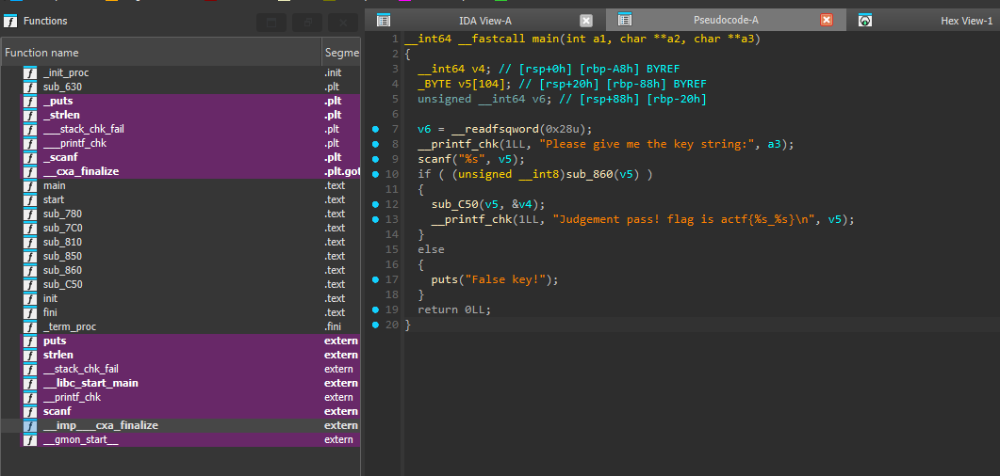
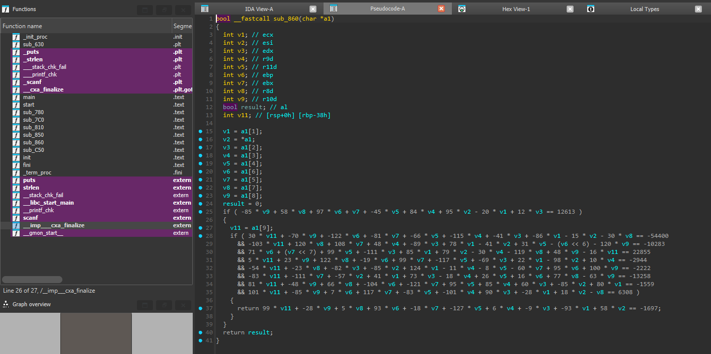

# [ACTF新生赛2020]Universe_final_answer

- Tôi sử dụng IDA để có thể dịch mã


- Tôi đọc hàm main thì thấy ngoài hàm sub_860 thì không có gì cần khai thác cả


- Sau khi đọc bên trong hàm sub_860 thì ta chỉ cần giải được đống dữ liệu số học ở dưới thì ta sẽ có được key
- Tôi tiến hành viết mã python sử dụng z3 module để có thể giải được

``` python
from z3 import *

solver = Solver()
a1 = [Int(f'a1[{i}]') for i in range(10)]

solver.add(-85 * a1[8] + 58 * a1[7] + 97 * a1[6] + a1[5] + -45 * a1[4] + 84 * a1[3] + 95 * a1[0] - 20 * a1[1] + 12 * a1[2] == 12613)

solver.add(30 * a1[9] + -70 * a1[8] + -122 * a1[6] + -81 * a1[5] + -66 * a1[4] + -115 * a1[3] + -41 * a1[2] + -86 * a1[1] - 15 * a1[0] - 30 * a1[7] == -54400)

solver.add(-103 * a1[9] + 120 * a1[7] + 108 * a1[5] + 48 * a1[3] + -89 * a1[2] + 78 * a1[1] - 41 * a1[0] + 31 * a1[4] - 64 * a1[6] - 120 * a1[8] == -10283)

solver.add(71 * a1[6] + 128 * a1[5] + 99 * a1[4] + -111 * a1[2] + 85 * a1[1] + 79 * a1[0] - 30 * a1[3] - 119 * a1[7] + 48 * a1[8] - 16 * a1[9] == 22855)

solver.add(5 * a1[9] + 23 * a1[8] + 122 * a1[7] + -19 * a1[6] + 99 * a1[5] + -117 * a1[4] + -69 * a1[2] + 22 * a1[1] - 98 * a1[0] + 10 * a1[3] == -2944)

solver.add(-54 * a1[9] + -23 * a1[7] + -82 * a1[2] + -85 * a1[0] + 124 * a1[1] - 11 * a1[3] - 8 * a1[4] - 60 * a1[5] + 95 * a1[6] + 100 * a1[8] == -2222)

solver.add(-83 * a1[9] + -111 * a1[5] + -57 * a1[0] + 41 * a1[1] + 73 * a1[2] - 18 * a1[3] + 26 * a1[4] + 16 * a1[6] + 77 * a1[7] - 63 * a1[8] == -13258)

solver.add(81 * a1[9] + -48 * a1[8] + 66 * a1[7] + -104 * a1[6] + -121 * a1[5] + 95 * a1[4] + 85 * a1[3] + 60 * a1[2] + -85 * a1[0] + 80 * a1[1] == -1559)

solver.add(101 * a1[9] + -85 * a1[8] + 7 * a1[6] + 117 * a1[5] + -83 * a1[4] + -101 * a1[3] + 90 * a1[2] + -28 * a1[1] + 18 * a1[0] - a1[7] == 6308)

solver.add(99 * a1[9] + -28 * a1[8] + 5 * a1[7] + 93 * a1[6] + -18 * a1[5] + -127 * a1[4] + 6 * a1[3] + -9 * a1[2] + -93 * a1[1] + 58 * a1[0] == -1697)


if solver.check() == sat:
    model = solver.model()
    result = [model[a1[i]].as_long() for i in range(10)]
    for i, val in enumerate(result):
        print(f"a1[{i}] = {val}")
    print("Result:", ''.join(chr(x) for x in result))
else:
    print("No solution found.")
```
- Sau khi chạy tôi có được key và gửi lại vào trong chương trình và đã nhận được flag

<details>
<summary style="cursor: pointer">FLAG</summary>

```
flag{F0uRTy_7w@_42}
```
</details>
