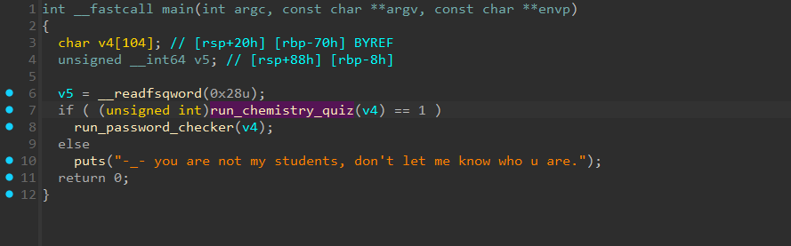
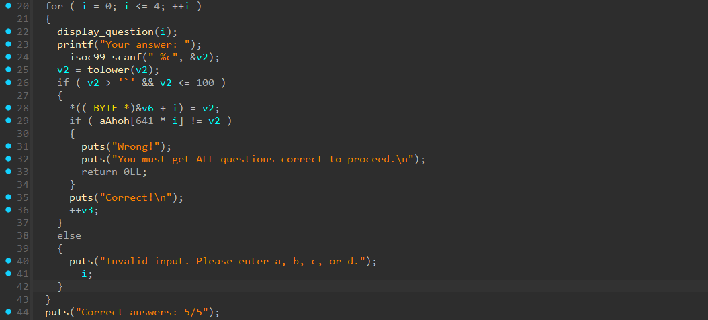
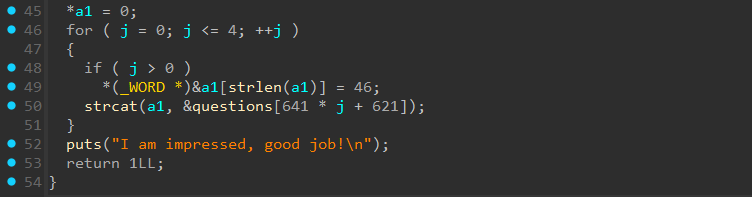
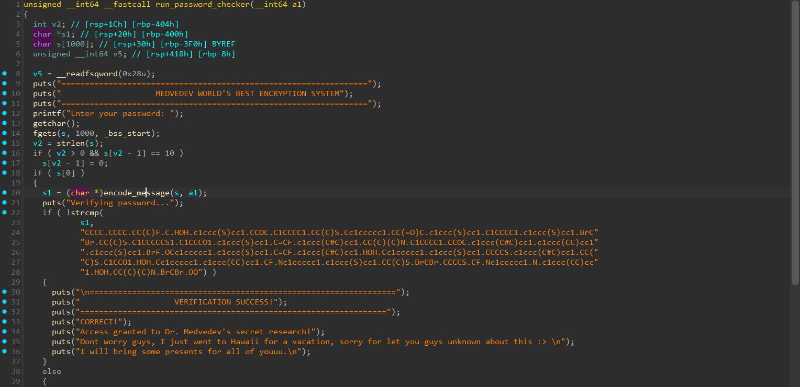
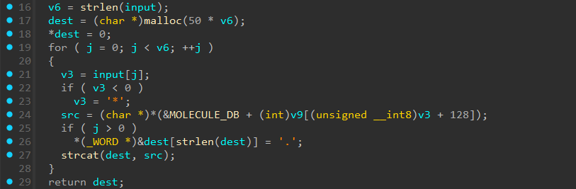

# AlcheSMILES

- Tôi dùng IDA để đọc code của bài này.


- Ở hàm main này thì khá tường minh và có thể đoán ngay chương trình sẽ đi qua 1 hàm các câu hỏi là `run_chemistry_quiz` và một hàm check password là `run_password_checker`.
- Trước tiên hãy cùng phân tích xem hàm `run_chemistry_quiz` đã làm gì.


- Ở vòng for đầu tiên thì đang thực hiện check các đáp án (a/b/c/d) mà người dùng nhập vào cho các câu hỏi hóa học.


- Tiếp đến, ở vòng for thứ 2 chương trình sẽ gán các đáp án đúng vào biến `a1`, mỗi đáp án cách nhau bởi dấu `.`.
- Đây là kết quả của `a1` sau khi kết thúc hàm `run_chemistry_quiz`.
```
HOH.HOH.CCO.c1ccc(O)cc1.CCNC
```

- Bây giờ ta sẽ phân tích tiếp hàm `run_password_checker`.


- Hàm này chỉ đơn giản là cho người dùng nhập vào 1 chuỗi, sau đó đi qua hàm `encode_message` để mã hóa và cuối cùng là so sánh chuỗi đã được mã hóa với dữ liệu có sẵn của chương trình.
- Ta cùng check xem hàm `encode_message` đang làm gì.
- Trước hết hàm này sẽ đi qua hàm `create_permutation` để hash key và gán vào mảng `v9`, dưới đây là phiên bản python tường minh hơn của hàm `create_permutation`.

``` python
def hash_molecular_key(s):
    v2 = 0
    for c in s:
        v2 = 31 * v2 + ord(c)
    return v2 & 0x7FFFFFFF

def create_permutation(key, v9):
    v4 = hash_molecular_key(key)
    for j in range(127, 0, -1):
        v4 = (16807 * v4) % 0x7FFFFFFF
        idx = v4 % (j + 1)
        v9[j], v9[idx] = v9[idx], v9[j]
```
- Tiếp đến đi qua vòng for mapping ngược các ký tự ở nửa sau của v9.


- Đây chính là hàm xử lý chính của input nhập vào.
- Vòng for này duyệt qua toàn bộ các ký tự của input.
- Với mỗi ký tự, `src` sẽ được gán với chuỗi trong mảng `MOLECULE_DB` tương ứng giá trị của v9 với index được tính từ ascii của ký tự đó cộng với 128.
- Các chuỗi được cách nhau bởi một dấu `.`.
- Bây giờ ta đã xác định được toàn bộ mạch logic của chương trình.
- Để dịch ngược lại flag ta cần lấy từng chuỗi trong mảng encoded.
- Sau đó tính index và trừ đi 128 thì ta sẽ có được từng ký tự của flag.
- Dưới đây là script python của tôi để tính và in ra flag cho bài này.

``` python
MOLECULE_DB = [
    "C",
    "CC",
    "CCC",
    "O",
    "CO",
    "CCO",
    "N",
    "CN",
    "CCN",
    "S",
    "CS",
    "CCS",
    "F",
    "CF",
    "CCF",
    "Cl",
    "CCl",
    "CCCl",
    "Br",
    "CBr",
    "HOH",
    "OO",
    "OCO",
    "c1ccccc1",
    "Cc1ccccc1",
    "OCc1ccccc1",
    "Nc1ccccc1",
    "Sc1ccccc1",
    "c1ccc(C)cc1",
    "c1ccc(O)cc1",
    "c1ccc(N)cc1",
    "c1ccc(S)cc1",
    "c1ccc(F)cc1",
    "CC(C)C",
    "CC(C)O",
    "CC(C)N",
    "CC(C)S",
    "CC(C)F",
    "CCCC",
    "CCCCO",
    "CCCCN",
    "CCCCS",
    "CCCCF",
    "C1CC1",
    "C1CCO1",
    "C1CCN1",
    "C1CCS1",
    "C1CCF1",
    "C=C",
    "C=CO",
    "C=CN",
    "C=CS",
    "C=CF",
    "C#C",
    "C#CO",
    "C#CN",
    "C#CS",
    "C#CF",
    "c1ccncc1",
    "c1ccnc(C)c1",
    "c1ccnc(O)c1",
    "c1ccnc(N)c1",
    "c1ccnc(S)c1",
    "CC=C",
    "CCC=C",
    "CCCC=C",
    "CCCCC=C",
    "CCCCCC=C",
    "c1cccnc1",
    "c1ccc(C=C)cc1",
    "c1ccc(C#C)cc1",
    "c1ccc(CC)cc1",
    "c1ccc(CCC)cc1",
    "COC",
    "CCOC",
    "CCCOC",
    "CCCCOC",
    "CCCCCOC",
    "CNC",
    "CCNC",
    "CCCNC",
    "CCCCNC",
    "CCCCCNC",
    "CSC",
    "CCSC",
    "CCCSC",
    "CCCCSC",
    "CCCCCSC",
    "CFC",
    "CCFC",
    "CCCFC",
    "CCCCFC",
    "CCCCCFC",
    "ClCCl",
    "BrCBr",
    "ICl",
    "ClF",
    "BrF",
    "c1ccc2ccccc2c1",
    "c1ccc2cc(C)ccc2c1",
    "c1ccc2cc(O)ccc2c1",
    "c1ccc2cc(N)ccc2c1",
    "c1ccc2cc(S)ccc2c1",
    "CC(C)(C)C",
    "CC(C)(C)O",
    "CC(C)(C)N",
    "CC(C)(C)S",
    "CC(C)(C)F",
    "C1CCC1",
    "C1CCCO1",
    "C1CCCN1",
    "C1CCCS1",
    "C1CCCF1",
    "C1CCCC1",
    "C1CCCCO1",
    "C1CCCCN1",
    "C1CCCCS1",
    "C1CCCCF1",
    "C1CCCCC1",
    "C1CCCCCO1",
    "C1CCCCCN1",
    "C1CCCCCS1",
    "C1CCCCCF1",
    "c1ccc(C(C)C)cc1",
    "c1ccc(C(C)O)cc1",
    "c1ccc(C(C)N)cc1",
    "CC(=O)C",
    "CC(=O)O"
]

def hash_molecular_key(s):
    v2 = 0
    for c in s:
        v2 = 31 * v2 + ord(c)
    return v2 & 0x7FFFFFFF

def create_permutation(key, v9):
    v4 = hash_molecular_key(key)
    for j in range(127, 0, -1):
        v4 = (16807 * v4) % 0x7FFFFFFF
        idx = v4 % (j + 1)
        v9[j], v9[idx] = v9[idx], v9[j]


key = "HOH.HOH.CCO.c1ccc(O)cc1.CCNC"
encoded = "CCCC.CCCC.CC(C)F.C.HOH.c1ccc(S)cc1.CCOC.C1CCCC1.CC(C)S.Cc1ccccc1.CC(=O)C.c1ccc(S)cc1.C1CCCC1.c1ccc(S)cc1.BrCBr.CC(C)S.C1CCCCCS1.C1CCCO1.c1ccc(S)cc1.C=CF.c1ccc(C#C)cc1.CC(C)(C)N.C1CCCC1.CCOC.c1ccc(C#C)cc1.c1ccc(CC)cc1.c1ccc(S)cc1.BrF.OCc1ccccc1.c1ccc(S)cc1.C=CF.c1ccc(C#C)cc1.HOH.Cc1ccccc1.c1ccc(S)cc1.CCCCS.c1ccc(C#C)cc1.CC(C)S.C1CCO1.HOH.Cc1ccccc1.c1ccc(CC)cc1.CF.Nc1ccccc1.c1ccc(S)cc1.CC(C)S.BrCBr.CCCCS.CF.Nc1ccccc1.N.c1ccc(CC)cc1.HOH.CC(C)(C)N.BrCBr.OO"

v9 = list(range(128)) + [0] * 128
create_permutation(key, v9)
for i in range(128):
    v9[v9[i] + 128] = i

flag = ""
for m in encoded.split('.'):
    idx = MOLECULE_DB.index(m)
    flag += chr(v9[128:].index(idx))
print(flag)
```
- Sau khi run code thì đã có được flag cho bài này.

<details>
<summary style="cursor: pointer">Flag</summary>

```
DDC{1_gu3s5_u_n3v4_7hought_0f_7h1s_ch3m1stry_3ncrypt1on}
```
</details>