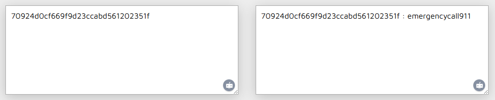

# rocky

- Tôi sử dụng IDA để dịch mã file
- Quá tốn thời gian để đọc source code của bài này, trong khi mã hash đã có trên mạng

```python
text1 = 0xD2F969F60C4D9270
text2 = 0x1F35021256BDCA3C

b1 = text1.to_bytes(8, 'little')
b2 = text2.to_bytes(8, 'little')

hash = b1 + b2
print(hash.hex())
```
- Đây là đoạn code python để lấy được mã hash theo dạng `little endiansess`
- Tôi cho lên mạng để tìm thử xem xem có được key không


- Tuyệt, đã có key rồi, giờ chỉ cần chạy file và lấy flag thôi

<details>
<summary style="cursor: pointer">Flag</summary>

```
DUCTF{In_the_land_of_cubicles_lined_in_gray_Where_the_clock_ticks_loud_by_the_light_of_day}
```
</details>