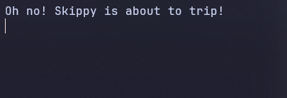
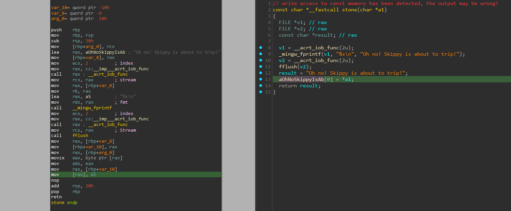
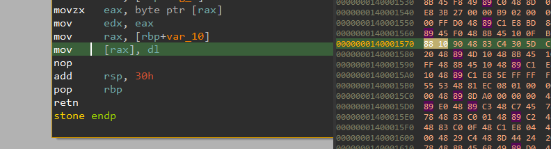
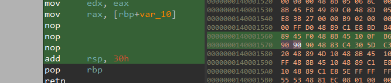
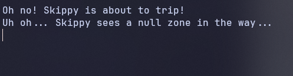
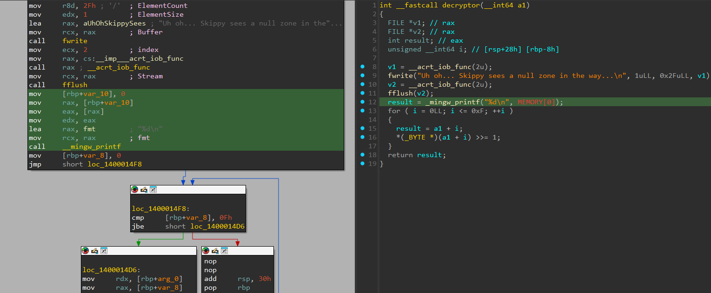
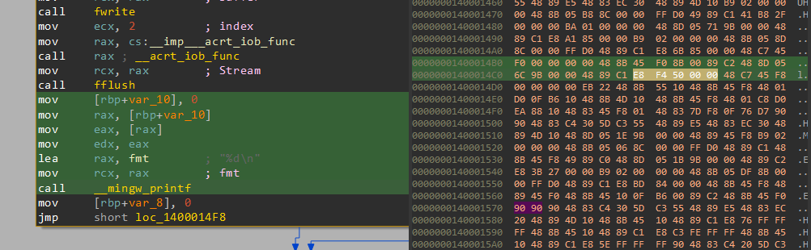
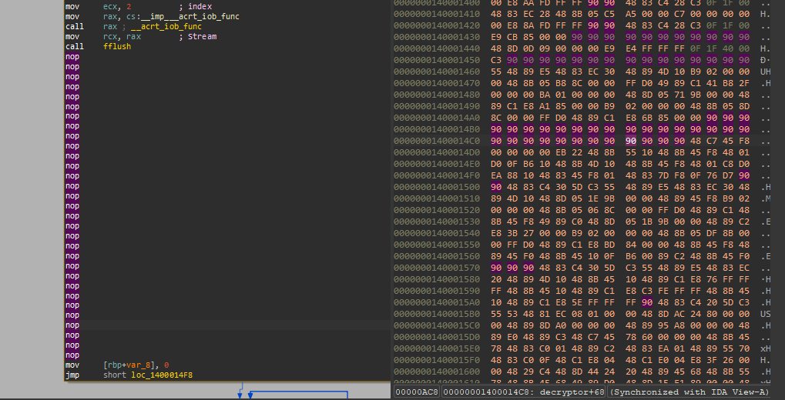
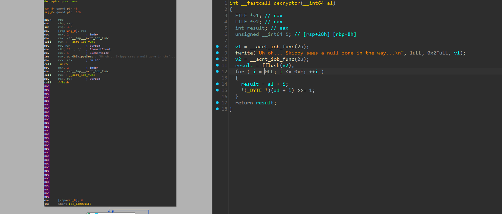

# skippy

- Tôi sử dụng IDA để tiến hành dịch mã của bài này
- Ngay tại hàm `main`, chỉ có một hàm duy nhất mà chúng ta cần chú ý là hàm `sandwich`
- Bên trong nó có 2 hàm:
  - Thứ nhất là `Stone`, hàm này sẽ in ra chuỗi `Oh no! Skippy is about to trip!`
  - Thứ hai là `decryptor`, hàm này in ra `Uh oh... Skippy sees a null zone in the way...\n`
- Tôi chạy thử file `skippy.exe` thử để xem chương trình hoạt động như nào


- Khi chạy file exe thì tôi chỉ thấy nó in ra như này và dừng lại, chứng tỏ làm `Stone` đang có vấn đề gì đó bên trong


- Như bạn thấy ở chỗ tôi đang trỏ vào, thì hàm này đang truy cập vào một vùng nhớ không được phép ghi, nên chương trình sẽ báo lỗi ở đây và chương trình sẽ dừng lại luôn
- Ở bài này tôi sẽ tiến hành ghi lại mã hex của lệnh `mov [rax], dl`


- Ở đây tôi đã tìm được vị trí của lệnh `mov [rax], dl`
- Tôi sẽ ghi đè thành `90 90` để có thể xóa lệnh này đi


- Ở đây tôi đã ghi đè để xóa lệnh `mov [rax], dl` và nó trở thành 2 lệnh nop
- Tôi thử chạy test lại file exe mới xem chương trình giờ như nào


- Có thể thấy nó đã chạy qua được hàm `Stone`, nhưng nó lại đang bị dừng lại ở hàm `decryptor`


- Sau khi phân tích lại hàm `decryptor`, tôi thấy nó đang gọi hàm in `MEMORY[0]`, ở đây sẽ bị lỗi và dừng lại tương tự như `Stone`
- Vậy nên tôi cũng tiến hành xóa hết đoạn mã này và thay thành nop để bỏ qua nó


- Tương tự tôi cũng tìm đến đoạn hex tương ứng



- Tuyệt vời rồi, giờ thì cả `Stone` và `decryptor` đều đã khá sạch sẽ rồi
- Tôi chạy lại thử chương trình 1 lần nữa để xem kết quả
- File đã chạy và tôi đã lấy được flag của bài này

<details>
<summary style="cursor: pointer">Flag</summary>

```
DUCTF{There_echoes_a_chorus_enending_and_wild_Laughter_and_gossip_unruly_and_piled}
```
</details>
