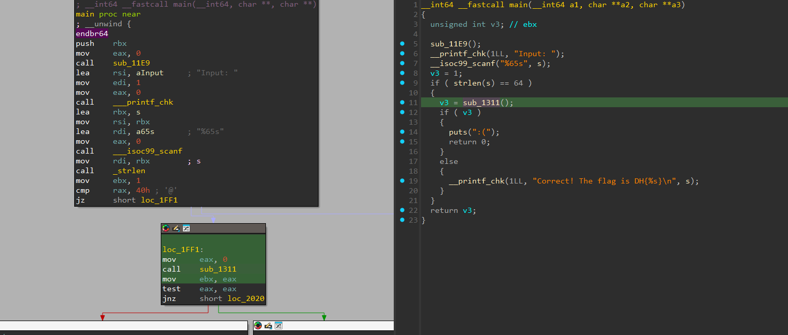
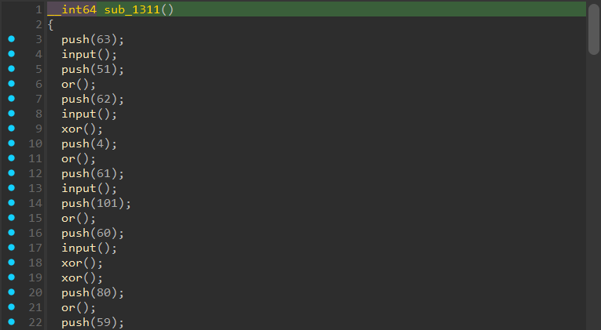

# [Call more functions](https://dreamhack.io/wargame/challenges/1422)

- Tôi tiến hảnh mở file bằng IDA để kiểm tra mạch chương trình.


- Tôi thấy được input nhập vào cần có 64 ký tự.
- Tiếp đến là hàm `sub_1311` để kiểm tra input có đúng không.
- Sau khi vào hàm `sub_1311` thì nó khá là rối, nhưng khi check kỹ lại thì ta thấy nó chỉ đơn giản là 4 hàm.


- Tôi đã phân tích và đổi tên lại cho 4 hàm này dễ hiểu hơn.
- Đầu tiên là hàm `push`, nó sẽ lưu giá trị được chỉ định vào trong mảng (ta có thể coi mảng này như là 1 stack).
- Tiếp đến là hàm `input`, thì đơn giản nó chỉ là lấy vị trí (vị trí là giá trị mà push đưa vào stack) của ký tự trong input rồi gán lại vào stack.
- Còn hàm `or` có thể coi nó như 1 hàm compare.
- Cuối cùng là hàm `xor` để xor các giá trị.
- Dựa vào mạch chương trình như vậy tôi tiến hành viết đoạn script python sử dụng z3 để có thể giải ra được các ký tự của input.

``` python
from z3 import Solver, BitVec, BitVecVal, And, Or

program = [
    ("push",63),("s",),("push",51),("or",),("push",62),("s",),("xor",),
    ("push",4),("or",),("push",61),("s",),("push",101),("or",),("push",60),("s",),("xor",),("xor",),
    ("push",80),("or",),("push",59),("s",),("push",102),("or",),("push",58),("s",),("xor",),
    ("push",82),("or",),("push",57),("s",),("push",52),("or",),("push",56),("s",),("xor",),("xor",),("xor",),
    ("push",83),("or",),("push",55),("s",),("push",50),("or",),("push",54),("s",),("xor",),
    ("push",87),("or",),("push",53),("s",),("push",52),("or",),("push",52),("s",),("xor",),("xor",),
    ("push",91),("or",),("push",51),("s",),("push",57),("or",),("push",50),("s",),("xor",),
    ("push",91),("or",),("push",49),("s",),("push",51),("or",),("push",48),("s",),("xor",),("xor",),("xor",),("xor",),
    ("push",4),("or",),("push",47),("s",),("push",102),("or",),("push",46),("s",),("xor",),
    ("push",7),("or",),("push",45),("s",),("push",56),("or",),("push",44),("s",),("xor",),("xor",),
    ("push",10),("or",),("push",43),("s",),("push",99),("or",),("push",42),("s",),("xor",),
    ("push",7),("or",),("push",41),("s",),("push",52),("or",),("push",40),("s",),("xor",),("xor",),("xor",),
    ("push",90),("or",),("push",39),("s",),("push",53),("or",),("push",38),("s",),("xor",),
    ("push",4),("or",),("push",37),("s",),("push",102),("or",),("push",36),("s",),("xor",),("xor",),
    ("push",86),("or",),("push",35),("s",),("push",99),("or",),("push",34),("s",),("xor",),
    ("push",6),("or",),("push",33),("s",),("push",50),("or",),("push",32),("s",),("xor",),("xor",),("xor",),("xor",),("xor",),
    ("push",93),("or",),("push",31),("s",),("push",99),("or",),("push",30),("s",),("xor",),
    ("push",6),("or",),("push",29),("s",),("push",52),("or",),("push",28),("s",),("xor",),("xor",),
    ("push",5),("or",),("push",27),("s",),("push",99),("or",),("push",26),("s",),("xor",),
    ("push",2),("or",),("push",25),("s",),("push",97),("or",),("push",24),("s",),("xor",),("xor",),("xor",),
    ("push",81),("or",),("push",23),("s",),("push",97),("or",),("push",22),("s",),("xor",),
    ("push",80),("or",),("push",21),("s",),("push",49),("or",),("push",20),("s",),("xor",),("xor",),
    ("push",88),("or",),("push",19),("s",),("push",98),("or",),("push",18),("s",),("xor",),
    ("push",84),("or",),("push",17),("s",),("push",51),("or",),("push",16),("s",),("xor",),("xor",),("xor",),("xor",),
    ("push",88),("or",),("push",15),("s",),("push",53),("or",),("push",14),("s",),("xor",),
    ("push",7),("or",),("push",13),("s",),("push",48),("or",),("push",12),("s",),("xor",),("xor",),
    ("push",85),("or",),("push",11),("s",),("push",48),("or",),("push",10),("s",),("xor",),
    ("push",82),("or",),("push",9),("s",),("push",100),("or",),("push",8),("s",),("xor",),("xor",),("xor",),
    ("push",1),("or",),("push",7),("s",),("push",52),("or",),("push",6),("s",),("xor",),
    ("push",3),("or",),("push",5),("s",),("push",100),("or",),("push",4),("s",),("xor",),("xor",),
    ("push",83),("or",),("push",3),("s",),("push",100),("or",),("push",2),("s",),("xor",),
    ("push",0),("or",),("push",1),("s",),("push",101),("or",),("push",0),("s",),("xor",),("xor",),("xor",),("xor",),("xor",),("xor",),
    ("push",0),("or",)
]

S = [BitVec(f"s{i}", 8) for i in range(64)]
solver = Solver()
stack = []

for instr in program:
    op = instr[0]
    if op == "push":
        stack.append(instr[1])
    elif op == "s":
        stack.append(S[stack.pop() % 64])
    elif op == "xor":
        b = stack.pop()
        a = stack.pop()
        if isinstance(a, int): a = BitVecVal(a & 0xFF, 8)
        if isinstance(b, int): b = BitVecVal(b & 0xFF, 8)
        stack.append(a ^ b)
    elif op == "or":
        b = stack.pop()
        a = stack.pop()
        if isinstance(a, int): a = BitVecVal(a & 0xFF, 8)
        if isinstance(b, int): b = BitVecVal(b & 0xFF, 8)
        solver.add(a == b)
        stack.append(a)

for i in range(64):
    c = S[i]
    solver.add(Or(And(c >= BitVecVal(48, 8), c <= BitVecVal(57, 8)), And(c >= BitVecVal(97, 8), c <= BitVecVal(102, 8))))

solver.check()
m = solver.model()
flag = ''.join(chr(m[S[i]].as_long()) for i in range(64))
print("FLAG:", f"DH{{{flag}}}")
```
- Sau khi chạy thì tôi đã có được flag cho bài này.

<details>
<summary style="cursor: pointer">Flag</summary>

```
DH{2edd4d74bdb0b025636b911a7aac74eca2ec4f15c4dc58afd3b984e2e44f1e73}
```
</details>