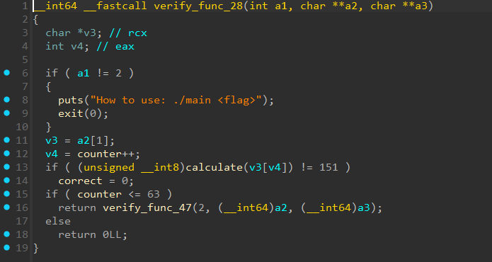

# [Honest](https://dreamhack.io/wargame/challenges/1894)

- Tôi sử dụng IDA để dịch mã
- Sau khi mở lên, tôi tiến hành check hàm `start` trước


- Tôi thấy hàm đầu tiên được gọi đến là `verify_func_28`
- Tiến hành mở hàm này lên


- Điều duy nhất cần để ý ở đây là hàm `calculate`, nó sẽ so sánh giá trị của `<flag>` nhập vào với các giá trị cho trước
- Lần lượt các hàm tiếp theo đó được gọi và đều có `calculate` để so sánh, cho đến khi đủ 64 ký tự thì dừng lại
- Tôi có viết một mô phỏng lại hàm `calculate` và rồi so sánh các giá trị được cho trong bài để tìm ra flag
```python
def calculate(a1: int) -> int:
    temp_calc = (4 * (a1 ^ 0x3C)) | (((a1 ^ 0x3C) & 0xFF) >> 6)
    v1 = 32 * ((5 * temp_calc + 125) & 0xFF)
    v1 &= 0xFFFF
    hibyte_v1 = (v1 >> 8) & 0xFF
    tmp = (hibyte_v1 | (v1 & 0xFF)) & 0xFF
    temp_xor = tmp ^ 0xB2
    v3 = (3 * ((16 * temp_xor) | ((temp_xor >> 4) & 0xFF)) - 47) & 0xFF
    v4 = ((2 * v3) | (v3 >> 7)) ^ 0xD4
    v4 &= 0xFF
    v5 = 0
    for i in range(8):
        v5 = (2 * v5) | (v4 & 1)
        v4 >>= 1
    return v5

reverse_mapping = {}
for c in "abcdefghijklmnopqrstuvwxyz1234567890":
    reverse_mapping[calculate(ord(c))] = c

lst = [
    0x97, 0xB9, 0xB1, 0xEE, 0xCA, 0xE3, 0xB1, 0x19,
    0x65, 0xC3, 0xB7, 0xC1, 0xE3, 0x3B, 0xE8, 0xB7,
    0xB9, 0x3B, 0xB9, 0x62, 0xE8, 0xBD, 0xB7, 0xB9,
    0x65, 0xCD, 0xB9, 0x19, 0xC1, 0x3B, 0xCD, 0xB1,
    0xB7, 0xC3, 0xEE, 0xC1, 0xC3, 0xEE, 0xB7, 0xCA,
    0xE8, 0xC3, 0xC1, 0xB1, 0x3B, 0x19, 0xEE, 0xCD,
    0xE8, 0x97, 0xBD, 0xCD, 0x65, 0x62, 0x65, 0xBD,
    0xB1, 0x3B, 0x65, 0x97, 0xEE, 0xBD, 0xB7, 0xCD
]

flag = ""
for i in lst:
    flag += reverse_mapping[i]

print("DH{" + flag + "}")
```
- Sau khi chạy đoạn code trên thì tôi đã có flag cho bài này.

<details>
<summary style="cursor: pointer">Flag</summary>

```
DH{d052a95e3f7b9487040186703c0eb4c57f2bf27a8fb54e2c8d6c3136543d267c}
```
</details>