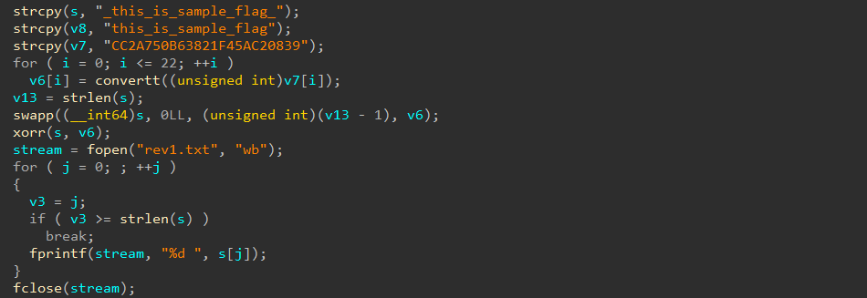

# [Permpkin](https://dreamhack.io/wargame/challenges/981)

- Tôi tiến hành mở file bằng IDA để theo dõi mạch của chương trình.


- Sau khi đọc qua hàm main và các hàm liên quan thì tôi có thể tóm tắt chương trình này như sau:
  - Đầu tiên chương trình sẽ tạo ra key `v6` từ `v7`.
  - Sau đó sẽ lấy ra flag, ở trong ảnh sẽ là chuỗi `s`, sau đó đi qua hàm `swapp` để hoán đổi vị theo key `v6`.
  - Cuối dùng là dùng hàm `xorr` để mã hóa flag và ghi vào file.
  - Tương tự với flag `v8`.
- Điều đặc biệt ở đây là ta nghĩ rằng `v6` có 23 phần từ vì hàm for được chạy từ 0 -> 22, nhưng mà khi ta debug thì sẽ thấy nó thật ra chỉ được 13 phần tử vì có một phần tử 0 chặn ở giữa làm cho máy tính hiểu lầm là mảng đã kết thúc.
- Hiểu được mạch của chương trình nên tôi tiến hành viết script python để giải mã trước với rev1.txt và rev2.txt để kiểm tra xem giải mã có hoạt động không, và nó đã thành công giải lại được `s` và `v8`.
- Tôi tiến hành giải mã file flag1.txt và flag2.txt để lấy flag cho bài này.

``` python
def swapp(a1, a4):
    for ch in range(len(a4) - 1, -1, -1):
        a1[0], a1[a4[ch]] = a1[a4[ch]], a1[0]

def xorr(a1, a2):
    v3 = len(a1)
    v4 = len(a2)

    if v3 <= v4:
        for i in range(v3):
            a1[i] ^= a2[i]
    else:
        for j in range(v4):
            a1[j] ^= a2[j]
        for k in range(v4, v3):
            a1[k] ^= a2[k % v4]

def convertt(a1):
    if chr(a1).isdigit():
        return a1 - 40
    elif a1 > 69:
        if a1 > 79:
            if a1 <= 89:
                return a1 - 80
        else:
            return a1 - 70
    else:
        return a1 - 60
    return 0


v7 = "CC2A750B63821"
key = []
for i in v7:
    key.append(convertt(ord(i)))

flag1 = list(map(int, open("flag1.txt").read().split()))
flag2 = list(map(int, open("flag2.txt").read().split()))

flag = ""
xorr(flag1, key)
swapp(flag1, key)
flag += "".join([chr(i) for i in flag1])
xorr(flag2, key)
swapp(flag2, key)
flag += "".join([chr(i) for i in flag2])

print(f"flag{{{flag}}}")
```
- Và tôi đã có được flag cho bài này.

<details>
<summary style="cursor: pointer">Flag</summary>

```
flag{ch4ng3_fla9_wi7h_3a5y_5impl3_p3rmutati0n}
```
</details>