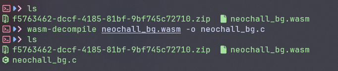

# [Reverse Me](https://dreamhack.io/wargame/challenges/1640)

- Vài bài này cung cấp cho một file WASM nên tôi sử dụng wabt để chuyển nó sang code C.


- Giờ thì chúng ta sẽ phân tích qua file C vừa có được.

``` C
export function validate(a:int, b:int):int { // func8
	var f:int;
	var g:int;
	let t0 = 
		{
			var c:long_ptr@1 = g_a + -64;
			c[24] = -8027257910932742720L;
			c[16] = -8962300257375415144L;
			c[8] = -4046906168085510008L;
			c[0] = -3182236542162769607L;
			c[56] = -1317269627771845897L;
			c[48] = -1086826317086034467L;
			c[40] = -7443625016462657032L;
			c[32] = -4701969379664811922L;
			if (b != 32) goto B_b;
			var d:int = -32;
			loop L_c {
				1;
				if (eqz(d)) goto B_a;
					var e:int = c + 32 + d;
				if (
					(e + 32)[0]:ubyte !=
					(((f = a + d) + 32)[0]:ubyte ^ ((g = c + d) + 32)[0]:ubyte)) goto B_b;
				d = d + 2;
				if (
					(e + 33)[0]:ubyte == ((f + 33)[0]:ubyte ^ (g + 33)[0]:ubyte)) continue L_c;
			}
			label B_b:
			0;
			label B_a:
		}
	if (b) { f_b(a) }
	return t0;
}
```
- Ở đây tôi có tìm đến được 1 hàm khá là khả nghi, cùng phân tích xem nó đang làm gì.
  - Ở đoạn đầu hàm này gán các giá trị cố định vào cho mảng `c`.
  - Tiếp đến nó chạy một vòng lặp 32 lần.
  - Trong mỗi lần lặp:
    - Nếu d == 0 thì kết thúc lặp.
    - Nếu thỏa mãn điều kiện `(e + 32)[0]:ubyte != (((f = a + d) + 32)[0]:ubyte ^ ((g = c + d) + 32)[0]:ubyte)` thì cũng dừng vòng lặp.
    - Còn nếu thỏa mãn `(e + 33)[0]:ubyte == ((f + 33)[0]:ubyte ^ (g + 33)[0]:ubyte)` thì tiếp tục lặp.
- Giờ thì tôi sẽ code một đoạn python để xem đoạn code đó sẽ tạo giá các giá trị như nào.

``` python
c = [
	-3182236542162769607,
	-4046906168085510008,
	-8962300257375415144,
	-8027257910932742720,
	-4701969379664811922,
	-7443625016462657032,
	-1086826317086034467,
	-1317269627771845897
]

import struct
c = b''.join(struct.pack('<q', v) for v in c)

for i in range(32):
	e = c[i] ^ c[i + 32]
	print(chr(e), end = "")
```
- Sau khi tôi chạy đoạn script này thì đã có được flag cho bài này.

<details>
<summary style="cursor: pointer">Flag</summary>

```
WANE{Simp1e_4nd_Ea5y_Rus7_Wa5m!}
```
</details>