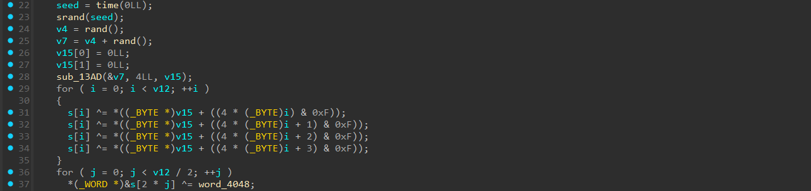

# [Times](https://dreamhack.io/wargame/challenges/247)

- Đầu tiên tôi chạy thử chương trình xem có gì xảy ra.


- Với 1 giá trị để test bất kỳ thì chương trình trả về như trên ảnh, cùng với gợi ý từ đề bài thì tôi biết được chương trình đang kiểm tra thời gian, nếu chưa đến ngày thì sẽ chưa thể truy cập được.
- Tiếp đến tôi dùng IDA để xem code của bài này.


- Tôi vào phần `Strings` và đã thấy một chuỗi giống như khi chạy thử in ra.
- Cùng xem nó sẽ dẫn ta đến đâu.


- Ở đây tôi thấy chương trình lấy `time(0LL)` (thời gian lúc chạy chương trình) so sánh với `1909094399`.
- Tôi lên mạng và tìm xem `1909094399` là ngày nào.


- Đúng với đề bài thì khoảng thời gian này rơi vào đúng 2030.
- Vậy chính xác đây là đoạn nào chương trình đang kiểm tra đã đến ngày hay chưa.
- Vì hiện tại vẫn chưa đến khoảng thời gian quy định nên khi chạy file ta sẽ luôn nhận được dòng `Not yet !!! Please wait more time.`.
- Vì làm vậy sẽ khá khó khăn và mất thời gian trong lúc debug về tôi nghĩ đến việc đổi phép so sánh của bài này.


- Như trong ảnh, chúng ta có thể thấy được code gốc sử dụng `jg` để nhảy và tương ứng với mã hex sẽ là `7F` (JG), tôi sẽ thay đổi mã hex ở đây thành `7E` (JLE) để làm thay đổi điều kiện nhảy của bài này.


- Và như vậy thì tôi đã có thể thay đổi được điều kiện của bài này.
- Tôi tiếp tục chạy thử lại chương trình với một giá trị test ngẫu nhiên.


- Tuyệt vời, giờ thì chương trình đã có thể check key được rồi.
- Tôi tiến hành mở hàm `main` của chương trình ra để phân tích.


- Ở phần đầu chương trình chỉ là xử lý tham số đưa vào và in ra lời chào thôi.


- Đây chính là phần đầu của bài này.
- Đầu tiên chương trình sẽ lấy ra các giá trị random dựa trên thời gian thực tế.
- Sau đó đưa giá trị random đó qua hàm `sub_13AD` và gán vào `v15`.
- Sau khi phân tích thì tôi biết được hàm `sub_13AD` chính là một hàm hash MD5, cũng chưa có gì đặc biệt ở đây cả.
- Bên dưới là một vòng for để đi qua từng ký tự trong key và xor với các ký tự của v15.
- Tiếp theo key sẽ được đi ra 1 vòng for ở bên dưới, lần lượt xor 2 ký tự với `word_4048` có giá trị là 0x04D2.


- Tiếp đến key lại được lặp lại việc xor trong vòng for 1 lần nữa với giá trị random được trả về từ hàm `sub_13AD`.
- Sau đó là 1 vòng for khác, cho giá trị của key đi qua hàm `sub_174A`.
- Sau khi phân tích thì tôi nhận thấy hàm `sub_174A` cũng giống logic của phép xor, khi ta sử dụng lại nó một lần nữa thì ta sẽ có được giá trị gốc, nên ta cũng chỉ cần code lại một hàm tương tự logic của nó thì đã có thể giải mã được rồi.


- Cuối dùng là key được so sánh với một mảng có sẵn.
- Điều đặc biệt ta có thể nhận thấy ở bài này là việc chương trình đang lấy 2 lần `srand(time(0LL))` nhưng mà nó lại được khá gần nhau nên việc chênh lệch giây ở đây gần như là bằng 0, vì thế mà khi key được đi qua hàm for 2 lần và xor với giá trị random được trả về từ hàm hash MD5 thì khả năng rất cao là key sẽ quay trở về ban đầu.

``` C
seed = time(0LL);
srand(seed);
v4 = rand();
v7 = v4 + rand();
v15[0] = 0LL;
v15[1] = 0LL;
sub_13AD(&v7, 4LL, v15);
for ( i = 0; i < v12; ++i )
{
    s[i] ^= *((_BYTE *)v15 + ((4 * (_BYTE)i) & 0xF));
    s[i] ^= *((_BYTE *)v15 + ((4 * (_BYTE)i + 1) & 0xF));
    s[i] ^= *((_BYTE *)v15 + ((4 * (_BYTE)i + 2) & 0xF));
    s[i] ^= *((_BYTE *)v15 + ((4 * (_BYTE)i + 3) & 0xF));
}
```
- Như phân tích bên trên thì khả năng rất cả là phần lấy random và xor này cùng với phần tương tự bên dưới là không có giá trị gì cả, chúng ta có thể không cần để ý đến nó.

``` C
for ( j = 0; j < v12 / 2; ++j )
    *(_WORD *)&s[2 * j] ^= word_4048;

for ( m = 0; m < v12 / 4; ++m )
{
    v6 = &s[4 * m];
    *(_DWORD *)v6 = sub_174A(*(unsigned int *)v6);
}
```
- Đây chính là 2 vòng for còn lại mà ta cần để ý tới.
- Tôi tiến hành code lại một đoạn script python để giải bài này ngược lại từ dữ liệu được cho trước.

``` python
def sub_174A(a1):
    a1 = a1 & 0xFFFFFFFF
    step1 = ((2 * a1) & 0xAAAAAAAA) | ((a1 >> 1) & 0x55555555)
    step1 = step1 & 0xFFFFFFFF
    step2 = ((4 * step1) & 0xCCCCCCCC) | ((step1 >> 2) & 0x33333333)
    step2 = step2 & 0xFFFFFFFF
    step3 = ((16 * step2) & 0xF0F0F0F0) | ((step2 >> 4) & 0x0F0F0F0F)
    step3 = step3 & 0xFFFFFFFF
    step4 = ((step3 << 8) & 0xFF00FF00) | ((step3 >> 8) & 0x00FF00FF)
    step4 = step4 & 0xFFFFFFFF
    result = ((step4 << 16) | (step4 >> 16)) & 0xFFFFFFFF
    return result

unk_4020 = [
    0x66, 0x0C, 0x4C, 0x86, 0xA6, 0x2C, 0x1C, 0x9C,
    0x1C, 0x66, 0x1C, 0x2C, 0x9C, 0x6C, 0xA6, 0xCC,
    0xA6, 0x6C, 0x6C, 0xAC, 0xA6, 0xA6, 0x86, 0x4C,
    0x2C, 0x46, 0xEC, 0x8C, 0xEC, 0x46, 0x8C, 0x9C,
    0x4C, 0xEC, 0xC6, 0x66, 0x4C, 0x46, 0x86, 0x4C,
]
data = bytearray(unk_4020)

for j in range(len(data) // 2):
    data[2 * j] ^= 0x04
    data[2 * j + 1] ^= 0xD2

for m in range(len(data) // 4):
    chunk = data[m * 4:(m + 1) * 4]
    val = int.from_bytes(chunk, "little")
    val = sub_174A(val)
    data[m * 4:(m + 1) * 4] = val.to_bytes(4, "little")

print(data)
```
- Đây là đoạn code python của tôi, nhưng ở đây tôi vẫn chưa giải được key cho bài này, tôi không hiểu sao vì gần như nếu so với logic của hàm `main` thì đến đây chúng ta đã có được key rồi.
- Tôi nghi ngờ là đã bỏ qua gì đó, tôi kiểm tra lại đề bài thì thấy được đề gợi ý ra một trang web tìm hiểu về `ptrace` và cùng khi đó tôi để ý thấy một hàm ptrace ở gần đoạn check time ban đầu.


- Chính xác là nó đây, ở đây khi ta debug thì `ptrace` sẽ trả về giá trị là -1 sau đó được +1 và trở thành 0 từ đó v0 sẽ có giá trị là 0, nên `word_4048` vẫn giữ nguyên giá trị mặc định là 0x04D2, nhưng mà khi ta không dùng debug thì `ptrace` sẽ trả về là 0 + 1 = 1 từ đó `word_4048` được xor với 1234 (0x04D2) và trở thành 0.
``` C
for ( j = 0; j < v12 / 2; ++j )
    *(_WORD *)&s[2 * j] ^= word_4048;
```
- Nên ta biết được khi ta chạy chương trình mà không dùng debug thì vòng for ở trên sẽ xor với 0 và không thay đổi gì cả.
- Từ đó code python của tôi được rút gọn còn lại như sau.

``` python
def sub_174A(a1):
    a1 = a1 & 0xFFFFFFFF
    step1 = ((2 * a1) & 0xAAAAAAAA) | ((a1 >> 1) & 0x55555555)
    step1 = step1 & 0xFFFFFFFF
    step2 = ((4 * step1) & 0xCCCCCCCC) | ((step1 >> 2) & 0x33333333)
    step2 = step2 & 0xFFFFFFFF
    step3 = ((16 * step2) & 0xF0F0F0F0) | ((step2 >> 4) & 0x0F0F0F0F)
    step3 = step3 & 0xFFFFFFFF
    step4 = ((step3 << 8) & 0xFF00FF00) | ((step3 >> 8) & 0x00FF00FF)
    step4 = step4 & 0xFFFFFFFF
    result = ((step4 << 16) | (step4 >> 16)) & 0xFFFFFFFF
    return result

data = bytearray([
    0x66, 0x0C, 0x4C, 0x86, 0xA6, 0x2C, 0x1C, 0x9C,
    0x1C, 0x66, 0x1C, 0x2C, 0x9C, 0x6C, 0xA6, 0xCC,
    0xA6, 0x6C, 0x6C, 0xAC, 0xA6, 0xA6, 0x86, 0x4C,
    0x2C, 0x46, 0xEC, 0x8C, 0xEC, 0x46, 0x8C, 0x9C,
    0x4C, 0xEC, 0xC6, 0x66, 0x4C, 0x46, 0x86, 0x4C,
])

for m in range(len(data) // 4):
    chunk = data[m * 4:(m + 1) * 4]
    val = int.from_bytes(chunk, "little")
    val = sub_174A(val)
    data[m * 4:(m + 1) * 4] = val.to_bytes(4, "little")
print(f"DH{{{data.decode('utf-8')}}}")
```
- Cuối cùng thì tôi cũng đã có flag cho bài này.

<details>
<summary style="cursor: pointer">Flag</summary>

```
DH{a20f984e48f83e69566e2aee17b491b7fc722ab2}
```
</details>
