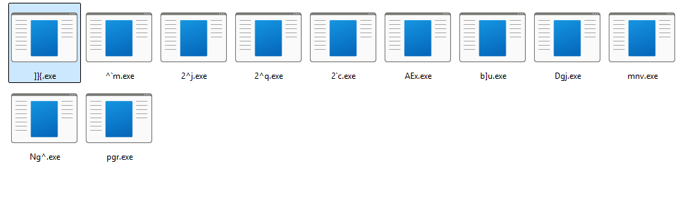
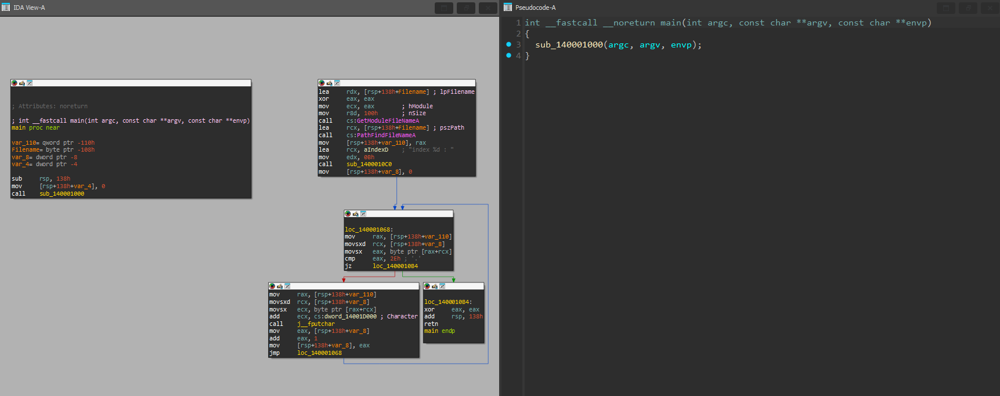
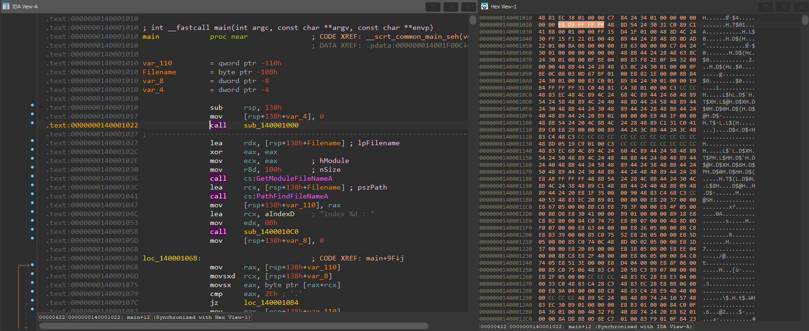
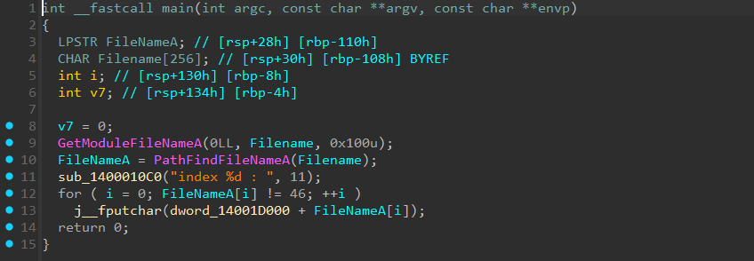

# [What is your name?](https://dreamhack.io/wargame/challenges/252)


- Sau khi giải nén file ra thì tôi nhận được khá nhiều file bên trong đúng như với đề bài.
- Tôi tiến hành dùng IDA để mở các file này xem bên trong nó liệu có gì.


- Tuy phần Pseudocode thì không có gì nhưng như ta thấy phần view asm ở bên trái thì còn có một phần nào đó không được main link tới.
- Lý do ở đây là vì hàm main đang call tới hàm `sub_140001000` và có lẽ sẽ không quay lại main và sau đó kết thúc chương trình luôn.


- Vì tò mò xem phần ở bên kia đang làm gì nên tôi sẽ thay thế có byte hex của `call sub_140001000` tương ứng `E8 D9 FF FF FF` thành 5 byte nop để có thể bỏ qua nó.


- Sau khi thay đổi thì có vẻ hàm main đã "thật sự làm cái gì đó" hơn trước.
- Sau đó tôi sẽ chạy file này để xem nó sẽ in ra gì.

``` shell
> .\]]{.exe
index 11 : __}
```
- Tuyệt, có vẻ nó chính là index và một mảnh của flag, tôi tiến hành làm tương tự với các file còn lại.
- Sau khi chạy hết 11 file và ghép các ký tự theo chính xác thứ tự gợi ý thì tôi đã có được flag cho bài này.

<details>
<summary style="cursor: pointer">Flag</summary>

```
DH{Oh_Fil3_r3ad_and_writ3_know__}
```
</details>