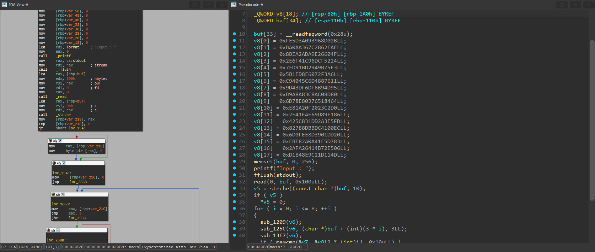

# [hash-browns](https://dreamhack.io/wargame/challenges/98)

- Tôi sử dụng IDA để mở bài này xem nó sẽ làm gì bên trong.


- Hàm main mới đầu sẽ khởi tạo mảng `v8` với khá nhiều đoạn hex nào đó.
- Tiếp theo sẽ cho người dùng nhập vào, theo ký tự xuống dòng `\n` thành `0` để ngắt chuỗi.
- Sau đó là đi qua một vòng for để có lẽ là mã hóa gì đó bên trong.

``` C
for ( i = 0; i <= 8; ++i )
{
    sub_1209(v6);
    sub_125C(v6, (char *)buf + (int)(3 * i), 3LL);
    sub_13E7(v6);
    if ( memcmp(&v7, &v8[2 * (int)i], 0x10uLL) )
    {
        puts("Wrong!");
        return 1LL;
    }
}
```
- Sau khi phân tích 3 hàm `sub_1209`, `sub_125C` và `sub_13E7` trong vòng for này, thì tôi biết đó làm hash MD5 nhưng điều đặc biệt là nó chỉ lấy từ input ra từng 3 ký tự một để hash thôi.
- Nhận thấy vậy nên tôi tiến hành viết script python để bruteforce từng 3 ký tự một và so sánh với mảng `v8` được khởi tạo ở đầu hàm, nếu 3 ký tự đó tương ứng đúng thì in ra.

``` python
import hashlib
import string
import itertools

lst = [
    '2bd06839093a5dfeae2e86c267a30aba',
    '4f60269eda2aea8b2452cf6dc9416f2e',
    'f3759b94d21bd97fa6f372608eedb105',
    '117688d4c64540c9954db9f66ddf439d',
    '808dc08a3ca8a8b96484517603e8786d',
    'd0c223200fa2810e86f1899de6ea412e',
    'fde5a3d21d835c42ec0041dcbb8d7882',
    '20dd01398dee0f6d83d7e5410a2ae8eb',
    '06e5724b4126fa2a4d111dc2e948180d'
]

for target in lst:
    for chars in itertools.product(string.printable, repeat=3):
        s = ''.join(chars)
        if hashlib.md5(s.encode()).hexdigest() == target:
            print(s, end="")
```
- Sau khi chạy script trên thì tôi đã có được flag cho bài này.

<details>
<summary style="cursor: pointer">Flag</summary>

```
DH{m-d-5_1s_vu1n-er-4b1e~!}
```
</details>