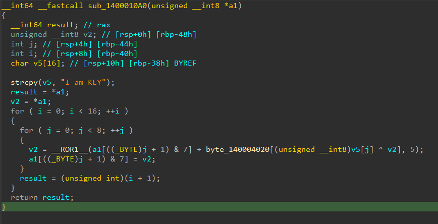

# [rev-basic-9](https://dreamhack.io/wargame/challenges/23)

- Tôi mở file bằng IDA để xem code của bài này.


- Hàm main này chỉ nhập vào và gọi hàm `check_key`.


- Sau khi check hàm `check_key` thì tôi có tóm tắt như này.
``` c
v3 = strlen(a1);
if ( (v3 + 1) % 8 )
    return 0LL;
```
- Dựa vào đoạn ở trên ta biết được key sẽ có độ dài dạng 7, 15, 23, ...
- Sau đó flag được chia làm các phần 8 phần tử và cho vào hàm `enc` để mã hóa.
- Sau khi mã hóa xong thì key được check với `unk_140004000` mà mảng giá trị có sẵn.


- Về logic của hàm `enc` thì nó được xoay quanh dòng này:
``` c
v2 = __ROR1__(a1[((_BYTE)j + 1) & 7] + byte_140004020[(unsigned __int8)v5[j] ^ v2], 5);
```
- Nó sẽ được viết tường minh hơn như này:
``` c
v2_new = ror(v2 + byte_140004020[v5[j] ^ v2_old], 5)
```
- Ví dụ, ta có 1 mảng 8 phần tử như sau: [a, b, c, d, e, f, g, h]
- Sau khi ta có v2_new, thì ta sẽ nhận ra v2_old là giá trị trước nó.
- Với mảng ví dụ ở trên, nếu v2_new = `f` ở vị trí số 5, thì v2_old sẽ là `e` ở vị trí số 4.
- Hoặc với trường hợp v2_new = `a` ở vị trí số 0, thì v2_old sẽ là `h` ở vị trí số 7.
- Như vậy ta có thể thấy, reverse được hàm này, ta chỉ cần dịch ngược lại logic của lệnh trên.
- Đầu tiên, ta lấy `rotate left 5` của giá trị cuối mỗi mảng, sau đó sẽ trừ nó với `byte_140004020[v5[j] ^ temp]`, temp ở đây sẽ là giá trị ngay phía trước (ở bước này thì sẽ là giá trị ở vị trí số 6).
- Cứ thế ta lùi dần và sẽ tìm ra được các ký tự ban đầu của key.
- Tôi có viết 1 file python để giải bài này như sau.
``` python
byte_140004020 = [
    0x63, 0x7C, 0x77, 0x7B, 0xF2, 0x6B, 0x6F, 0xC5, 0x30, 0x01,
    0x67, 0x2B, 0xFE, 0xD7, 0xAB, 0x76, 0xCA, 0x82, 0xC9, 0x7D,
    0xFA, 0x59, 0x47, 0xF0, 0xAD, 0xD4, 0xA2, 0xAF, 0x9C, 0xA4,
    0x72, 0xC0, 0xB7, 0xFD, 0x93, 0x26, 0x36, 0x3F, 0xF7, 0xCC,
    0x34, 0xA5, 0xE5, 0xF1, 0x71, 0xD8, 0x31, 0x15, 0x04, 0xC7,
    0x23, 0xC3, 0x18, 0x96, 0x05, 0x9A, 0x07, 0x12, 0x80, 0xE2,
    0xEB, 0x27, 0xB2, 0x75, 0x09, 0x83, 0x2C, 0x1A, 0x1B, 0x6E,
    0x5A, 0xA0, 0x52, 0x3B, 0xD6, 0xB3, 0x29, 0xE3, 0x2F, 0x84,
    0x53, 0xD1, 0x00, 0xED, 0x20, 0xFC, 0xB1, 0x5B, 0x6A, 0xCB,
    0xBE, 0x39, 0x4A, 0x4C, 0x58, 0xCF, 0xD0, 0xEF, 0xAA, 0xFB,
    0x43, 0x4D, 0x33, 0x85, 0x45, 0xF9, 0x02, 0x7F, 0x50, 0x3C,
    0x9F, 0xA8, 0x51, 0xA3, 0x40, 0x8F, 0x92, 0x9D, 0x38, 0xF5,
    0xBC, 0xB6, 0xDA, 0x21, 0x10, 0xFF, 0xF3, 0xD2, 0xCD, 0x0C,
    0x13, 0xEC, 0x5F, 0x97, 0x44, 0x17, 0xC4, 0xA7, 0x7E, 0x3D,
    0x64, 0x5D, 0x19, 0x73, 0x60, 0x81, 0x4F, 0xDC, 0x22, 0x2A,
    0x90, 0x88, 0x46, 0xEE, 0xB8, 0x14, 0xDE, 0x5E, 0x0B, 0xDB,
    0xE0, 0x32, 0x3A, 0x0A, 0x49, 0x06, 0x24, 0x5C, 0xC2, 0xD3,
    0xAC, 0x62, 0x91, 0x95, 0xE4, 0x79, 0xE7, 0xC8, 0x37, 0x6D,
    0x8D, 0xD5, 0x4E, 0xA9, 0x6C, 0x56, 0xF4, 0xEA, 0x65, 0x7A,
    0xAE, 0x08, 0xBA, 0x78, 0x25, 0x2E, 0x1C, 0xA6, 0xB4, 0xC6,
    0xE8, 0xDD, 0x74, 0x1F, 0x4B, 0xBD, 0x8B, 0x8A, 0x70, 0x3E,
    0xB5, 0x66, 0x48, 0x03, 0xF6, 0x0E, 0x61, 0x35, 0x57, 0xB9,
    0x86, 0xC1, 0x1D, 0x9E, 0xE1, 0xF8, 0x98, 0x11, 0x69, 0xD9,
    0x8E, 0x94, 0x9B, 0x1E, 0x87, 0xE9, 0xCE, 0x55, 0x28, 0xDF,
    0x8C, 0xA1, 0x89, 0x0D, 0xBF, 0xE6, 0x42, 0x68, 0x41, 0x99,
    0x2D, 0x0F, 0xB0, 0x54, 0xBB, 0x16
]

check = [
    0x7E, 0x7D, 0x9A, 0x8B, 0x25, 0x2D, 0xD5, 0x3D,
    0x03, 0x2B, 0x38, 0x98, 0x27, 0x9F, 0x4F, 0xBC,
    0x2A, 0x79, 0x00, 0x7D, 0xC4, 0x2A, 0x4F, 0x58
]

def rol(value, count):
    return ((value << count) | (value >> (8 - count))) & 0xFF

def decrypt(a1):
    v5 = b"I_am_KEY"
    v2 = a1[7]
    for _ in range(16):
        for j in range(7, -1, -1):
            idx = (j + 1) & 7
            v2 = rol(a1[idx] & 0xFF, 5)
            v2 -= byte_140004020[v5[j] ^ a1[(idx - 1) if (idx - 1) >= 0 else 7]]
            v2 &= 0xFF
            a1[idx] = v2
    return a1

for i in range(3):
    block = check[i * 8: (i + 1) * 8]
    check[i * 8: (i + 1) * 8] = decrypt(block)

print("DH{", end = "")
print("".join(chr(x) for x in check), end = "")
print("}")
```
- Chạy nó và tôi đã có được flag cho bài này.

<details>
<summary style="cursor: pointer">Flag</summary>

```
DH{Reverse__your__brain_;)}
```
</details>