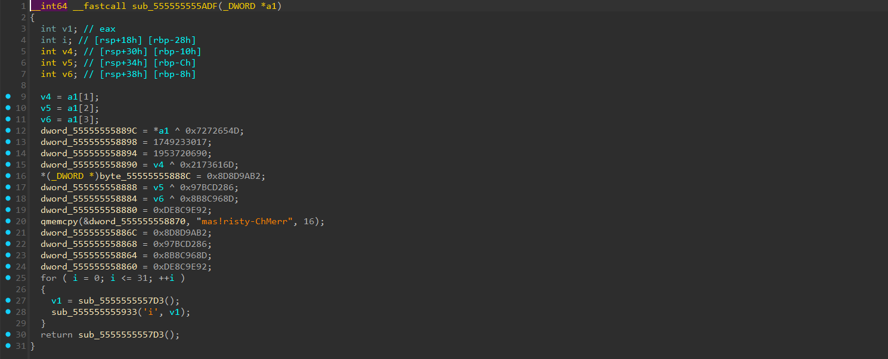
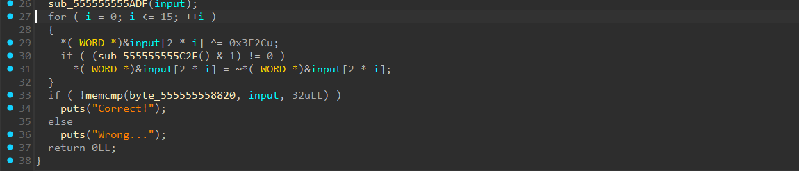

# [snow](https://dreamhack.io/wargame/challenges/718)

- Tôi tiến hành mở file bằng IDA để xem chương trình đang làm gì.


- Chương trình xử lý input qua một số những hàm và gán vào các biến làm cho ta cảm giác rất rối.
- Việc giải mã các hàm hoặc biến này sẽ mất khá nhiều thời gian.


- Nhưng khi ta xem lại hàm `main`, ta sẽ thấy chương trình này đơn giản chỉ là chạy hàm for và lấy lần lượt ra 2 byte từ input và xor với 0x3F2C và nếu thỏa mã điều kiện bên dưới thì sẽ đảo ngược các bit.
- Cuối cùng là so sánh với một mảng có sẵn của bài.
- Và for cũng chỉ trong giới hạn 15 lần lặp nên tôi nảy ra ý tưởng bruteforce input của bài này, sau đó mở file và gửi input đó vào, nếu chương trình trả ra `Correct!` thì đó sẽ là flag cho bài này.
- Tôi tiến hành viết script python bruteforce cho bài này.

``` python
from pwn import *

def brute_force(key):
    words = [int.from_bytes(key[i:i+2], "little") for i in range(0, 32, 2)]
    for mask in range(1 << 16):
        out_words = []
        for j, w in enumerate(words):
            ww = (~w) & 0xFFFF if (mask >> j) & 1 else w
            ww ^= 0x3F2C
            out_words.append(ww)
        flag = b''.join(w.to_bytes(2, 'little') for w in out_words)
        p = process(["./prob", flag.decode(errors="ignore")])
        output = p.recvall(timeout=1).decode(errors="ignore")
        p.close()

        if "Correct!" in output:
            print("Flag:", flag.decode())
            return flag

key = [
    0x97, 0x88, 0xA8, 0x86, 0x14, 0x0F, 0xE6, 0xF0, 0xE7, 0xF2, 
    0x92, 0x83, 0x19, 0x7A, 0x19, 0x06, 0x6A, 0x7B, 0xE3, 0xF7, 
    0x6D, 0x7D, 0x96, 0x86, 0x1D, 0x7A, 0x15, 0x7D, 0x1E, 0x7A, 
    0x6A, 0x42
]
brute_force(key)
```
- Việc bruteforce pow(2, 16) tuy tốn kha khá thời gian thôi nhưng nó vẫn khả thi, sau khi chạy file python và đợi 1 lúc thì tôi đã có cho mình flag của bài này.

<details>
<summary style="cursor: pointer">Flag</summary>

```
DH{F805042AC5E59FD07ABEF1E9B2EF}
```
</details>