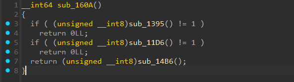
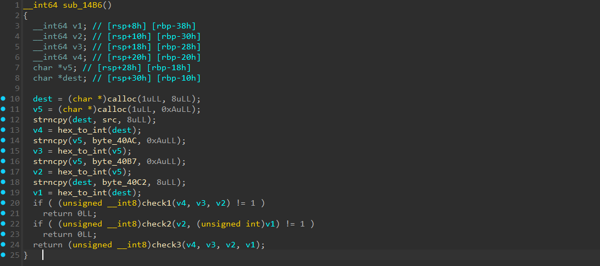

# [verify](https://dreamhack.io/wargame/challenges/772)

- Tôi tiến hành mở file bằng IDA để xem cách chương trình hoạt động.


- Theo mạch chương trình thì tìm được đến hàm này.
- Đầu tiên hàm `sub_1395`, nó chỉ là kiểm tra độ dài của flag có bằng 43 hay không.
- Sau đó đến hàm `sub_11D6` là kiểm tra các ký tự trong flag có hợp lệ không, 3 ký tự đầu là `DH{`, các ký tự thứ 12, 23, 34 là `-` và ký tự cuối là `}`.
- Hàm quan trọng nhất ở đây là hàm `sub_14B6`.


- Theo mạch của hàm này ta thấy nó sẽ gán lại các giá trị trong flag vào lần lượt các biến v4 -> v3 -> v2 -> v1, sau đó các biến này sẽ được đi qua hàm `hex_to_int` để chuyển từ các ký tự hex trong flag thành số.
- Cuối cùng các biến v4, v3, v2, v1 sẽ lần lượt đi qua các hàm `check1`, `check2`, `check3` để kiểm tra có đúng so với đề bài không, nếu pass qua hết thì flag đã đúng.
- Bây giờ tôi tiến hành code python với z3 để giải các phương trình được cung cấp ở trong các hàm `check1`, `check2`, `check3` để tìm các biến v4, v3, v2, v1 và sau đó ghép lại để có được flag.

``` python
from z3 import *

def reverse_sub_13BC(n):
    return hex(n)[2:]

v4, v3, v2, v1 = BitVecs("v4 v3 v2 v1", 64)
solver = Solver()
solver.add(
    v4 + v3 == 0xA255CEA0BA,
    v3 + v2 == 0xC4259FEEE3,
    v2 + v1 == 0x2284419047,
    v1 + v4 == 0xB470421E,
    v1 ^ v2 ^ v3 == 0x8391639987
)

solver.check()
m = solver.model()
v4, v3, v2, v1 = [m[v].as_long() for v in (v4, v3, v2, v1)]

a = reverse_sub_13BC(v4)
b = reverse_sub_13BC(v3)
c = reverse_sub_13BC(v2)
d = reverse_sub_13BC(v1)
print(f"DH{{{a}-{b}-{c}-{d}}}")
```
- Sau khi chạy code thì tôi đã có được flag cho bài này.

<details>
<summary style="cursor: pointer">Flag</summary>

```
DH{62f0aaba-a1f2ddf600-2232c1f8e3-517f9764}
```
</details>