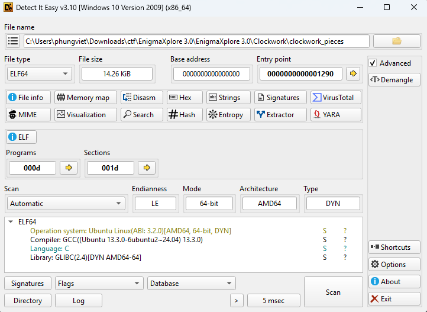
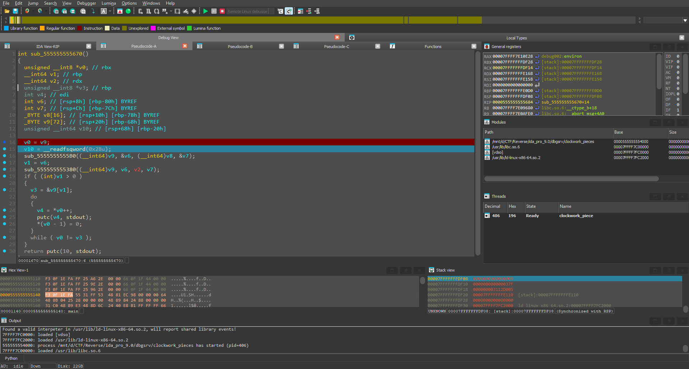
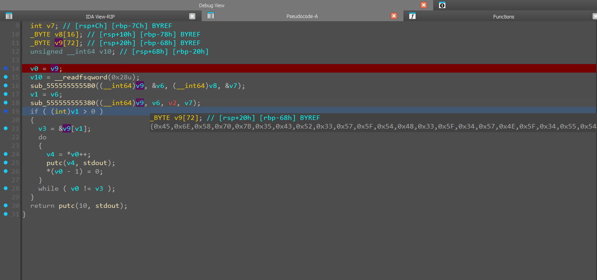
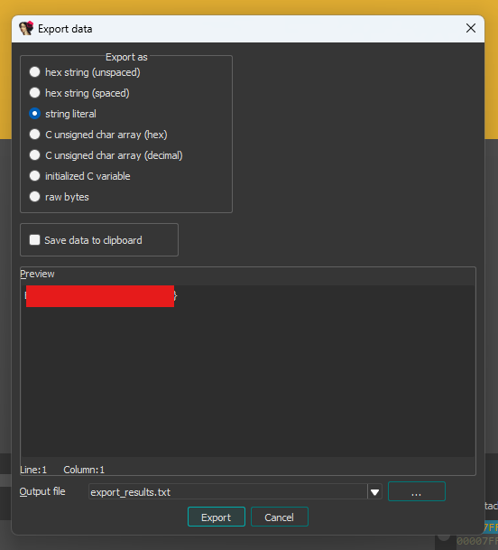

# Clockwork

- Đầu tiên tôi sử dụng DiE để xem qua các thông tin cơ bản của file này.


- Xem qua thì nó cũng không có gì đặc biệt lắm, nó chỉ là một file code C và được biên dịch bằng GCC rất bình thường.
- Giờ thì cùng mở nó bằng IDA để xem code của nó như nào.

``` C
// positive sp value has been detected, the output may be wrong!
void __fastcall __noreturn start(__int64 a1, __int64 a2, void (*a3)(void))
{
  __int64 v3; // rax
  int v4; // esi
  __int64 v5; // [rsp-8h] [rbp-8h] BYREF
  char *retaddr; // [rsp+0h] [rbp+0h] BYREF

  v4 = v5;
  v5 = v3;
  _libc_start_main(main, v4, &retaddr, 0LL, 0LL, a3, &v5);
  __halt();
}

__int64 __fastcall main(int a1, char **a2, char **a3)
{
  time_t v3; // rax
  __m128i v4; // xmm0
  __m128i v5; // xmm0
  __int64 v6; // rdx
  char *v7; // rax
  _OWORD v9[3]; // [rsp+0h] [rbp-A8h] BYREF
  __int16 v10; // [rsp+30h] [rbp-78h]
  char v11[14]; // [rsp+32h] [rbp-76h] BYREF
  char s[72]; // [rsp+40h] [rbp-68h] BYREF
  unsigned __int64 v13; // [rsp+88h] [rbp-20h]

  v13 = __readfsqword(0x28u);
  v3 = time(0LL);
  v9[0] = _mm_load_si128((const __m128i *)&xmmword_4060);
  v9[1] = _mm_load_si128((const __m128i *)&xmmword_4070);
  v9[2] = _mm_load_si128((const __m128i *)&xmmword_4080);
  v4 = _mm_cvtsi32_si128(v3 % 256);
  v5 = _mm_unpacklo_epi8(v4, v4);
  v10 = word_4090;
  xmmword_40C0 = (__int128)_mm_add_epi8(_mm_shuffle_epi32(_mm_unpacklo_epi16(v5, v5), 0), (__m128i)xmmword_2030);
  ((void (__fastcall *)(_OWORD *, __int64))sub_1460)(v9, 50LL);
  ((void (*)(void))sub_1660)();
  __printf_chk(2LL, "Enter key: ");
  if ( fgets(s, 64, stdin) )
  {
    s[strcspn(s, "\n")] = 0;
    v6 = (unsigned int)sub_14C0(s);
    v7 = (char *)v9;
    if ( (_DWORD)v6 )
    {
      sub_1660(s, v11, v6, -17 - (unsigned int)v9);
    }
    else
    {
      do
      {
        *v7 += -17 - (unsigned __int8)v9 + (_BYTE)v7;
        ++v7;
      }
      while ( v11 != v7 );
      puts("Invalid key");
    }
  }
  return 0LL;
}
```
- Men theo màn `start` và `main`, sau khi tôi phân tích qua thì có thể tóm tắt đoạn này sẽ cho người dùng nhập vào key sau đó qua các bước check, nhưng mà nó sẽ luôn in ra lỗi.
- Nghi ngờ đây không phải hàm logic chính để xử lý flag nên tôi đi mò thêm từ các hàm lân cận.
- Sau một lúc tìm kiếm thì tôi có tìm đến được hàm này.

``` C
int sub_1670()
{
  unsigned __int8 *v0; // rbx
  __int64 v1; // rbp
  __int64 v2; // rdx
  unsigned __int8 *v3; // rbp
  int v4; // edi
  int v6; // [rsp+8h] [rbp-80h] BYREF
  int v7; // [rsp+Ch] [rbp-7Ch] BYREF
  _BYTE v8[16]; // [rsp+10h] [rbp-78h] BYREF
  _BYTE v9[72]; // [rsp+20h] [rbp-68h] BYREF
  unsigned __int64 v10; // [rsp+68h] [rbp-20h]

  v0 = v9;
  v10 = __readfsqword(0x28u);
  sub_15B0(v9, &v6, v8, &v7);
  v1 = v6;
  sub_1380((__int64)v9, v6, v2, v7);
  if ( (int)v1 > 0 )
  {
    v3 = &v9[v1];
    do
    {
      v4 = *v0++;
      putc(v4, stdout);
      *(v0 - 1) = 0;
    }
    while ( v0 != v3 );
  }
  return putc(10, stdout);
}
```
- Cùng phân tích xem liệu nó đang làm gì:
  - Đầu tiên hàm này khởi tạo các giá trị bằng hàm `sub_15B0`, gán các giá trị cho các biến.
  - Sau đó đi qua các bước biến đổi bằng hàm `sub_1380`.
  - Cuối cùng là in từng giá trị đó ra.
- Nghi ngờ nó sẽ in một điều gì đó quan trọng nên tôi sẽ debug và nhảy vào hàm này để xem nó sẽ in ra những gì.


- Tôi nhảy thẳng đến hàm này và chạy qua hàm biến đổi `sub_1380` để check các giá trị của các biến sau khi được biến đổi.


- Ở đây tôi có check đến biến `v9` và thấy các byte có thể in ra được, cùng xem nó là các ký tự gì.


- Tuyệt vời, vậy là tôi đã có được flag cho bài này.

<details>
<summary style="cursor: pointer">Flag</summary>

```
EnXp{5CR3W_TH3_4WN_4UTH0R}
```
</details>