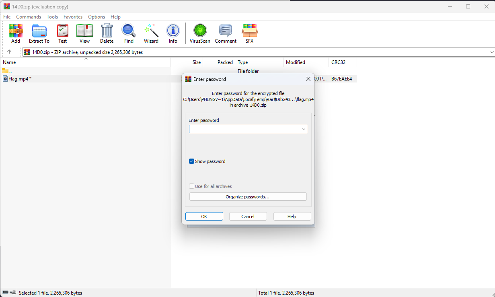

# Never Gonna Solve You

- Đề bài có cung cấp cho chúng ta một file ảnh, khả năng cao thì nó không chỉ là một chiếc ảnh bình thường.


- Đầu tiên tôi dùng thử exiftool để xem các thông tin của file ảnh này và thấy cũng không có gì thật sự cần thiết.


- Sau đó tôi dùng binwalk để kiểm tra các file ẩn ở bên trong thì thấy có một file zip, cùng extract nó ra để xem nó có những gì ở bên trong.


- Nó cho chúng ta một file zip nhưng mà lại không hề cho ta mật khẩu.
- Khi này tôi đã đọc lại đề bài để có thể tìm thêm manh mối cho bài này thì lấy ở đề bài có một đoạn kiểu `weknowthegameandweregonnaplayit` và nghi ngờ nó chính là mật khẩu của file zip này nên tôi đã nhập thử.


- Thật sự thì nó đúng là mật khẩu của file zip này.
- Nhưng file mp4 này chỉ là một video RickRoll thôi, cũng có khả năng nó sẽ chứa các file ẩn ở bên như file ảnh.
- Tôi sẽ lại thử binwalk nó để xem liệu có gì không.


- Hay quá, nó lại có một file RAR ở bên trong, ta lại extract nó ra để tìm hiểu tiếp.


- Trong đó tôi thấy có một file pcap, cùng mở nó ra để xem các thông tin của nó.


- Ở đây tôi thấy có một đường dẫn lạ đến trang `bit.ly/RickRollme`, tôi thử mở đến trang đó ra xem liệu nó có ẩn chứa điều gì ở bên trong.


- Nó dẫn đến 1 link drive chứa file lyrics.txt.
- Cùng tải nó về để tìm xem nó có gì bên trong.


- Mở bằng notepad thì tôi thấy nó có những byte linh tinh ở giữa các chữ, có thể nó đang sử dụng kỹ thuật giấu tin ở trong các byte ẩn này.
- Sau một hồi tìm kiếm các kỹ thuật giấu tin bằng các byte ẩn thì tôi có tìm thấy trang này [`stegzero`](https://stegzero.com/).


- Tôi vào trang đó và paste đoạn text trong file `lyrics.txt` vào và đã có được flag cho bài này.

<details>
<summary style="cursor: pointer">Flag</summary>

```
EnXp{y0u_r34lly_d1dnt_g1v3_up}
```
</details>