# Forensic 2 (Candle)

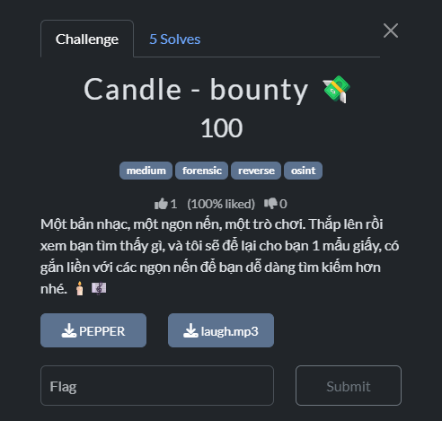

- Đầu tiên mình mở file MP3 tiếng cười bằng HXD để xem hex của file.

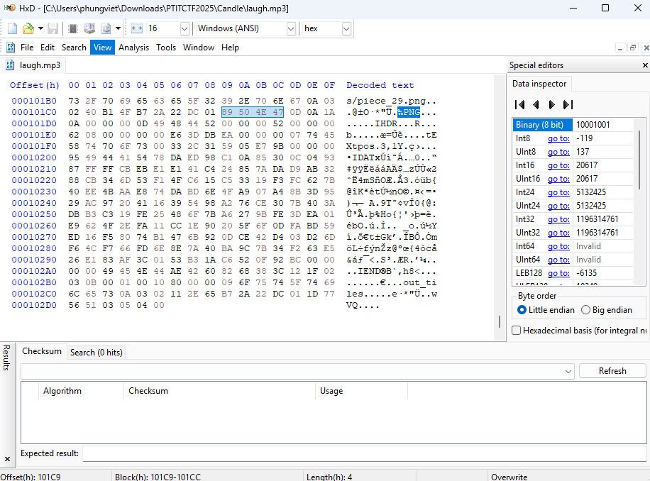
- Khá bất ngờ khi kéo xuống cuối file thì mình thấy rất nhiều các hex `PNG` của file ảnh.
- Vậy nên mình sử dụng binwalk để lấy các file png này ra.

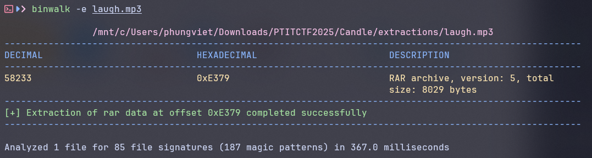
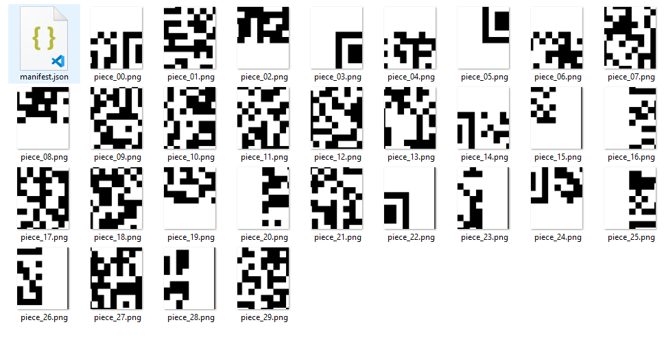
- Sau khi binwalk ra thì mình nhận được khá nhiều ảnh và có vẻ như nó sẽ ghép thành một mã QR.

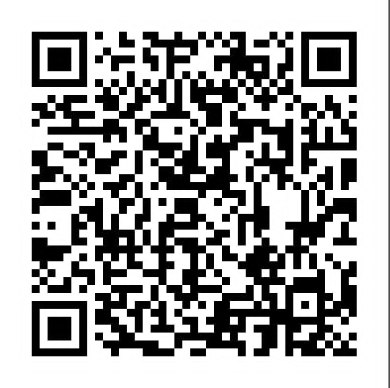
- Sau đó mình ghép lại các mảnh này thành một mã QR, từ đó mình quét ra được một link X.

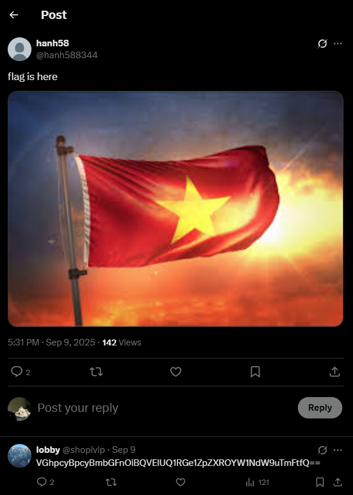
- Ồ có vẻ có một đoạn `base64` ở đây, mình thử decode nó ra xem được gì.

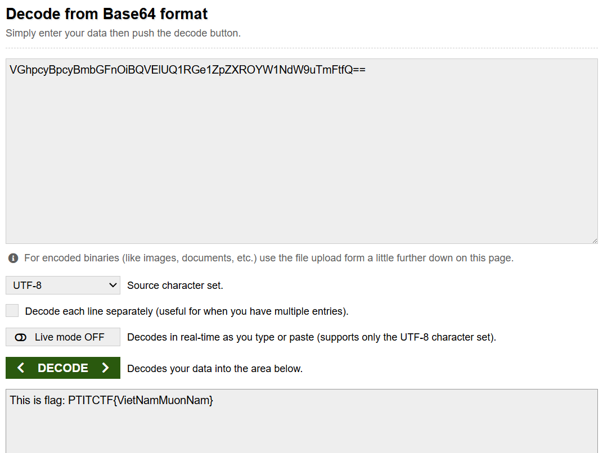
- Tuy đây là một flag chuẩn form nhưng tiếc nó lại là một fake flag.
- Mình tiếp tục tìm kiếm trong bài viết trên X để xem có được thêm thông tin gì không.

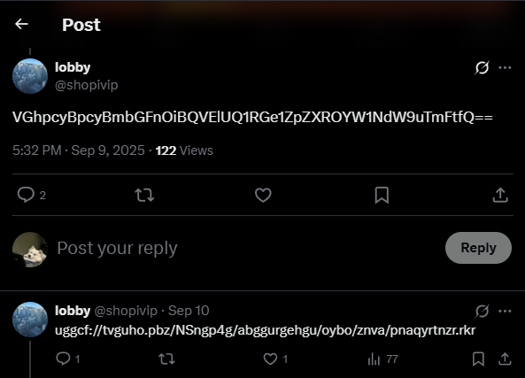
- Cũng ở chính bình luận đó mình thấy một đoạn có vẻ như là `ROT-13`, mình sẽ decode nó ra để xem có thông tin gì không.

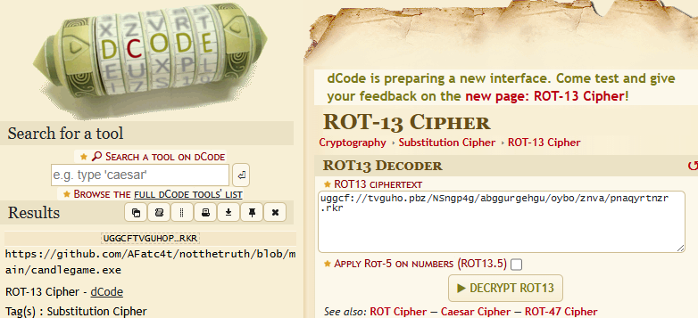
- Tuyệt vời, ta có một link github ở đây.
- Truy cập vào link github đó và tải về file exe được cung cấp.
- Trước hết như bao bài reverse mình sẽ dùng DiE để xem các thông tin của file exe này.

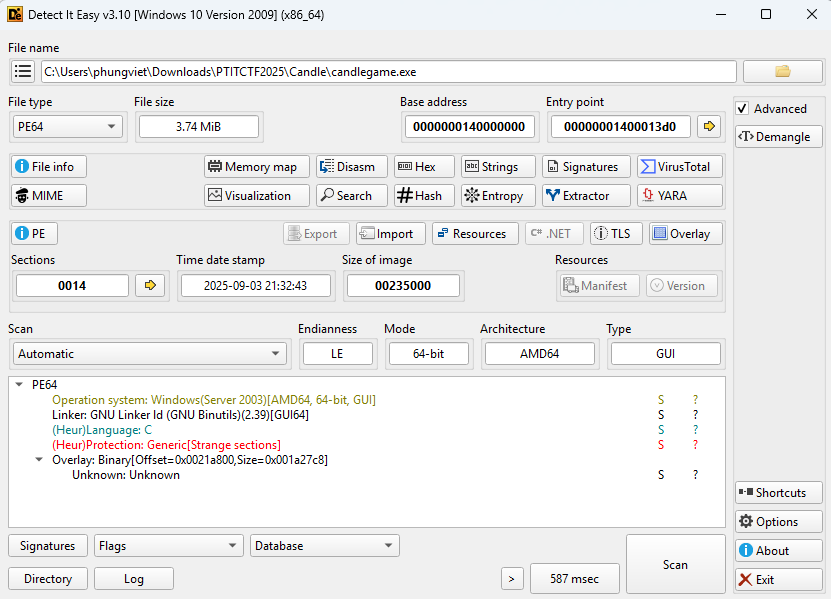
- Có vẻ file này cũng khá bình thường và không có gì đặc biệt.
- Mình chạy thử xem chương trình này như nào.

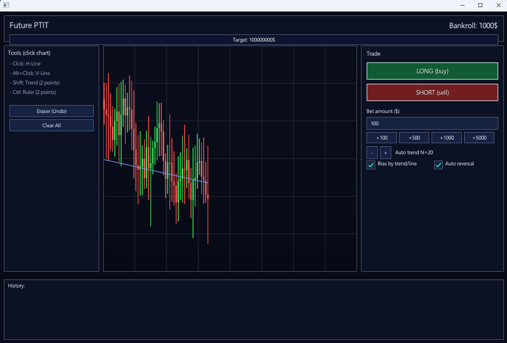
- Chúng ta được cung cấp một chương trình chứng khoán ở đây, mình có chơi thử và khi bị khá sản sẽ hiện ra một hàm hình màu đen như bị hack.
- Vì cũng không biết phải làm gì tiếp theo tôi mình sẽ dùng IDA để có thể check code của nó.
``` C
__int64 sub_140001180()
{
    ...
    *(_QWORD *)off_140191658 = qword_14020E018;
    result = sub_140189EE0(v14, qword_14020E020);
    dword_14020E010 = result;
    ...
}
```
- Men theo flow của chương trình mình đến được hàm này.
- Và ở đây cái chúng ta cần quan tâm chính là hàm `sub_140189EE0` được gọi ở đoạn `result = sub_140189EE0(v14, qword_14020E020);`.
- Ta cùng phân tích xem hàm đó đang làm gì.
- Như khi chạy chương trình giao dịch chứng khoán thì sẽ có một phần `Bankroll: xxx$` nên mình nghĩ chương trình cũng sẽ lấy giá trị ở đây để so sánh điều kiện thắng và phá sản.

``` C
sub_140004720(v325, v295);
v319 = 10LL;
strcpy(v320, "Bankroll: ");
v265 = &Block;
Block = v320;
v262 = &Size;
sub_140187050(&Size, &Block, v325); // In ra "Bankroll: ...$"
```
- Sau một hồi phân tích thì mình tìm đến được vị trí gán `Bankroll: + Tiền$`.
- Và ở đây biến `v295` chính là biến chứa số tiền của còn lại trong tài khoản, nó được khai báo mặc định là `v295 = 1000;`.
- Và chương trình này sẽ kiểm tra số dư của tài khoản, nếu thỏa mãn thì sẽ in ra flag.
- Ở đây mình sẽ sửa giá trị mặc định của `v295` lên một số lớn ví dụ như 0x7FFFFFFF cho cực lớn, sau đó trade thử.

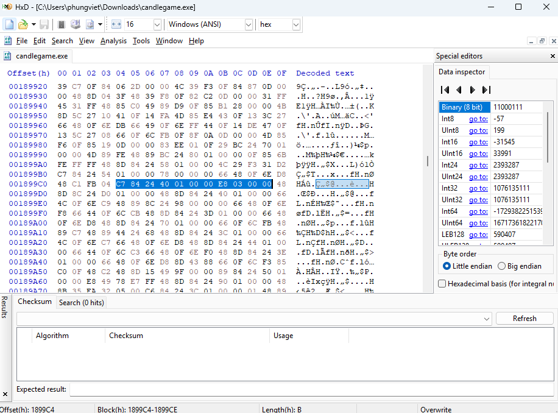

- Ta chỉ cần sửa lại hex mặc định là được.
- Giờ thì mình sẽ chạy file và trade thử.

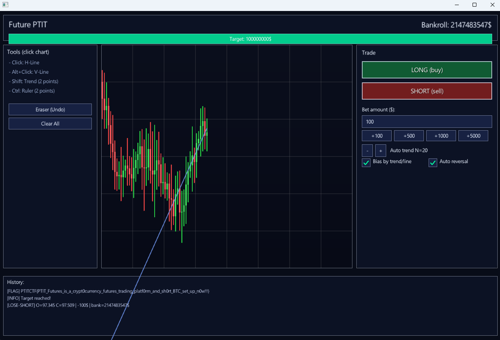
- Và với số tiền lớn đó thì mình đã có được flag cho bài này.

<details>
<summary style="cursor: pointer">Flag</summary>

```
PTITCTF{PTIT_Futures_is_a_crypt0currency_futures_trading_platf0rm_and_sh0rt_BTC_set_up_n0w!!!}
```
</details>