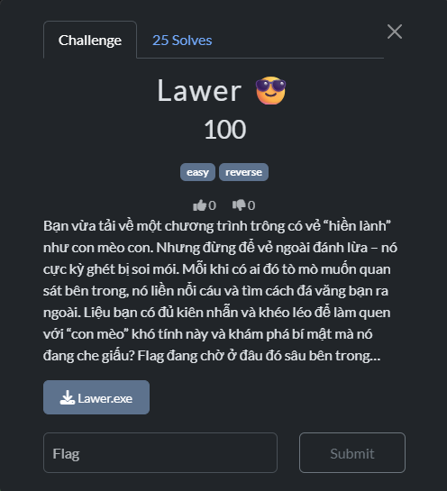
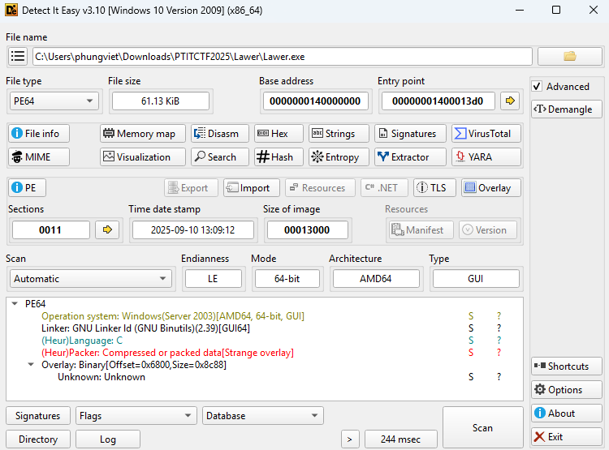

# Reverse 1 (Lawer)



- Đầu tiên mình sẽ sử dụng DiE để xem các thông tin về file.


- Xem qua thì file này cũng không có gì đặc biệt cả nên mình sẽ chạy thử để xem liệu chương trình sẽ có những gì.


- Sau khi chạy thì file không in ra hoặc mở gì cả.
- Thế nên mình sẽ dùng IDA để xem liệu file đang ẩn chứa những gì.

``` C
int __fastcall main(int argc, const char **argv, const char **envp)
{
  char v3; // si
  char *v4; // rbx
  unsigned int v5; // ecx
  char v6; // al
  int wShowWindow; // r9d
  _STARTUPINFOA StartupInfo; // [rsp+20h] [rbp-88h] BYREF

  v3 = 0;
  _main(argc, argv, envp);
  v4 = *_p__acmdln();
  if ( v4 )
  {
    while ( 1 )
    {
      v5 = *v4;
      if ( *v4 <= 32 )
      {
        if ( !(_BYTE)v5 )
          goto LABEL_15;
        if ( (v3 & 1) == 0 )
        {
          do
            v6 = *++v4;
          while ( v6 && v6 <= 32 );
          goto LABEL_15;
        }
        v3 = 1;
      }
      else if ( (_BYTE)v5 == 34 )
      {
        v3 ^= 1u;
      }
      if ( ismbblead(v5) )
        v4 += -(v4[1] == 0) + 1;
      ++v4;
    }
  }
  v4 = (char *)&unk_1400040A0;
LABEL_15:
  memset(&StartupInfo, 0, sizeof(StartupInfo));
  GetStartupInfoA(&StartupInfo);
  wShowWindow = 10;
  if ( (StartupInfo.dwFlags & 1) != 0 )
    wShowWindow = StartupInfo.wShowWindow;
  return WinMain((HINSTANCE)refptr___image_base__, 0LL, v4, wShowWindow);
}
```
- Đầu tiên ta sẽ thấy một hàm `main`, nhưng thực chất hàm này chỉ có nhiệm vụ chuẩn bị môi trường để sau đó gọi đến hàm `WinMain`.
- Ta cùng xem hàm `WinMain` hoạt động như nào.

``` C
int __stdcall WinMain(HINSTANCE hInstance, HINSTANCE hPrevInstance, LPSTR lpCmdLine, int nShowCmd)
{
  BOOL v4; // ebx
  BOOL v5; // eax
  int v6; // ebx
  HANDLE CurrentProcess; // rax
  int v8; // ebx
  HMODULE ModuleHandleA; // rax
  HMODULE v10; // rsi
  FARPROC ProcAddress; // rdi
  HANDLE v12; // rsi
  unsigned int v13; // r12d
  HANDLE ProcessHeap; // rax
  char *v15; // rbp
  int v16; // r10d
  unsigned __int64 i; // r9
  char v18; // al
  int v19; // eax
  char *v20; // rdx
  char *v21; // rcx
  HANDLE v22; // rax
  unsigned __int64 v24; // rdx
  unsigned __int64 j; // rax
  char *v26; // rcx
  HANDLE v27; // rax
  int v28; // [rsp+3Ch] [rbp-4Ch] BYREF
  __int64 v29; // [rsp+40h] [rbp-48h] BYREF
  _QWORD v30[8]; // [rsp+48h] [rbp-40h] BYREF

  hide_from_debugger();
  v4 = NtCurrentPeb()->BeingDebugged != 0;
  v5 = IsDebuggerPresent();
  LODWORD(v30[0]) = 0;
  v6 = v4 - (!v5 - 1);
  CurrentProcess = GetCurrentProcess();
  _IAT_start__(CurrentProcess, v30);
  v8 = v6 - ((LODWORD(v30[0]) == 0) - 1);
  ModuleHandleA = GetModuleHandleA("ntdll.dll");
  v10 = ModuleHandleA;
  if ( ModuleHandleA )
  {
    ProcAddress = GetProcAddress(ModuleHandleA, "NtQueryInformationProcess");
    GetProcAddress(v10, "NtSetInformationThread");
    if ( ProcAddress )
    {
      v29 = 0LL;
      v12 = GetCurrentProcess();
      if ( ((int (__fastcall *)(HANDLE, __int64, __int64 *, __int64, _QWORD))ProcAddress)(v12, 7LL, &v29, 8LL, 0LL) >= 0 )
        v8 -= (v29 == 0) - 1;
      v30[0] = 0LL;
      if ( ((int (__fastcall *)(HANDLE, __int64, _QWORD *, __int64, _QWORD))ProcAddress)(v12, 30LL, v30, 8LL, 0LL) >= 0 )
        v8 -= (v30[0] == 0LL) - 1;
      v28 = 0;
      if ( ((int (__fastcall *)(HANDLE, __int64, int *, __int64, _QWORD))ProcAddress)(v12, 31LL, &v28, 4LL, 0LL) >= 0 )
        v8 += v28 == 0;
    }
  }
  v13 = 1590204330;
  if ( v8 >= 2 )
    v13 = -2140842124;
  ProcessHeap = GetProcessHeap();
  v15 = (char *)HeapAlloc(ProcessHeap, 0, 0x28uLL);
  if ( !v15 )
    goto LABEL_20;
  v16 = 85;
  for ( i = 0LL; i != 39; ++i )
  {
    v18 = v16 ^ __ROR1__(g_flag_enc[i], i - (i / 5 + (((0xCCCCCCCCCCCCCCCDuLL * (unsigned __int128)i) >> 64) & 0xFC)));
    v16 += 7;
    v15[i] = (v13 >> (8 * (i & 3))) ^ v18;
  }
  v15[39] = 0;
  if ( v8 <= 1
    || lstrlenA(v15) <= 8
    || *v15 != 80
    || v15[1] != 84
    || v15[2] != 73
    || v15[3] != 84
    || v15[4] != 67
    || v15[5] != 84
    || v15[6] != 70
    || v15[7] != 123 )
  {
    v19 = lstrlenA(v15);
    v20 = v15;
    v21 = &v15[v19];
    if ( v19 )
    {
      if ( (v19 & 1) == 0 || (v20 = v15 + 1, *v15 = 0, v21 != v15 + 1) )
      {
        do
        {
          *v20 = 0;
          v20 += 2;
          *(v20 - 1) = 0;
        }
        while ( v21 != v20 );
      }
    }
    v22 = GetProcessHeap();
    HeapFree(v22, 0, v15);
LABEL_20:
    Sleep(0xC8u);
    return v8 >= 2;
  }
  OutputDebugStringA("[CTF] FLAG: ");
  OutputDebugStringA(v15);
  DebugBreak();
  v24 = lstrlenA(v15);
  for ( j = 0LL; j < v24; ++j )
  {
    v26 = &v15[j];
    *v26 = 0;
  }
  v27 = GetProcessHeap();
  HeapFree(v27, 0, v15);
  return v8 >= 2;
}
```
- Chuẩn ở đây rồi, hàm `WinMain` chính là hàm xử lý chính của chương trình này.
- Ta hãy phân tích xem nó đang làm gì.

``` C
hide_from_debugger();
v4 = NtCurrentPeb()->BeingDebugged != 0;
v5 = IsDebuggerPresent();
LODWORD(v30[0]) = 0;
v6 = v4 - (!v5 - 1);
CurrentProcess = GetCurrentProcess();
_IAT_start__(CurrentProcess, v30);
v8 = v6 - ((LODWORD(v30[0]) == 0) - 1);
ModuleHandleA = GetModuleHandleA("ntdll.dll");
v10 = ModuleHandleA;
if ( ModuleHandleA )
{
    ProcAddress = GetProcAddress(ModuleHandleA, "NtQueryInformationProcess");
    GetProcAddress(v10, "NtSetInformationThread");
    if ( ProcAddress )
    {
        v29 = 0LL;
        v12 = GetCurrentProcess();
        if ( ((int (__fastcall *)(HANDLE, __int64, __int64 *, __int64, _QWORD))ProcAddress)(v12, 7LL, &v29, 8LL, 0LL) >= 0 )
            v8 -= (v29 == 0) - 1;
        v30[0] = 0LL;
        if ( ((int (__fastcall *)(HANDLE, __int64, _QWORD *, __int64, _QWORD))ProcAddress)(v12, 30LL, v30, 8LL, 0LL) >= 0 )
            v8 -= (v30[0] == 0LL) - 1;
        v28 = 0;
        if ( ((int (__fastcall *)(HANDLE, __int64, int *, __int64, _QWORD))ProcAddress)(v12, 31LL, &v28, 4LL, 0LL) >= 0 )
            v8 += v28 == 0;
    }
}
```
- `v4 = NtCurrentPeb()->BeingDebugged != 0;`
    - v4 = 1 nếu PEB->BeingDebugged = true, ngược lại 0.
- `v5 = IsDebuggerPresent();`
    - v5 = 1 nếu Windows API IsDebuggerPresent() cho biết có debugger.
- `LODWORD(v30[0]) = 0;`
    - khởi tạo vùng v30[0] = 0 (dùng sau này để chứa kết quả kiểm tra).
- `v6 = v4 - (!v5 - 1);`
    - Nếu BeingDebugged=0, IsDebuggerPresent=0 thì v6 = 0.
    - Nếu một trong hai là 1 (một trong hai báo debug) thì v6 = 1.
    - Nếu cả hai là 1 thì v6 = 2.

=> v6 là số “điểm” ban đầu cho các dấu hiệu debug từ PEB & IsDebuggerPresent.

``` C
CurrentProcess = GetCurrentProcess();
_IAT_start__(CurrentProcess, v30);
v8 = v6 - ((LODWORD(v30[0]) == 0) - 1);
```
- Ở đoạn này sẽ tăng v8 lên 1 đơn vị nếu như phát hiện có can thiệp của debugger.

``` C
v29 = 0LL;
v12 = GetCurrentProcess();
if ( ((int (__fastcall *)(HANDLE, __int64, __int64 *, __int64, _QWORD))ProcAddress)(v12, 7LL, &v29, 8LL, 0LL) >= 0 )
    v8 -= (v29 == 0) - 1;
```
- ProcessInformationClass = 7 → ProcessDebugPort.
    - Nếu process không bị debug thì v29 = 0.
    - Nếu có debugger attach thì v29 != 0.
    - Nếu có `debug port` thì v8 + 1.

``` C
v30[0] = 0LL;
if ( NtQueryInformationProcess(v12, 30, v30, 8, 0) >= 0 )
    v8 -= (v30[0] == 0LL) - 1;
```
- ProcessInformationClass = 30 → ProcessDebugObjectHandle.
    - Nếu không có debugger thì v30[0] = 0.
    - Nếu bị debug thì v30[0] != 0.
    - Nếu có `debug object` thì v8 + 1.

``` C
v28 = 0;
if ( NtQueryInformationProcess(v12, 31, &v28, 4, 0) >= 0 )
    v8 += v28 == 0;
```
- ProcessInformationClass = 31 → ProcessDebugFlags.
    - Nếu không debug thì v28 = 1.
    - Nếu bị debug thì v28 = 0.
    - Nếu `DebugFlags = 0` thì tăng 1 điểm nghi ngờ.

``` C
v13 = 0x5EC897AA;
if ( v8 >= 2 )
    v13 = 0x80655774;
```
- Nếu phát hiện nhiều hơn 1 dấu hiệu debug thì `v13` sẽ đổi sang một giá trị khác.

``` C
v16 = 85;
for ( i = 0LL; i != 39; ++i )
{
    v18 = v16 ^ __ROR1__(g_flag_enc[i], i - (i / 5 + (((0xCCCCCCCCCCCCCCCDuLL * (unsigned __int128)i) >> 64) & 0xFC)));
    v16 += 7;
    v15[i] = (v13 >> (8 * (i & 3))) ^ v18;
}
v15[39] = 0;
```
- Tiếp đến là một hàm giải mã dữ liệu bên trong mảng `g_flag_enc` dựa theo giá trị của v13 vì thế ta có thể sẽ có 2 kết quả tùy theo việc có đang sử dụng debug hay không.

``` C
if ( v8 <= 1
    || lstrlenA(v15) <= 8
    || *v15 != 80
    || v15[1] != 84
    || v15[2] != 73
    || v15[3] != 84
    || v15[4] != 67
    || v15[5] != 84
    || v15[6] != 70
    || v15[7] != 123 )
{
v19 = lstrlenA(v15);
v20 = v15;
v21 = &v15[v19];
if ( v19 )
{
    if ( (v19 & 1) == 0 || (v20 = v15 + 1, *v15 = 0, v21 != v15 + 1) )
    {
        do
        {
            *v20 = 0;
            v20 += 2;
            *(v20 - 1) = 0;
        }
        while ( v21 != v20 );
    }
}
v22 = GetProcessHeap();
HeapFree(v22, 0, v15);
LABEL_20:
Sleep(0xC8u);
return v8 >= 2;
}
OutputDebugStringA("[CTF] FLAG: ");
OutputDebugStringA(v15);
DebugBreak();
v24 = lstrlenA(v15);
for ( j = 0LL; j < v24; ++j )
{
    v26 = &v15[j];
    *v26 = 0;
}
v27 = GetProcessHeap();
HeapFree(v27, 0, v15);
return v8 >= 2;
```
- Tiếp đó là đoạn kiểm tra và in flag ra nếu flag đúng.
- Dựa vào phần giải mã mảng `g_flag_enc`, mình viết một script python để thực hiện giải mã với cả 2 giá trị của `v8` để tìm ra được giá trị đúng cho flag.

``` python
def ror(val, rbits):
    rbits &= 7 
    return ((val >> rbits) | (val << (8 - rbits))) & 0xFF

def decode_flag(g_flag_enc, v13):
    v16 = 85
    result = []
    for i in range(39):
        shift = i - (i // 5 + (((0xCCCCCCCCCCCCCCCD * i) >> 64) & 0xFC))

        v18 = v16 ^ ror(g_flag_enc[i], shift)
        v16 = (v16 + 7) & 0xFF
        decoded = ((v13 >> (8 * (i & 3))) & 0xFF) ^ v18
        result.append(decoded)
    return bytes(result).decode(errors="ignore")


g_flag_enc = [
    0x71, 0xBE, 0x3D, 0xF5, 0x64, 0x7B, 0xB8, 0xF5, 0x6D, 0xBA, 
    0x97, 0xA2, 0x0A, 0xB6, 0x1A, 0x50, 0xBD, 0xBF, 0x4F, 0x73, 
    0xA1, 0xA7, 0xF7, 0xB8, 0xBF, 0x36, 0x62, 0xDB, 0x10, 0x91, 
    0x65, 0xB5, 0x78, 0xE0, 0x94, 0xB8, 0xAE, 0xD9, 0x3A, 0x00
]

print(decode_flag(g_flag_enc, 0x5EC897AA))
print(decode_flag(g_flag_enc, 0x80655774))
```
- Sau khi chạy đoạn code python này thì mình đã có được flag cho bài này.

<details>
<summary style="cursor: pointer">Flag</summary>

```
PTITCTF{This_1snot_m4lware_don't_worry}
```
</details>