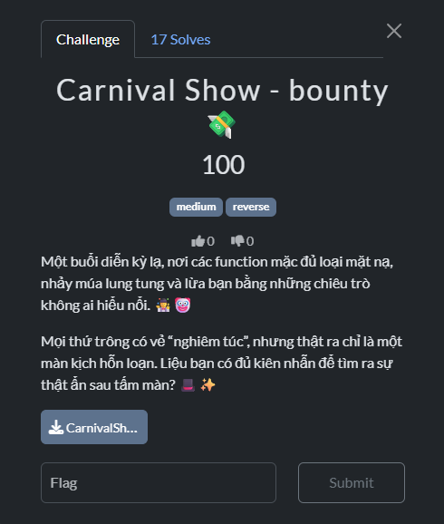
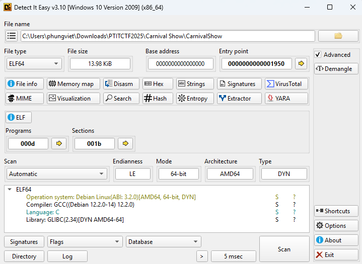
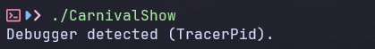

# Reverse 2 (Carnival Show)



- Trước hết mình sử dụng DiE để xem các thông tin của file này.


- File này cũng không có gì đặc biệt, mình tiến hành chạy thử để xem file này sẽ in ra những gì.


- Có vẻ là chương trình đang check debug hay gì đó.
- Ta cùng dùng IDA để xem liệu cụ thế nó đang làm gì.

``` C
void __fastcall __noreturn start(__int64 a1, __int64 a2, void (*a3)(void))
{
    __int64 v3; // rax
    int v4; // esi
    __int64 v5; // [rsp-8h] [rbp-8h] BYREF
    char *retaddr; // [rsp+0h] [rbp+0h] BYREF

    v4 = v5;
    v5 = v3;
    _libc_start_main(main, v4, &retaddr, 0LL, 0LL, a3, &v5);
    __halt();
}

__int64 __fastcall main(int a1, char **a2, char **a3)
{
    printf("flag (maybe?): %s\n", "PTITCTF{W3lcome_T0_My_Chall!!!}");
    return 0LL;
}
```
- Đầu tiên ta sẽ được dùng lại ở hàm `start` và nó sẽ dẫn đến hàm `main` nhưng có lẽ đây sẽ không phải logic chính xác của chương trình và flag ở trong main cũng là fake flag.
- Ta cùng tìm kỹ hơn trong các hàm lân cận xem có gì khai thác được không.
- Sau một lúc tìm kiếm thì mình nhận thấy có hàm `sub_1300` có xử lý yêu cầu nhập vào của người dùng và mã hóa input đó và mình nghĩ nó chính là logic chính để xử lý flag.
- Ta cùng phân tích xem nó liệu đang làm những gì.
- Các dòng đầu của hàm `sub_1300` thật sự chúng chỉ là những phần để check debug nên mình nghĩ chúng ta có thể bỏ qua phần đó và phân tích những phần cụ thể hơn ở bên dưới.

``` C
  sub_12B0(1); // "Enter flag: "
  while ( read(0, rlimits, 1uLL) > 0 && LOBYTE(rlimits[0].sa_handler) != 10 )
  {
    s[v14++] = (char)rlimits[0].sa_handler;
    v15 = s;
    if ( v14 == 255 )
    {
      s[255] = 0;
      goto LABEL_26;
    }
  }
  s[v14] = 0;
  v15 = s;
  if ( !v14 )
  {
    sub_12B0(1);
    exit(2);
  }
LABEL_26:
  prctl(22, 1LL);
  v16 = strlen(s);
  if ( 4 * ((v16 + 2) / 3) == 60 )
  {
    if ( v16 )
    {
      v18 = rlimits;
      v19 = 0LL;
      do
      {
        v27 = v19 + 1;
        v28 = (unsigned __int8)s[v19];
        if ( v19 + 1 < v16 )
        {
          v20 = v19 + 2;
          v21 = (unsigned __int8)s[v27] << 8;
          if ( v19 + 2 >= v16 )
          {
            v19 += 2LL;
            v22 = 0;
          }
          else
          {
            v22 = (unsigned __int8)s[v20];
            v19 += 3LL;
          }
        }
        else
        {
          v20 = ++v19;
          v22 = 0;
          v21 = 0;
        }
        v23 = v28 << 16;
        v24 = v23 | v22 | v21;
        LOBYTE(v23) = aQwertyuiopasdf[v23 >> 18];
        BYTE1(v23) = aQwertyuiopasdf[(v24 >> 12) & 0x3F];
        LOWORD(v18->sa_handler) = v23;
        v25 = 46;
        if ( v27 < v16 )
          v25 = aQwertyuiopasdf[(v24 >> 6) & 0x3F];
        BYTE2(v18->sa_sigaction) = v25;
        v26 = 46;
        if ( v20 < v16 )
          v26 = aQwertyuiopasdf[v24 & 0x3F];
        BYTE3(v18->sa_sigaction) = v26;
        v18 = (struct sigaction *)((char *)v18 + 4);
      }
      while ( v19 < v16 );
    }
    v29 = 0LL;
    v30 = 1;
    do
    {
      v31 = v30;
      v30 += 3;
      v32 = (char *)&v43 + v29 + 800;
      *(_DWORD *)((char *)&rlimits[0].sa_handler + v29) = (unsigned __int8)v32[(v31 & 3) - 512] | (((unsigned __int8)v32[(((v31 & 3) + 1) & 3) - 512] | (((unsigned __int8)v32[(((v31 & 3) + 2) & 3) - 512] | ((unsigned __int8)v32[(((v31 & 3) + 3) & 3) - 512] << 8)) << 8)) << 8);
      v29 += 4LL;
    }
    while ( v30 != 46 );
    v33 = -2128831035;
    v34 = "n0_dbg^_^";
    do
    {
      v35 = (unsigned __int8)*v34++;
      v33 = 16777619 * (v35 ^ v33);
    }
    while ( v34 != "" );
    v36 = v33 ^ 0x9E377985;
    v37 = 0;
    for ( j = 0LL; j != 60; ++j )
    {
      v36 ^= ((v36 ^ (v36 << 13)) >> 17) ^ (v36 << 13) ^ (32 * (((v36 ^ (v36 << 13)) >> 17) ^ v36 ^ (v36 << 13)));
      v39 = v36 + aN0Dbg[j - (j / 9 + (((0xE38E38E38E38E38FLL * (unsigned __int128)j) >> 64) & 0xFFFFFFFFFFFFFFF8LL))];
      v40 = byte_2220[j] ^ *((_BYTE *)&rlimits[0].sa_handler + j);
      v37 |= v40 ^ v39;
    }
    v41 = rlimits;
    do
    {
      v42 = v41;
      v41 = (struct sigaction *)((char *)v41 + 1);
      LOBYTE(v42->sa_handler) = 0;
    }
    while ( v41 != (struct sigaction *)&v49 );
    v0 = v37 == 0;
  }
  do
  {
    v17 = v15++;
    *v17 = 0;
  }
  while ( v15 != (char *)rlimits );
  if ( v0 )
  {
    sub_12B0(1); // "Correct! GG.\n"
    exit(0);
  }
  sub_12B0(1); // "Nope.\n"
  exit(1);
```
- Những gì ta cần để ý chính là đoạn này.

``` C
while ( read(0, rlimits, 1uLL) > 0 && LOBYTE(rlimits[0].sa_handler) != 10 )
{
    s[v14++] = (char)rlimits[0].sa_handler;
    v15 = s;
    if ( v14 == 255 )
    {
        s[255] = 0;
        goto LABEL_26;
    }
}
```
- Đầu tiên chương trình cho ta nhập flag vào và gán vào biến `s`.

``` C
v16 = strlen(s);
if ( 4 * ((v16 + 2) / 3) == 60 )
```
- Sau đó là kiểm tra độ dài input khi đi qua một phép toán và có thể nó sẽ là độ dài của input ngay sau khi được mã hóa base64 và ở dưới mình thấy có một đoạn base64.

``` C
v18 = rlimits;
v19 = 0LL;
do
{
    v27 = v19 + 1;
    v28 = (unsigned __int8)s[v19];
    if ( v19 + 1 < v16 )
    {
        v20 = v19 + 2;
        v21 = (unsigned __int8)s[v27] << 8;
        if ( v19 + 2 >= v16 )
        {
            v19 += 2LL;
            v22 = 0;
        }
        else
        {
            v22 = (unsigned __int8)s[v20];
            v19 += 3LL;
        }
    }
    else
    {
        v20 = ++v19;
        v22 = 0;
        v21 = 0;
    }
    v23 = v28 << 16;
    v24 = v23 | v22 | v21;
    LOBYTE(v23) = aQwertyuiopasdf[v23 >> 18];
    BYTE1(v23) = aQwertyuiopasdf[(v24 >> 12) & 0x3F];
    LOWORD(v18->sa_handler) = v23;
    v25 = '.';
    if ( v27 < v16 )
        v25 = aQwertyuiopasdf[(v24 >> 6) & 0x3F];
    BYTE2(v18->sa_sigaction) = v25;
    v26 = '.';
    if ( v20 < v16 )
        v26 = aQwertyuiopasdf[v24 & 0x3F];
    BYTE3(v18->sa_sigaction) = v26;
    v18 = (struct sigaction *)((char *)v18 + 4);
}
while ( v19 < v16 );
```
- Tiếp đến ở đây chương trình thực hiện một đoạn mã hóa base64 giá trị input với bảng `aQwertyuiopasdf` và pad byte sẽ được thay thành `.`.

``` C
v29 = 0LL;
v30 = 1;
do
{
    v31 = v30;
    v30 += 3;
    v32 = (char *)&v43 + v29 + 800;
    *(_DWORD *)((char *)&rlimits[0].sa_handler + v29) = (
        unsigned __int8)v32[(v31 & 3) - 512]
        | (((unsigned __int8)v32[(((v31 & 3) + 1) & 3) - 512]
        | (((unsigned __int8)v32[(((v31 & 3) + 2) & 3) - 512]
        | ((unsigned __int8)v32[(((v31 & 3) + 3) & 3) - 512] << 8)) << 8)) << 8
    );
    v29 += 4LL;
}
while ( v30 != 46 );
```
- Sau đó lấy chuỗi encode ở trong `rlimits` và biến đổi thêm dựa trên vùng nhớ `v32 = (char *)&v43 + v29 + 800;`.

``` C
v33 = -2128831035;
v34 = "n0_dbg^_^";
do
{
    v35 = (unsigned __int8)*v34++;
    v33 = 16777619 * (v35 ^ v33);
}
while ( v34 != "" );
v36 = v33 ^ 0x9E377985;
```
- Tiếp ngay dưới đó là một đoạn hash bằng FNV-1a 64-bit với chuỗi `n0_dbg^_^`. Sau đó XOR kết quả với 0x9E377985.

``` C
v37 = 0;
for ( j = 0LL; j != 60; ++j )
{
    v36 ^= ((v36 ^ (v36 << 13)) >> 17) ^ (v36 << 13) ^ (32 * (((v36 ^ (v36 << 13)) >> 17) ^ v36 ^ (v36 << 13)));
    v39 = v36 + aN0Dbg[j - (j / 9 + (((0xE38E38E38E38E38FLL * (unsigned __int128)j) >> 64) & 0xFFFFFFFFFFFFFFF8LL))];
    v40 = byte_2220[j] ^ *((_BYTE *)&rlimits[0].sa_handler + j);
    v37 |= v40 ^ v39;
}
```
- Loop qua 60 ký tự của chuỗi encode.
    - Ở mỗi bước cập nhật giá trị của biến `v36`.
    - v39 = v36 + ký tự trong `aN0Dbg` (`n0_dbg^_^`).
    - Xor các giá trị trong `byte_2220` với giá trị encode ở trong `rlimits`.
    - `v37` sẽ so sánh kết quả của `v40` và `v39`, nếu 2 biến này có kết quả giống nhau thì v37 sẽ = 0.

``` C
v0 = v37 == 0;
if ( v0 )
{
    sub_12B0(1); // "Correct! GG.\n"
    exit(0);
}
```
- Nếu như `v37` có kết quả = 0 thì `v0` = 1 thì in ra `Correct! GG.\n`.
- Từ logic đó mình tiến hành viết một đoạn script python để reverse lại flag.

``` python
aQwertyuiopasdf = b"QWERTYUIOPASDFGHJKLZXCVBNMqwertyuiopasdfghjklzxcvbnm0123456789-_"
aN0Dbg = b"n0_dbg^_^"
byte_2220 = [
    0x87,0xA4,0x55,0x21,0xAC,0x4B,0x57,0xAE,0x13,0xAB,
    0x5D,0x97,0x5C,0xFD,0xF0,0xB5,0xCA,0x5D,0x22,0xCF,
    0xE7,0xE0,0x3F,0x98,0x49,0x58,0x06,0xAF,0x87,0x90,
    0x50,0xBC,0xE3,0xA9,0x30,0xFC,0xE0,0xB3,0x8F,0xAE,
    0x4C,0x04,0x56,0x39,0x76,0xC0,0x39,0x93,0xDC,0x08,
    0x21,0xF7,0xC2,0xE2,0x56,0xFC,0xFE,0x16,0xDE,0x43
]

def fnv():
    h = 0x811C9DC5
    for b in aN0Dbg:
        h = ((h ^ b) * 16777619) & 0xFFFFFFFF
    return h

def last():
    v = (fnv() ^ 0x9E377985) & 0xFFFFFFFF
    result = []
    for j in range(60):
        a = ((v ^ ((v << 13) & 0xFFFFFFFF)) >> 17) & 0xFFFFFFFF
        b = (v << 13) & 0xFFFFFFFF
        u = (a ^ v ^ b) & 0xFFFFFFFF
        v = (v ^ a ^ b ^ ((32 * u) & 0xFFFFFFFF)) & 0xFFFFFFFF

        idx = j - (j // 9 + (((0xE38E38E38E38E38F * j) >> 64) & 0xFFFFFFFFFFFFFFF8))
        result.append((v + aN0Dbg[idx % len(aN0Dbg)]) & 0xFF)
    return result

def xorr(c_bytes, prng):
    return [c ^ p for c, p in zip(c_bytes, prng)]

def rotation(eperm):
    enc = []
    v31 = 1
    for i in range(0, len(eperm), 4):
        block = eperm[i:i+4]
        s = v31 & 3
        if s:
            rotated = block[-s:] + block[:-s]
        else:
            rotated = block[:]
        enc.extend(rotated)
        v31 += 3
    return bytes(enc)

def base64_decode(enc_bytes):
    pad_byte = ord('.')
    inv = {aQwertyuiopasdf[i]: i for i in range(len(aQwertyuiopasdf))}
    out = bytearray()
    for i in range(0, len(enc_bytes), 4):
        chunk = enc_bytes[i:i + 4]
        if len(chunk) < 4:
            chunk = chunk.ljust(4, bytes([pad_byte]))
        pad_count = chunk.count(pad_byte)
        vals = [(0 if b == pad_byte else inv.get(b, 0)) for b in chunk]
        v = (vals[0] << 18) | (vals[1] << 12) | (vals[2] << 6) | vals[3]
        b1 = (v >> 16) & 0xFF
        b2 = (v >> 8) & 0xFF
        b3 = v & 0xFF
        if pad_count == 0:
            out += bytes([b1, b2, b3])
        elif pad_count == 1:
            out += bytes([b1, b2])
        elif pad_count == 2:
            out += bytes([b1])
    return bytes(out)

def decode():
    xorr_result = xorr(byte_2220, last())
    encoded_bytes = rotation(xorr_result)
    decoded = base64_decode(encoded_bytes)
    return decoded


flag = decode()
print(flag.decode())
```
- Sau khi chạy script python này thì mình đã có được flag cho chall.

<details>
<summary style="cursor: pointer">Flag</summary>

```
PTITCTF{Y0u_c4n_bypass_4ll_types_0f_4nt1!!!}
```
</details>