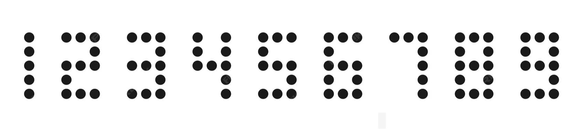

# First Steps

- Ở bài này chúng ta được bài cung cấp cho một file lgo nhìn cũng khá tường minh rồi nhưng tôi sẽ chuyển nó sang python để có thể nhìn quen thuộc hơn.

``` python
from PIL import Image

img = Image.open("input.png").convert("RGB")
pixels = img.load()

maxx, maxy = 400, 200
sol = []

def get_pixel(x, y):
    if 0 <= x < img.width and 0 <= y < img.height:
        return pixels[x, y]
    return (255, 255, 255)

def dfs(x, y, been):
    # up, right, down, left
    dx = [0, 1, 0, -1]
    dy = [1, 0, -1, 0]

    dir_vec = []
    been.add((x, y))

    a = b = 0

    for i in range(4):
        xx, yy = x + dx[i], y + dy[i]
        pix = get_pixel(xx, yy)
        if pix == (0, 128, 0):   # green
            dir_vec.append(1)
        else:
            dir_vec.append(0)

        if (xx, yy) not in been and pix == (0, 128, 0):
            a2, b2 = dfs(xx, yy, been)
            a += a2
            b += b2

    if dir_vec in ([1,1,1,0], [0,1,1,1], [1,0,1,1], [1,1,0,1]):
        b += 1
    if dir_vec in ([1,1,0,0], [0,1,1,0], [0,0,1,1], [1,0,0,1]):
        a += 1

    return a, b

def g(x, y):
    pix = get_pixel(x, y - 2)
    if pix == (0, 128, 0):
        return 3
    else:
        return 4

def h(x, y):
    pix = get_pixel(x, y - 2)
    if pix == (0, 128, 0):
        return 5
    else:
        return 6

def f(x, y):
    been = set()
    a, b = dfs(x, y, been)

    ret = 10 * a + b
    if ret == 40:
        ret += g(x, y)
    if ret == 41:
        ret += h(x, y)
    return ret

for x in range(maxx + 1):
    for y in range(maxy + 1):
        if get_pixel(x, y) == (0, 0, 0):   # black
            pixels[x, y] = (0, 128, 0)     # convert to green
            sol.append(f(x, y))
            pixels[x, y] = (0, 0, 0)       # reset to black
target = [44, 47, 0, 10, 11, 43, 10, 42, 46, 21, 11, 0, 42]

if sol == target:
    print("Correct!")
else:
    print("Nope!")
```

- Rồi giờ thì ta đọc code có vẻ quen thuộc hơn nhiều rồi.
- Tiếp theo ta cùng phân tích qua code này đang làm gì.
- Đầu tiên là nó mở một tấm ảnh ra, đi qua từng pixel của ảnh.
- Nếu pixel đó là màu đen thì chuyển thành màu xanh và gọi hàm `f` ở ngay pixel đó.
- Đầu tiên hàm `f` sẽ gọi tới hàm `dfs`.
- Hàm `dfs` sẽ đánh dấu pixel được gọi để tránh đi qua 2 lần, sau đó duyệt qua các pixel liền kề theo 4 hướng, nếu pixel được duyệt đó là màu xanh thì gọi dfs lại pixel đó.
- Hàm `dfs` trả về theo 2 biến `a` và `b`, biến `a` được cộng nếu pixel đang xét ở vị trí có 2 pixel xanh liền kề ở vị trí cạnh nhau (ngã 2 nhưng không phải đường thẳng), còn `b` được cộng nếu nó ở vị trí có 3 pixel liền nhau (ngã 3).
- Sau đó biến `ret` trong `f` được cập nhật theo công thức `(10 * a) + b`.
- Nếu `ret == 40` thì gọi hàm `g`, và ret sẽ có 2 trường hợp trả ra là `43` hoặc `44`.
- Nếu `ret == 4` thì gọi hàm `h`, và ret sẽ có 2 trường hợp trả ra là `46` hoặc `47`.
- Ở đây chúng ta đã hoàn thành phân tích bài toán, nhưng làm sao để ta có thể giải được nó, tôi chưa thấy có dấu hiệu nào để có thể dịch ngược lại được cả.
- Thế nên tôi quyết định đọc lại đề bài xem có gọi ý gì không.
- Đề bài nói đến một kiểu vẽ theo turtle, một kiểu vẽ khá đơn giản, các nét được vẽ ra khi chú rùa di chuyển và nó chỉ là các nét thằng, tiếp theo có một thông tin tôi khai thác được là trong flag chỉ có các chữ số `Note: once you figure out the secret "digits", wrap them in FortID{} before submitting.`
- Dựa vào các gọi ý đó từ đề bài tôi liên tưởng đến các chữ số digital.


- Các chữ số đấy như này, nhìn vào tấm ảnh này thì ta có vẻ đã ngờ ngợ ra một điều gì đó.
- Chúng ta có thể liên tưởng các `ngã 2` và `ngã 3` ở trong hàm `dfs` nhưng là các đoạn gấp của các chữ số.
- Từ đó ta có thể liệu kê ra dạng mã hóa của các chữ số như sau.

```
1: a, b = (0, 0). ret = 0
2: a, b = (4, 0). ret = 40 => call g
3: a, b = (2, 1). ret = 21
4: a, b = (1, 1). ret = 11
5: a, b = (4, 0). ret = 40 => call g
6: a, b = (4, 1). ret = 41 => call h
7: a, b = (1, 0). ret = 10
8: a, b = (4, 2). ret = 42
9: a, b = (4, 1). ret = 41 => call h
```
- Giờ đây ta có thể khẳng định suy luận của chúng ta đã đúng nhưng vẫn còn một điều ta chưa giải ra là hàm `g` và `h` xử lý điểm ở pixel đó như nào. Nhưng tại chỉ có 2 x 2 = 4 trường hợp nên tôi quyết định gửi check flag 4 lần.
- Sau khi ghép lại các chữ số theo thứ tự của mảng `target` và check flag thì tôi đã có được flag cho bài này.

<details>
<summary style="cursor: pointer">Flag</summary>

```
FortID{5917427863418}
```
</details>
