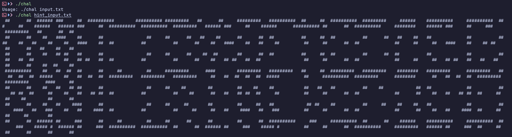
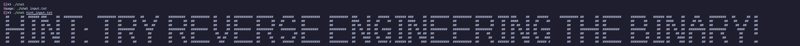

# Skibidi Toilet

- Đầu tiên tôi tiến hành chạy thử để xem file chall cùng với 2 file txt đi kèm để làm gì.


- File yêu cầu sử dụng theo format: `./chal input.txt`.
- Trước tiên tôi sử dụng đối với file `hint_input.txt` và nhận được các ký tự # nhìn qua thì khá rối.


- Tôi đã thử các cách để có thể hiểu được hint từ đề bài và khi tôi thu nhỏ màn hình terminal lại thì tôi đã thấy được các ký tự mà đề bài cung cấp.
- Và sau đó tôi tiến hành thử với file `flag_input.txt` thì thấy màn hình terminal có vẻ bị đơ cứng lại không hề in ra ký tự gì cả.
- Giờ thì tôi tiến hành dùng IDA để đọc code của bài này xem tại sao chúng ta lại có được các ký tự tương ứng của file `hint_input`.

``` C
__int64 __fastcall main(int a1, char **a2, char **a3)
{
  unsigned int v3; // ebx
  __int64 v4; // rax
  __int64 v5; // rax
  _QWORD *v6; // rax
  unsigned int v7; // eax
  __int64 v8; // rax
  __int64 v9; // rax
  int v10; // r12d
  _QWORD *v11; // rax
  _QWORD *v12; // rax
  unsigned int v14; // [rsp+14h] [rbp-40Ch] BYREF
  unsigned __int64 v15; // [rsp+18h] [rbp-408h] BYREF
  unsigned __int64 v16; // [rsp+20h] [rbp-400h]
  __int64 v17; // [rsp+28h] [rbp-3F8h]
  _BYTE v18[32]; // [rsp+30h] [rbp-3F0h] BYREF
  _BYTE v19[32]; // [rsp+50h] [rbp-3D0h] BYREF
  _BYTE v20[400]; // [rsp+70h] [rbp-3B0h] BYREF
  _BYTE v21[256]; // [rsp+200h] [rbp-220h] BYREF
  _QWORD v22[36]; // [rsp+300h] [rbp-120h] BYREF

  v22[33] = __readfsqword(0x28u);
  if ( a1 == 2 )
  {
    std::ifstream::basic_ifstream(v21, a2[1], 8LL);
    if ( (unsigned __int8)std::ios::operator!(v22) )
    {
      perror("open input");
      v3 = 1;
    }
    else
    {
      v6 = (_QWORD *)std::istream::operator>>(v21, &v14);
      if ( (unsigned __int8)std::ios::operator!((char *)v6 + *(_QWORD *)(*v6 - 24LL)) )
      {
        std::operator<<<std::char_traits<char>>(&std::cerr, "Error: could not read brush size\n");
        v3 = 1;
      }
      else if ( v14 && v14 <= 0x3C )
      {
        v16 = (1LL << v14) - 1;
        std::string::basic_string(v18);
        std::getline<char,std::char_traits<char>,std::allocator<char>>(v21, v18);
        while ( 1 )
        {
          v12 = (_QWORD *)std::getline<char,std::char_traits<char>,std::allocator<char>>(v21, v18);
          if ( !(unsigned __int8)std::ios::operator bool((char *)v12 + *(_QWORD *)(*v12 - 24LL)) )
            break;
          if ( (unsigned __int8)std::string::empty(v18) )
          {
            std::operator<<<std::char_traits<char>>(&std::cout, "\n");
          }
          else
          {
            v7 = sub_2E42(16LL, 8LL);
            std::basic_stringstream<char,std::char_traits<char>,std::allocator<char>>::basic_stringstream(v20, v18, v7);
            while ( 1 )
            {
              v11 = (_QWORD *)std::istream::operator>>(v20, &v15);
              if ( !(unsigned __int8)std::ios::operator bool((char *)v11 + *(_QWORD *)(*v11 - 24LL)) )
                break;
              if ( v16 < v15 )
              {
                v8 = std::operator<<<std::char_traits<char>>(&std::cerr, "Error: k = ");
                v9 = std::ostream::operator<<(v8, v15);
                std::operator<<<std::char_traits<char>>(v9, " is too large\n");
                v3 = 1;
                v10 = 0;
                goto LABEL_19;
              }
              v17 = sub_26DC(v15, v16);
              sub_288B(v19, v17, v14);
              std::operator<<<char>(&std::cout, v19);
              std::string::~string(v19);
            }
            std::operator<<<std::char_traits<char>>(&std::cout, "\n");
            v10 = 1;
LABEL_19:
            std::basic_stringstream<char,std::char_traits<char>,std::allocator<char>>::~basic_stringstream(v20);
            if ( v10 != 1 )
              goto LABEL_22;
          }
        }
        v3 = 0;
LABEL_22:
        std::string::~string(v18);
      }
      else
      {
        std::operator<<<std::char_traits<char>>(&std::cerr, "Error: brush size must be between 1 and 60\n");
        v3 = 1;
      }
    }
    std::ifstream::~ifstream(v21);
  }
  else
  {
    v4 = std::operator<<<std::char_traits<char>>(&std::cerr, "Usage: ");
    v5 = std::operator<<<std::char_traits<char>>(v4, *a2);
    std::operator<<<std::char_traits<char>>(v5, " input.txt\n");
    return 1;
  }
  return v3;
}
```
- Giờ ta cùng phân tích qua xem hàm main xem liệu nó đang làm gì.
- Trước hết chúng ta có thể thấy các thông báo được chương trình in ra như:
    - "open input".
    - "Error: could not read brush size\n".
    - "Error: k = ".
    - " is too large\n".
    - "Error: brush size must be between 1 and 60\n".
    - "Usage: " + ... + " input.txt\n".
- Có lẽ ta cũng không cần chú ý lắm đến các thông báo này vì ta chỉ sử dụng file mà đề bài cung cấp nên có lẽ format cũng đã chuẩn rồi.

``` C
std::ifstream::basic_ifstream(v21, a2[1], 8LL);
```
- Đầu tiên chương trình được file input.

``` C
std::istream::operator>>(v21, &v14);
```
- Sau đó chương trình lấy số đầu tiên trong file input và lưu vào v14.
- Điều kiện thoải mãn của v14 ở đây là `v14 && v14 <= 0x3C` (1 <= v14 <= 60).

``` C
v16 = (1LL << v14) - 1;
```
- Sau đó tọa một mask bit gồm v14 bit 1 (v14: 4 => v16: 10000 - 1 = 1111).

``` C
std::getline<char,std::char_traits<char>,std::allocator<char>>(v21, v18);
```
- Sau đó đọc từng dòng trong file ra v18.
- Chuyển v18 (chuỗi dòng hiện tại) thành stringstream v20.

``` C
std::istream::operator>>(v20, &v15);
```
- Tiếp đến là lặp qua từng số trong v20 và gán vào v15.

``` C
v17 = sub_5555555566DC(v15, v16);
sub_55555555688B(v19, v17, v14);
std::operator<<<char>(&std::cout, v19);
std::string::~string(v19);
```
- Tiếp theo dữ liệu được đi qua 2 hàm `sub_5555555566DC` và `sub_55555555688B` để xử lý và rồi gán lại vào v19 để in ra.
- Vậy ở đây 2 hàm `sub_5555555566DC` và `sub_55555555688B` xử lý dữ liệu như nào.
- Tôi tiến hành debug thử và có thể kết luận lại như sau:
    - hàm `sub_5555555566DC` xử lý các số nhập vào qua một thuật toán nào đó để có thể biến đổi lại số đó thành 1 số khác, các số này trong giới hạn `(0, pow(2, v14) - 1)`.
    - hàm `sub_55555555688B` chuyển đổi lại số vừa đc biến đổi thành các ký tự `#` theo binary theo độ dài `v14`. (VD: có v14 = 8 và v17 = 10 -> 00001010, số 0 sẽ được thay thành một ký tự `\x20`, còn 1 thì được thay thành ký tự `#`).
- Từ đó mà chương trình có thể vẽ ra được các ký tự giống như lúc đầu ta thấy.
- Vì 2 hàm này được bị lồng rất nhiều hàm ở bên trong để làm rối code nên dưới đây tôi có một đoạn script python mà tôi dựng lại cách xử lý của hàm `sub_5555555566DC` và `sub_55555555688B` đối với dữ liệu của file `hint_input.txt`.

``` python
def sub_555555556589(container_a1, container_a2, max_range):
    if not container_a2:
        return 1
    best_value = 0
    max_min_distance = 0

    for candidate in range(1, max_range + 1):
        if candidate in container_a1:
            continue

        min_distance = float('inf')
        for existing in container_a2:
            distance = abs(candidate - existing)
            min_distance = min(min_distance, distance)

        if min_distance > max_min_distance:
            max_min_distance = min_distance
            best_value = candidate
    return best_value if best_value > 0 else 1

def sub_5555555566DC(argc, brush_size):
    if argc <= 1:
        return argc

    mask = (1 << brush_size) - 1
    if argc == 2:
        return mask

    container_v9 = set([1, mask])
    container_v8 = set([1, mask])

    v6 = 0
    for _ in range(3, argc + 1):
        v6 = sub_555555556589(container_v9, container_v8, mask)
        container_v9.add(v6)
        container_v8.add(v6)
    return v6

def sub_55555555688B(val, brush_size):
    for row in val:
        for pattern in row:
            print(''.join('#' if (pattern >> (brush_size - 1 - i)) & 1 else ' ' for i in range(brush_size)), end='')
        print()


brush_size = 8
hint_input = [
    [6, 179, 247, 34, 2, 224, 159, 31, 254, 6, 6, 2, 17, 254, 112, 9, 126, 2, 131, 120, 2, 65, 2, 20, 10, 254, 96, 240, 14, 254, 2, 14, 252, 127, 112, 33, 240, 191, 246, 34, 2, 112, 255, 143, 220, 10, 12, 191, 227, 66, 6],
    [6, 176, 17, 34, 34, 0, 129, 66, 66, 10, 224, 224, 230, 0, 112, 204, 1, 192, 198, 152, 3, 129, 0, 40, 152, 195, 18, 248, 230, 0, 224, 34, 34, 152, 120, 198, 10, 66, 34, 34, 224, 1, 65, 66, 40, 10, 236, 6, 177, 34, 6],
    [6, 176, 99, 198, 34, 0, 129, 66, 66, 140, 3, 224, 230, 0, 112, 204, 1, 192, 204, 1, 3, 129, 0, 78, 153, 0, 18, 236, 230, 0, 224, 34, 34, 152, 108, 204, 0, 66, 34, 34, 224, 1, 65, 66, 78, 152, 198, 6, 176, 204, 6],
    [191, 120, 198, 230, 34, 18, 129, 131, 254, 135, 0, 2, 17, 252, 112, 9, 124, 2, 135, 124, 2, 129, 255, 153, 153, 80, 18, 230, 14, 252, 2, 17, 252, 152, 102, 102, 248, 66, 135, 254, 2, 192, 255, 66, 153, 153, 255, 191, 224, 248, 6],
    [6, 176, 198, 46, 34, 0, 129, 66, 18, 66, 0, 56, 34, 0, 177, 18, 1, 195, 0, 140, 3, 129, 0, 152, 54, 66, 18, 227, 230, 0, 224, 34, 10, 152, 99, 204, 10, 66, 34, 34, 224, 1, 192, 195, 152, 54, 66, 176, 3, 6, 6],
    [6, 176, 198, 40, 34, 0, 129, 66, 34, 66, 0, 112, 198, 0, 78, 18, 1, 65, 34, 152, 3, 129, 0, 10, 124, 199, 18, 56, 230, 0, 224, 34, 18, 152, 33, 198, 12, 66, 34, 34, 224, 1, 192, 195, 10, 62, 66, 6, 224, 6],
    [6, 179, 246, 36, 34, 18, 129, 66, 66, 66, 0, 224, 14, 254, 36, 143, 126, 192, 33, 120, 2, 65, 2, 10, 12, 253, 96, 112, 14, 254, 2, 230, 34, 127, 65, 33, 232, 66, 34, 34, 2, 112, 2, 143, 216, 185, 66, 6, 6, 6, 6],
]

results_data = []
for line in hint_input:
    results_data.append(sub_5555555566DC(num, brush_size) for num in line)
sub_55555555688B(results_data, brush_size)
```
- Rồi giờ thì code đã khá tường minh rồi và tôi đã test thì kết quả được in ra là như mong đợi.
- Nhưng vấn đề ở đây là brush_size của file hint chỉ là 8 còn với file flag là tận 60 nên với thuật toán này thì ta không thể giải quyết việc in ra flag được thì vấn đề thời gian là rất rất lớn.
- Vì thế ở đây ta cần một thuật toán nào đó tối ưu hơn để có thể giải được bài này.
- Tuy ở đây tôi cũng chưa tìm được thuật toán nào có thể giải chính xác các con số lớn nhưng tôi đã có cho mình 2 script khá tối ưu và giải ra được một đoạn flag đã đẹp.

``` python
# Script flag 1

def solve_main(argc, brush_size):
    if argc <= 1:
        return argc
    
    mask = (1 << brush_size) - 1
    if argc == 2:
        return mask
    
    j = argc - 2
    m = j.bit_length()
    t = j - (1 << (m - 1))
    
    if m <= brush_size:
        val = (2 * t + 1) << (brush_size - m)
    else:
        val = (2 * t + 1) >> (m - brush_size)
    return val & mask

def sub_55555555688B(val, brush_size):
    for row in val:
        for pattern in row:
            print(''.join('#' if (pattern >> (brush_size - 1 - i)) & 1 else ' ' for i in range(brush_size)), end='')
        print()


brush_size = 60
flag_input = [
    [54025603343196096, 640065713366106880, 54043196064792684, 1154610357701165056, 36030962187370528, 1139094314385440, 291621270414426594, 68721542130, 864154695629799487, 1152929776726958080, 2100],
    [99079191803726946, 685405175251730432, 864691128857788620, 48481590937114, 72064295901331554, 2278188498747490, 291621272025039714, 68722673178, 24826704522379266, 96758737667682, 4194],
    [198175853282990274, 686236408861418303, 919156536853382848, 202644391259749570, 72070791653688834, 1294784894546477440, 291622223905523298, 144128382268996672, 18120790167715842, 808283879726134271, 1166643409721491456],
    [216058654098462914, 685669064082207584, 114894567106809048, 1154610354971325190, 576530875590127864, 871446531168149248, 291622232493444194, 288247901705342146, 583243010728263743, 1168714228417422092, 5730],
    [198184990929852610, 612493120638818736, 919156536854472384, 198580596119948482, 576461197261168652, 871446534389367168, 291622095054491642, 2251800619831290, 18437451928403970, 73750621854369378, 22916],
    [99092495464926306, 685405181291803489, 919719486807893708, 198580596119804100, 576514367211094796, 880453733644132736, 289946439333757026, 288243782999474370, 18437442466054146, 73748200029783650, 5634],
    [49543962809573312, 685101713289110334, 56253211778088044, 1153994610977260022, 1296508385424015864, 20099064067266812, 1263226164613316803, 216106744813845568, 18440944340803578, 73747478433299554, 5730],
    [0, 10, 2050, 0, 0, 0, 0, 0, 0, 0, 4098],
    [0, 36, 1088, 0, 0, 0, 0, 0, 0, 0, 2052],
]

results_data = []
for line in flag_input:
    results_data.append(solve_main(num, brush_size) for num in line)
sub_55555555688B(results_data, brush_size)
```

``` python
# Script flag 2

def kth_point(n, left, right):
    if n == 1:
        return left
    if n == 2:
        return right

    mid = (left + right) // 2
    if n == 3:
        return mid

    path = bin(n)[3:]
    node_left, node_right = left, right
    node_mid = mid

    for c in path:
        if c == '0':
            node_right = node_mid
        else:
            node_left = node_mid
        node_mid = (node_left + node_right) // 2
    return node_mid

def solve_main(argc, brush_size):
    mask = (1 << brush_size) - 1
    return kth_point(argc, 1, mask)

def sub_55555555688B(val, brush_size):
    for row in val:
        for pattern in row:
            print(''.join('#' if (pattern >> (brush_size - 1 - i)) & 1 else ' ' for i in range(brush_size)), end='')
        print()


brush_size = 60
flag_input = [
    [54025603343196096, 640065713366106880, 54043196064792684, 1154610357701165056, 36030962187370528, 1139094314385440, 291621270414426594, 68721542130, 864154695629799487, 1152929776726958080, 2100],
    [99079191803726946, 685405175251730432, 864691128857788620, 48481590937114, 72064295901331554, 2278188498747490, 291621272025039714, 68722673178, 24826704522379266, 96758737667682, 4194],
    [198175853282990274, 686236408861418303, 919156536853382848, 202644391259749570, 72070791653688834, 1294784894546477440, 291622223905523298, 144128382268996672, 18120790167715842, 808283879726134271, 1166643409721491456],
    [216058654098462914, 685669064082207584, 114894567106809048, 1154610354971325190, 576530875590127864, 871446531168149248, 291622232493444194, 288247901705342146, 583243010728263743, 1168714228417422092, 5730],
    [198184990929852610, 612493120638818736, 919156536854472384, 198580596119948482, 576461197261168652, 871446534389367168, 291622095054491642, 2251800619831290, 18437451928403970, 73750621854369378, 22916],
    [99092495464926306, 685405181291803489, 919719486807893708, 198580596119804100, 576514367211094796, 880453733644132736, 289946439333757026, 288243782999474370, 18437442466054146, 73748200029783650, 5634],
    [49543962809573312, 685101713289110334, 56253211778088044, 1153994610977260022, 1296508385424015864, 20099064067266812, 1263226164613316803, 216106744813845568, 18440944340803578, 73747478433299554, 5730],
    [0, 10, 2050, 0, 0, 0, 0, 0, 0, 0, 4098],
    [0, 36, 1088, 0, 0, 0, 0, 0, 0, 0, 2052],
]

results_data = []
for line in flag_input:
    results_data.append(solve_main(num, brush_size) for num in line)
sub_55555555688B(results_data, brush_size)
```
- Sử dụng cùng lúc 2 script để in ra các flag "gần đúng" và thêm một chút phán đoán thì tôi đã có được flag cho bài này.

<details>
<summary style="cursor: pointer">Flag</summary>

```
FortID{Sk1bidy_Toil3t_Y0u_S0lv3d_7h3_Ur1n4l_S3lec710n_Pr0bl3m!}
```
</details>