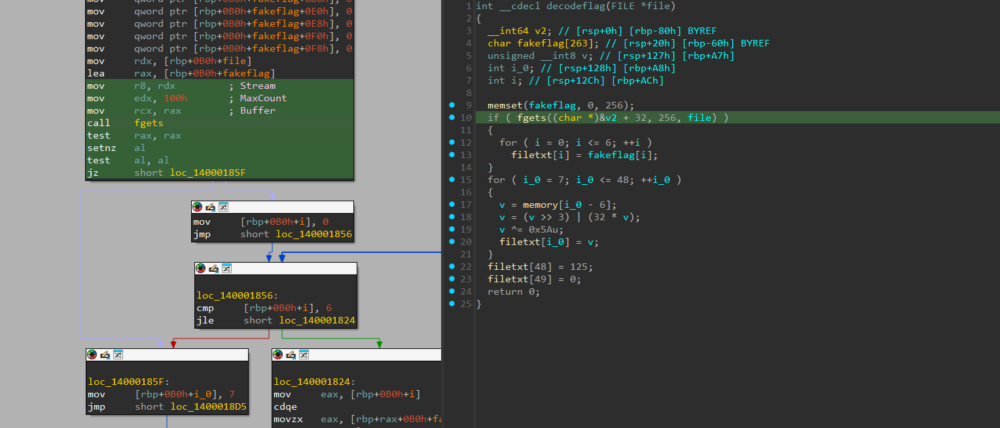

# I_HATE_DEBUGGING

- Đầu tiên tôi mở IDA để check code của bài này.


- Hàm main này khá là clean, theo mạch chính ta biết sẽ có một đoạn check xem ta có đang debug không, nếu có thì sẽ dừng chương trình luôn nhưng ở đây ta có thể bỏ qua được đoạn này nên cũng không cần để ý đến nó lắm.
- Điều ta cần chú ý chính là hàm `decodeflag`.
- Ta cùng phân tích xem nó đang làm gì.


- Phân tích qua thì ta sẽ biết được hàm này lấy 7 ký tự đầu trong fakeflag để gán vào mảng `filetxt`, 7 ký tự này tương ứng `fwectf{`.
``` C
{
    v = memory[i_0 - 6];
    v = (v >> 3) | (32 * v);
    v ^= 0x5Au;
    filetxt[i_0] = v;
}
```
- Tiếp đến là lấy các giá trị trong mảng `memory` ra, đi qua 1 lần shift xong xor với 0x5A và gán vào mảng `filetxt`.
- Hàm này khá tường mình, không có gì rắc rối cả.
- Ta cùng tiến hành debug để xem kết quả cuối cùng của nó sẽ là gì.


- Ở đoạn này ta có thể đổi RIP để nhảy trực tiếp qua phần check debug và hook.
- Giờ thì ta chỉ cần đi vào hàm `decodeflag` và chạy đến cuối để xem flag là gì.


- Chạy đến cuối thì ta đã có được flag, cùng in ra xem nó là gì.

``` python
filetxt = bytearray([
    0x66, 0x77, 0x65, 0x63, 0x74, 0x66, 0x7B, 0x03,
    0x6D, 0x6C, 0x2A, 0x6F, 0x03, 0x18, 0x44, 0x65,
    0x86, 0x6A, 0x78, 0x6C, 0x7F, 0x6A, 0x70, 0x64,
    0x7F, 0x67, 0x70, 0x4C, 0x70, 0x78, 0x7F, 0x67,
    0x44, 0x75, 0x46, 0x3E, 0x30, 0x21, 0x6D, 0x5F,
    0x48, 0x30, 0x37, 0x56, 0x49, 0x30, 0x21, 0x6A,
    0x7D
])

print(filetxt)

# bytearray(b'fwectf{\x03ml*o\x03\x18De\x86jxl\x7fjpd\x7fgpLpx\x7fgDuF>0!m_H07VI0!j}')
```
- Nhìn qua thì ta thấy ta mới chỉ tìm được 1 vài ký tự trong flag thôi, tại sao lại thế.


- Sau đó tôi đã kiểm tra lại xem liệu mảng `filetxt` có đang được sử dụng ở đâu không thì thấy có một hàm khác cũng gọi đến `filetxt`.
- Cùng xem nó đang làm gì.


- Như trên ảnh, tuy ở mã Pseudocode rất ít nhưng mà bên asm thì lại rất nhiều nhánh code.
- Chương trình chắc chắn đang chặn không cho IDA thấy được phần quan trọng của hàm này.
- Ta cùng phân tích xem hàm này đang làm gì mà IDA lại không thể dịch được.


- Đầu tiên nó chạy một hàm check debug, nếu đang debug thì sẽ sleep 1s và return luôn.


- Còn nếu không debug thì sẽ nhảy luôn vào phần như trên ảnh.


- Nhìn lại thì ta thấy được ở phần này, ta có thể thấy khi cmp 1 với 1 thì sẽ luôn nhảy sang phần `originaldebug()`, đây chỉnh là lý do tại sao IDA không thể dịch được toàn bộ sang Pseudocode.
- Giờ tôi tiến hành đổi hex code của `jnz` thành `jz` để chương trình sẽ luôn nhảy vào phần còn lại của hàm.


- Ở đây tôi đã sửa lại thành `jz` và đã thấy được thấy được phần còn lại của hàm này

``` C
for ( i = 0; i <= 49; ++i )
    memory[i] = filetxt[i];
for ( i_0 = 35; i_0 <= 47; ++i_0 )
{
    if ( i_0 % 3 )
    LOBYTE(v8) = (LOBYTE(filetxt[i_0]) ^ 0xD) + 4;
    else
    v8 = filetxt[i_0];
    memory[i_0] = v8;
}
for ( i_1 = 7; i_1 <= 13; ++i_1 )
    memory[i_1] = LOBYTE(filetxt[i_1]) ^ 0x5C;
for ( i_2 = 14; i_2 <= 34; ++i_2 )
{
    if ( (i_2 & 1) != 0 )
    memory[i_2] = filetxt[i_2] - 3;
    else
    memory[i_2] = filetxt[i_2] - 17;
}
for ( i_3 = 49; i_3 > 6; --i_3 )
    memory[i_3 + 1] = memory[i_3];
memory[7] = 73;
return originaldebug();
```

- Phân tích qua thì tôi thấy hàm này cũng không quá khó để dịch ngược, hoàn toàn có thể chuyển ngay sang code python.
- Giờ thì tôi sẽ hoàn thành nốt phần còn lại của mã hóa flag trong script python.
- Dưới đây sẽ là script python của tôi.

``` python
filetxt = bytearray([
    0x66, 0x77, 0x65, 0x63, 0x74, 0x66, 0x7B, 0x03,
    0x6D, 0x6C, 0x2A, 0x6F, 0x03, 0x18, 0x44, 0x65,
    0x86, 0x6A, 0x78, 0x6C, 0x7F, 0x6A, 0x70, 0x64,
    0x7F, 0x67, 0x70, 0x4C, 0x70, 0x78, 0x7F, 0x67,
    0x44, 0x75, 0x46, 0x3E, 0x30, 0x21, 0x6D, 0x5F,
    0x48, 0x30, 0x37, 0x56, 0x49, 0x30, 0x21, 0x6A,
    0x7D
])

memory = bytearray(100)
for i in range(49):
    memory[i] = filetxt[i]
for i in range(35, 48):
    if ( i % 3 ):
        v8 = (filetxt[i] ^ 0xD) + 4
    else:
        v8 = filetxt[i]
    memory[i] = v8
for i in range(7, 14):
    memory[i] = (filetxt[i] ^ 0x5C)
for i in range(14, 35):
    if ( (i & 1) != 0 ):
        memory[i] = filetxt[i] - 3
    else:
        memory[i] = filetxt[i] - 17
for i in range(48, 6, -1):
    memory[i + 1] = memory[i]
memory[7] = 73

print(memory.decode())
```
- Đây là đoạn script python sau khi thêm phần xử lý của hàm `newopen()`.
- Sau khi chạy thì tôi đã có được flag chính thức của bài này.

<details>
<summary style="cursor: pointer">Flag</summary>

```
fwectf{I_10v3_D3bugging_and_I_und3r5700d_IA7_H00k}
```
</details>