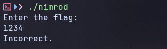
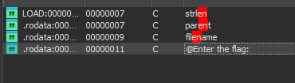
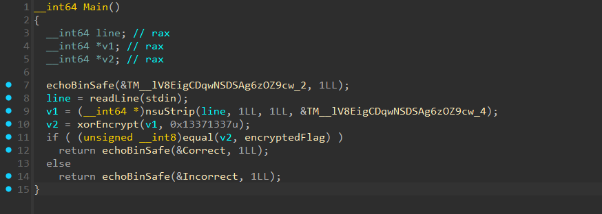

# nimrod

- Đầu tiên tôi chạy thử file để xem nó hoạt động như nào.


- Khi tôi nhập tạm một input thay cho flag thì nó sẽ báo sai.
- Tiếp đến tôi mở IDA để xem code của chương trình.
- Tìm kiểm thử xem liệu có string `Enter the flag:` không.


- Tuyệt vời, nó đây rồi.
- Nhưng khi tôi mở ra thì nó chỉ trỏ tới địa chỉ chứ không phải biến cố định.
- Vậy nên tôi thử debug và xem liệu ở đâu sẽ gọi đến nó.


- Sau một lúc debug thì tôi đến được hàm này, khả năng nó sẽ là hàm xử lý chính của chương trình.
- Đầu tiên là đọc input vào `v1`.
- Sau đó đi qua một hàm `xorEncrypt` và gán kết quả vào `v2`.
- Cuối cùng là so sánh `v2` với `encryptedFlag`.
- Bên trong hàm `xorEncrypt` còn phụ thuộc vào cả hàm `keystream` ở bên trong nó nữa.
- Từ đó tôi sẽ viết một đoạn script python để tái tạo lại hàm `xorEncrypt` và `keystream`, sau đó cho `encryptedFlag` để decode xor và ta sẽ có được flag.
- Dưới đây là script python của tôi.

``` python
def keystream(seed, length):
    result = bytearray()
    for _ in range(length):
        seed = (1664525 * seed + 1013904223) & 0xFFFFFFFFFFFFFFFF
        result.append((seed >> 16) & 0xFF)
    return bytes(result)

def xorEncrypt(data, seed):
    ks = keystream(seed, len(data))
    return bytes([b ^ k for b, k in zip(data, ks)])


encryptedFlag = bytearray([
    0x28, 0xF8, 0x3E, 0xE6, 0x3E, 0x2F, 0x43, 0x0C,
    0xB9, 0x96, 0xD1, 0x5C, 0xD6, 0xBF, 0x36, 0xD8,
    0x20, 0x79, 0x0E, 0x8E, 0x52, 0x21, 0xB2, 0x50,
    0xE3, 0x98, 0xB5, 0xC9, 0xB8, 0xA0, 0x88, 0x30,
    0xD9, 0x0A
])
seed = 0x13371337

cipher = xorEncrypt(encryptedFlag, seed)
print(cipher.decode('UTF-8', errors='ignore'))
```
- Sau khi chạy script thì tôi đã có được flag cho bài này.

<details>
<summary style="cursor: pointer">Flag</summary>

```
ictf{a_mighty_hunter_bfc16cce9dc8}
```
</details>
