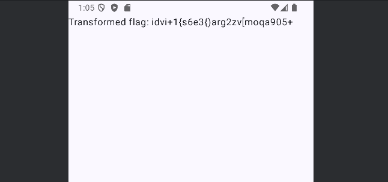
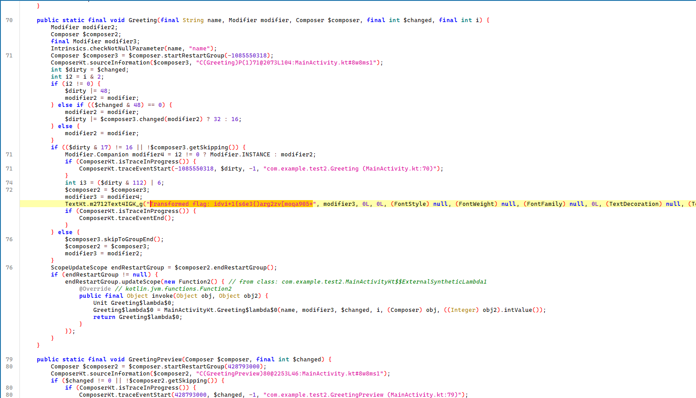

# weird-app

- Tôi mở file apk của chall trong giả lập android để xem chương trình sẽ làm những gì.


- App apk này khi mở lên chỉ hiển thị một dòng ký tự kỳ lạ chứ không có tương tác gì cả.
- Tiếp đến tôi dùng JADX để xem code file apk của chall này.
- Tìm kiếm ký tự `Transformed flag: idvi+1{s6e3{)arg2zv[moqa905+` xem nó có xuất hiện ở đâu không.


- Sau khi tìm kiếm thì tôi được dẫn đến file này.
- Thì ra đây chỉ là một dòng được in cố định.
- Tôi tiếp tục phân tích qua để hiểu hơn về file này.

``` Java
public static final String transformFlag(String flag) {
    Intrinsics.checkNotNullParameter(flag, "flag");
    String res = "";
    int length = flag.length();
    for (int i = 0; i < length; i++) {
        int length2 = "abcdefghijklmnopqrstuvwxyz".length();
        for (int c = 0; c < length2; c++) {
            if ("abcdefghijklmnopqrstuvwxyz".charAt(c) == flag.charAt(i)) {
                int ind = c + i;
                res = res + "abcdefghijklmnopqrstuvwxyz".charAt(ind % "abcdefghijklmnopqrstuvwxyz".length());
            }
        }
        int length3 = "0123456789".length();
        for (int c2 = 0; c2 < length3; c2++) {
            if ("0123456789".charAt(c2) == flag.charAt(i)) {
                int ind2 = (i * 2) + c2;
                res = res + "0123456789".charAt(ind2 % "0123456789".length());
            }
        }
        int length4 = "!@#$%^&*()_+{}[]|".length();
        for (int c3 = 0; c3 < length4; c3++) {
            if ("!@#$%^&*()_+{}[]|".charAt(c3) == flag.charAt(i)) {
                int ind3 = (i * i) + c3;
                res = res + "!@#$%^&*()_+{}[]|".charAt(ind3 % "!@#$%^&*()_+{}[]|".length());
            }
        }
    }
    return res;
}
```
- Tôi tìm được một hàm, có lẽ nó dùng để mã hóa flag theo từng nhóm (ký tự, chữ số, ký hiệu).
- Nghi ngờ là flag được mã hóa bởi hàm này nên tôi tiến hành decode ngược lại.
- Sau đây là script python decode của tôi.

``` python
alphabet = "abcdefghijklmnopqrstuvwxyz"
digits   = "0123456789"
symbols  = "!@#$%^&*()_+{}[]|"

cipher = "idvi+1{s6e3{)arg2zv[moqa905+"
flag = ""

for i, ch in enumerate(cipher):
    if ch in alphabet:
        ind = alphabet.index(ch)
        flag += alphabet[(ind - i) % 26]
    elif ch in digits:
        ind = digits.index(ch)
        flag += digits[(ind - 2*i) % 10]
    elif ch in symbols:
        ind = symbols.index(ch)
        flag += symbols[(ind - i*i) % len(symbols)]

print(res)
```
- Tôi chạy script và đã có flag cho bài này.

<details>
<summary style="cursor: pointer">Flag</summary>

```
ictf{1_l0v3_@ndr0id_stud103}
```
</details>