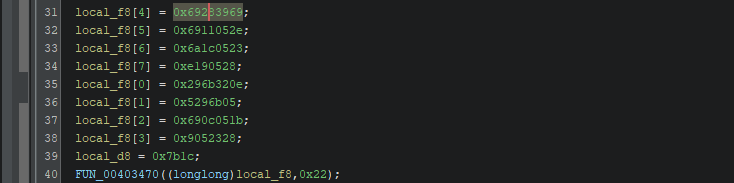

# AntiChatGPT


- Ở bài này mình sẽ dùng Ghidra để xong code của chương trình.


- Trong hàm `FUN_00401020` khá là rối, sau khi phân tích nhanh qua thì mình nhận thấy hàm `FUN_00402240` chính là hàm main của chương trình này.


- Hàm `FUN_00402240` cũng có khá nhiều các hàm rác để làm rối.


- Sau khi tìm một lúc thì mình đã thấy được hàm `FUN_00402ff0` chính là hàm xử lý logic chính của bài này.


- Trước hết, hàm `FUN_00402ff0` đang chuẩn bị các dữ liệu ban đầu cho mảng `local_f8`.
- Hàm `FUN_00403470` thực chất là đang xor từng ký tự với `0x5A`.
- Mình tiến hành viết một đoạn script python để xem liệu sau khi xử lý thì `local_f8` sẽ là gì.
    ``` python
    local_f8 = [
        0x296b320e,
        0x05296b05,
        0x690c051b,
        0x09052328,
        0x69283969,
        0x6911052e,
        0x6a1c0523,
        0x0e190528
    ]

    raw = b''.join(x.to_bytes(4, 'little') for x in local_f8)
    raw += (0x7b1c).to_bytes(2, 'little')

    decoded = bytes([b ^ 0x5A for b in raw])
    print(decoded.decode('utf-8', errors='replace'))

    # Th1s_1s_A_V3ry_S3cr3t_K3y_F0r_CTF!
    ```


- Tiếp đến, hàm `FUN_00402ff0` chuẩn bị mảng `local_88`.
- Mảng `local_88` được đi qua hàm `FUN_00403440` xor với `0x5A` và được in ra.
- Đây là đoạn code python tường minh hơn của đoạn xử lý `local_88` này.
    ``` python
    local_88 = [
        31, 52, 46, 63, 40, 122, 46, 50,
        63, 122, 51, 52, 57, 59, 52, 46,
        59, 46, 51, 53, 52, 122, 114, 60,
        54, 59, 61, 115, 96, 122
    ]
    print(''.join(chr(i ^ 0x5A) for i in local_88))

    # Enter the incantation (flag):
    ```

- Tiếp đến hàm sẽ xử lý dữ liệu nhập vào.


- Ở đoạn này chương trình kiểm tra đọc dữ liệu thất bại không.
- Nếu đúng thì in ra một đoạn text.
    ``` python
    local_118 = [
        0x36333b1c, 0x2e7a3e3f, 0x3b3f287a35,
        0x337a3e, 0x2e343b3934, 0x507b3435332e3b
    ]
    for val in local_118:
        for b in val.to_bytes(len(hex(val)[2:]) // 2, 'little'):
            print(chr(b ^ 0x5A), end="")
    
    # Failed to read incantation!
    ```


- Nếu đã đọc được dữ liệu nhập vào thì sẽ xử lý ở phần này.
- Đổi ký tự `\n` ở cuối thành `\0`, đảm bảo độ dài là bội của 8 và không vượt quá 0x40.


- Và đây là đoạn xử lý cuối cùng.
- Đưa input qua hàm `FUN_00401e20` để xử lý, sau đó so sánh với mảng `DAT_00412330` có sẵn.
- Nếu đúng thì in ra `INCREDIBLE!` hoặc không thì in ra `THE CURSE HOLDS STRONG`.
- Mình tiến hành viết một đoạn script mô phỏng lại các hàm và mảng của chương trình để từ đó sẽ giải ngược ra lại flag.

``` python
DAT_004120f0 = [
    0x63,0x7C,0x77,0x7B,0xF2,0x6B,0x6F,0xC5,0x30,0x01,0x67,0x2B,0xFE,0xD7,0xAB,0x76,
    0xCA,0x82,0xC9,0x7D,0xFA,0x59,0x47,0xF0,0xAD,0xD4,0xA2,0xAF,0x9C,0xA4,0x72,0xC0,
    0xB7,0xFD,0x93,0x26,0x36,0x3F,0xF7,0xCC,0x34,0xA5,0xE5,0xF1,0x71,0xD8,0x31,0x15,
    0x04,0xC7,0x23,0xC3,0x18,0x96,0x05,0x9A,0x07,0x12,0x80,0xE2,0xEB,0x27,0xB2,0x75,
    0x09,0x83,0x2C,0x1A,0x1B,0x6E,0x5A,0xA0,0x52,0x3B,0xD6,0xB3,0x29,0xE3,0x2F,0x84,
    0x53,0xD1,0x00,0xED,0x20,0xFC,0xB1,0x5B,0x6A,0xCB,0xBE,0x39,0x4A,0x4C,0x58,0xCF,
    0xD0,0xEF,0xAA,0xFB,0x43,0x4D,0x33,0x85,0x45,0xF9,0x02,0x7F,0x50,0x3C,0x9F,0xA8,
    0x51,0xA3,0x40,0x8F,0x92,0x9D,0x38,0xF5,0xBC,0xB6,0xDA,0x21,0x10,0xFF,0xF3,0xD2,
    0xCD,0x0C,0x13,0xEC,0x5F,0x97,0x44,0x17,0xC4,0xA7,0x7E,0x3D,0x64,0x5D,0x19,0x73,
    0x60,0x81,0x4F,0xDC,0x22,0x2A,0x90,0x88,0x46,0xEE,0xB8,0x14,0xDE,0x5E,0x0B,0xDB,
    0xE0,0x32,0x3A,0x0A,0x49,0x06,0x24,0x5C,0xC2,0xD3,0xAC,0x62,0x91,0x95,0xE4,0x79,
    0xE7,0xC8,0x37,0x6D,0x8D,0xD5,0x4E,0xA9,0x6C,0x56,0xF4,0xEA,0x65,0x7A,0xAE,0x08,
    0xBA,0x78,0x25,0x2E,0x1C,0xA6,0xB4,0xC6,0xE8,0xDD,0x74,0x1F,0x4B,0xBD,0x8B,0x8A,
    0x70,0x3E,0xB5,0x66,0x48,0x03,0xF6,0x0E,0x61,0x35,0x57,0xB9,0x86,0xC1,0x1D,0x9E,
    0xE1,0xF8,0x98,0x11,0x69,0xD9,0x8E,0x94,0x9B,0x1E,0x87,0xE9,0xCE,0x55,0x28,0xDF,
    0x8C,0xA1,0x89,0x0D,0xBF,0xE6,0x42,0x68,0x41,0x99,0x2D,0x0F,0xB0,0x54,0xBB,0x16
]
DAT_00412330 = [
    0x40, 0x32, 0xC4, 0xDA, 0x67, 0xA9, 0x1C, 0x97,
    0x69, 0xA1, 0xD8, 0xBE, 0x1F, 0xEE, 0xE9, 0xA1,
    0xF5, 0x28, 0x54, 0x09, 0x55, 0x5D, 0xC5, 0x7D,
    0xCD, 0x26, 0x6B, 0x36, 0x22, 0x15, 0x0C, 0xE2,
    0x5E, 0x5E, 0xBE, 0xA5, 0xFF, 0x4A, 0x24, 0x34,
    0x05, 0xF5, 0x7D, 0xDD, 0xBA, 0x9F, 0x62, 0xEB
]

def FUN_00401d10(key):
    p = [int.from_bytes(key[i * 4:(i + 1) * 4], "little") for i in range(4)]
    out = [0] * 8

    u5 = p[3]
    u4 = ((u5 << 11) | (u5 >> 21)) ^ p[0]
    u1 = p[1]
    u2 = p[2] ^ ((u1 + u4) & 0xFFFFFFFF)
    u5 = ((u2 ^ 99) + u5) & 0xFFFFFFFF
    out[0] = u4 & 0xFFFFFFFF

    u3 = (((u5 * 0x800) & 0xFFFFFFFF) | (u5 >> 21)) ^ u4
    u1 = (u1 + u4 + u3) & 0xFFFFFFFF
    u2 = (u2 ^ u1) & 0xFFFFFFFF
    u5 = ((u2 ^ 0x1F) + u5) & 0xFFFFFFFF
    out[1] = u1

    u3 = (((u5 * 0x800) & 0xFFFFFFFF) | (u5 >> 21)) ^ u3
    u1 = (u1 + u3) & 0xFFFFFFFF
    u2 = (u2 ^ u1) & 0xFFFFFFFF
    u4 = (u2 ^ 0x68) & 0xFFFFFFFF
    u5 = (u5 + u4) & 0xFFFFFFFF
    out[2] = u4

    u3 = (((u5 * 0x800) & 0xFFFFFFFF) | (u5 >> 21)) ^ u3
    u1 = (u1 + u3) & 0xFFFFFFFF
    u2 = (u2 ^ u1) & 0xFFFFFFFF
    u5 = ((u2 ^ 0x13) + u5) & 0xFFFFFFFF
    out[3] = u5

    u3 = (((u5 * 0x800) & 0xFFFFFFFF) | (u5 >> 21)) ^ u3
    u1 = (u1 + u3) & 0xFFFFFFFF
    u2 = (u2 ^ u1) & 0xFFFFFFFF
    u5 = ((u2 ^ 0xE1) + u5) & 0xFFFFFFFF
    out[4] = u3 & 0xFFFFFFFF

    u3 = (((u5 * 0x800) & 0xFFFFFFFF) | (u5 >> 21)) ^ u3
    u1 = (u1 + u3) & 0xFFFFFFFF
    u2 = (u2 ^ u1) & 0xFFFFFFFF
    u5 = ((u2 ^ 0x8A) + u5) & 0xFFFFFFFF
    out[5] = u1

    u3 = (((u5 * 0x800) & 0xFFFFFFFF) | (u5 >> 21)) ^ u3
    u1 = (u1 + u3) & 0xFFFFFFFF
    u2 = (u2 ^ u1) & 0xFFFFFFFF
    u4 = (u2 ^ 0xE5) & 0xFFFFFFFF
    u5 = (u5 + u4) & 0xFFFFFFFF
    out[6] = u4

    out[7] = ((((u5 * 0x800) & 0xFFFFFFFF) | (u5 >> 21)) ^ u3)
    out[7] = ((out[7] + u1) ^ u2 ^ 0x20) + u5
    out[7] &= 0xFFFFFFFF

    return out

def rol32(x, r):
    x &= 0xFFFFFFFF
    return ((x << r) | (x >> (32 - r))) & 0xFFFFFFFF

def FUN_00401cb0(x, k):
    t = x ^ k
    b = [0] * 4
    for i in range(4):
        b[i] = DAT_004120f0[(t >> (i * 8)) & 0xFF]
    u = b[0] | (b[1] << 8) | (b[2] << 16) | (b[3] << 24)
    return (rol32(u, 13) + 0x9E3779B9) & 0xFFFFFFFF

def FUN_00401e20(block8, subkeys):
    L = int.from_bytes(block8[:4], 'little')
    R = int.from_bytes(block8[4:], 'little')
    R ^= FUN_00401cb0(L, subkeys[7])
    for i in range(6, -1, -1):
        L, R = R, L ^ FUN_00401cb0(R, subkeys[i])
    return (L.to_bytes(4, 'little') + R.to_bytes(4, 'little')).decode('utf-8')


key = b"Th1s_1s_A_V3ry_S3cr3t_K3y_F0r_CTF!"
subkeys = FUN_00401d10(key)
flag = ""
for i in range(0, len(DAT_00412330), 8):
    flag += FUN_00401e20(DAT_00412330[i:i + 8], subkeys)
print(flag)
```
- Và sau khi giải xong ta đã có được flag cho bài này.

<details>
<summary style="cursor: pointer">Flag</summary>

```
PTITCTF{k1ng_0f_Pt1t_NigM4o_z3ro_d4Y_zxo}
```
</details>