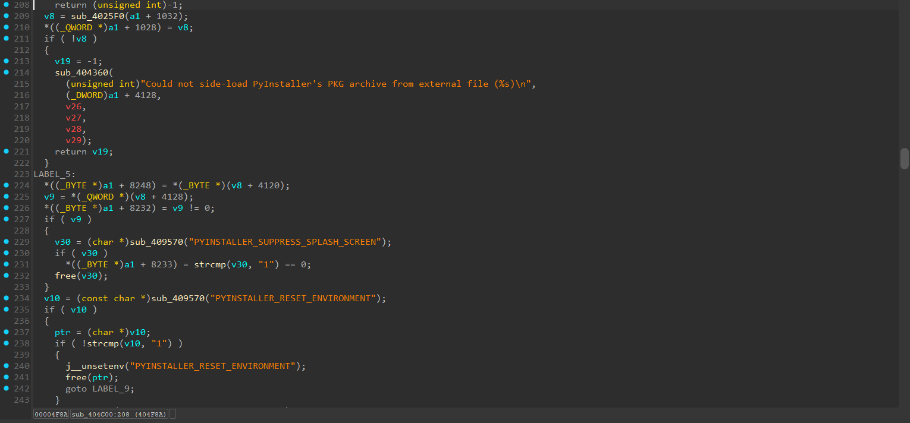
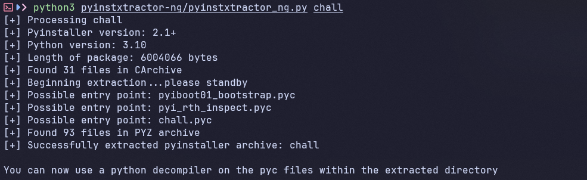
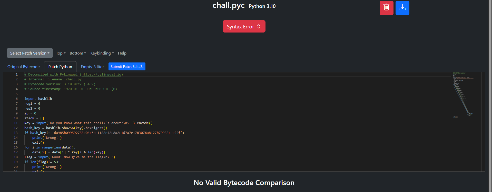
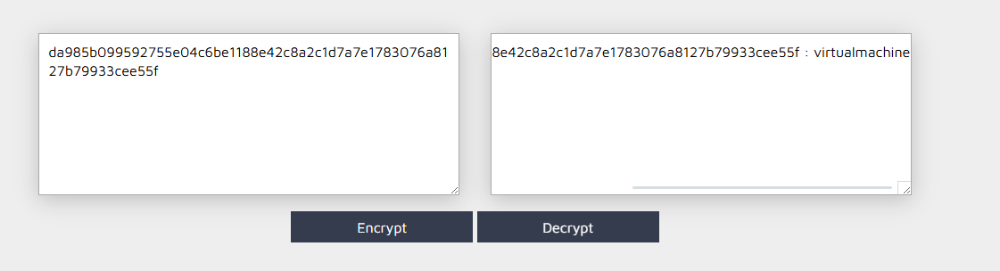
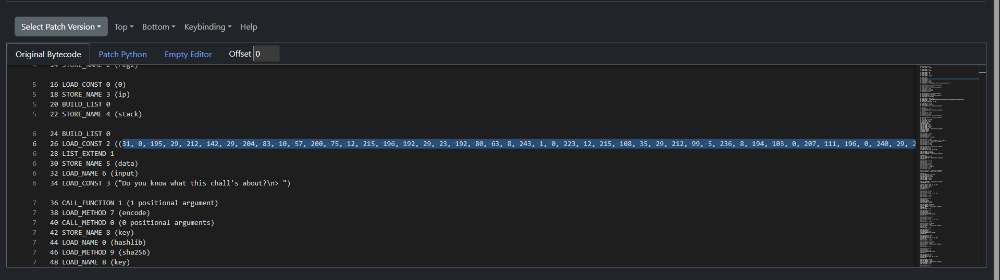

# Baby VM


- Mình tiến hành mở file bằng IDA để xem chương trình hoạt động như nào.


- Nghiên cứu code một hồi thì mình thấy chương trình này đang chuẩn bị môi trường cho python, vậy thì đây đích thị là file được build từ python qua pyinstaller rồi.
- Mình sử dụnng `pyinstxtractor-ng` để có thể chuyển từ file elf này sang file pyc.


- Vậy là mình đã thành công có được file pyc của bài này.
- Tiếp theo mình sẽ dùng `pylingual` để dịch từ file pyc này sang code python.


- Thế là ta đã có được code python của bài này.
- Cùng phân tích đoạn code này.
- Dưới đây là đoạn code mình đã clean lại.

``` python
import hashlib
reg1 = 0
reg2 = 0
ip = 0
stack = []

# Key validation
key = input("Do you know what this chall's about?\n> ").encode()
hash_key = hashlib.sha256(key).hexdigest()
if hash_key != 'da985b099592755e04c6be1188e42c8a2c1d7a7e1783076a8127b79933cee55f':
    print('Wrong!')
    exit()

# Decrypt data
for i in range(len(data)):
    data[i] ^= key[i % len(key)]

# Flag validation
flag = input('Good! Now give me the flag\n> ')
if len(flag) != 53:
    print('Wrong!')
    exit()

# Push flag characters to stack
for char in flag:
    stack.append(ord(char))

# Process instructions
check = True
while ip < len(data):
    match data[ip]:
        case 161: 
            val = data[ip + 1]
            stack.append(val)
            ip += 2
        case 162: 
            stack.append(reg1)
            ip += 1
        case 163: 
            stack.append(reg2)
            ip += 1
        case 177: 
            reg1 = stack.pop()
            ip += 1
        case 178: 
            reg2 = stack.pop()
            ip += 1
        case 81: 
            reg1 += stack.pop()
            ip += 1
        case 82: 
            reg2 += stack.pop()
            ip += 1
        case 97: 
            reg1 -= stack.pop()
            ip += 1
        case 98: 
            reg2 -= stack.pop()
            ip += 1
        case 113: 
            reg1 ^= stack.pop()
            ip += 1
        case 114: 
            reg2 ^= stack.pop()
            ip += 1
        case 129: 
            reg1 *= stack.pop()
            ip += 1
        case 130: 
            reg2 *= stack.pop()
            ip += 1
        case 144:
            if reg1 != reg2:
                check = False
            ip += 1
        case 105: 
            ip += 1
        case _: 
            ip += 1

# Output result
if check:
    print('Correct!')
else:
    print('Wrong!')
```

- Đầu tiên thì chương trình dùng `sha256` để hash input nhập vào và so sánh nó với đoạn `da985b099592755e04c6be1188e42c8a2c1d7a7e1783076a8127b79933cee55f`.
- Mình sử dụng Sha256 Decrypt trên mạng để xem liệu đoạn hash này có sẵn hay không.


- Và ở đây mình đã có key đầu tiên của bài này.
- Vấn đề ở đây là pylingual không hề có đoạn `data` nào ở trong code cả.
- Tại sao lại vậy, mình nghi ngờ có gì đó còn ở trong phần bytecode python, mình quay lại pylingual để check kỹ lại.


- Đúng như mình nghi ngờ thì ở đây có một list các số nhưng pylingual không hề dịch sang code python, mình lấy nó vào thêm vào code python của mình.
- Dưới đây sẽ là đoạn code python để giải flag của mình.
- Trước hết ta cần hiểu cách hoạt động của VM như nào.
  - Với các case `[81, 82, 97, 98, 113, 114, 129, 130]` sẽ là các phép tính bình thường và ip sẽ +1.
  - Với các case `[162, 163, 177, 178, 105]` sẽ là các push và pop, ip cũng sẽ +1.
  - Với case `161` thì cũng là push nhưng nó không push thanh ghi và sẽ push giá trị đi theo ngay sau, cùng với đó ip +2.
  - Và cuối cùng là case `144`, nó sẽ kết thúc 1 lần tính toán và return giá trị của reg1 và reg2, nếu 2 thanh ghi khác nhau thì flag sẽ là sai.
- Tức là ở đây, mỗi lần chạy vào case `144` sẽ check xem ký tự ở đấy có thỏa mãn với đề bài hay không.
- Theo mạch logic đó, mình tiến hành viết script python mô phỏng lại các case của VM và cùng với đó là bruteforce các ký tự của flag.

``` python
key = b"virtualmachine"
data = [
    31, 0, 195, 29, 212, 142, 29, 204, 83, 10, 57, 200, 75, 12, 215, 196,
    192, 29, 23, 192, 80, 63, 8, 243, 1, 0, 223, 12, 215, 108, 35, 29,
    212, 99, 5, 236, 8, 194, 103, 0, 207, 111, 196, 0, 240, 29, 212, 115,
    14, 253, 8, 210, 201, 107, 7, 228, 215, 52, 3, 29, 212, 77, 205, 210,
    8, 209, 58, 200, 86, 7, 230, 0, 27, 197, 212, 99, 237, 4, 192, 120,
    1, 56, 207, 237, 31, 200, 232, 198, 7, 192, 181, 63, 8, 243, 1, 216,
    207, 120, 39, 0, 211, 118, 244, 192, 98, 204, 243, 209, 10, 200, 122, 55,
    31, 249, 27, 197, 212, 110, 13, 204, 48, 18, 1, 200, 74, 196, 113, 219,
    32, 29, 212, 94, 5, 31, 8, 243, 1, 216, 207, 33, 31, 24, 27, 213,
    119, 224, 205, 113, 8, 194, 91, 0, 220, 12, 36, 200, 101, 29, 23, 8,
    252, 4, 208, 194, 109, 56, 7, 196, 116, 232, 27, 213, 119, 192, 232, 223,
    8, 1, 1, 200, 26, 23, 230, 0, 27, 29, 196, 192, 203, 28, 192, 14,
    9, 0, 207, 97, 215, 109, 27, 198, 247, 192, 237, 63, 241, 10, 1, 0,
    223, 12, 215, 100, 27, 21, 212, 67, 5, 60, 8, 194, 44, 0, 207, 214,
    196, 0, 16, 213, 152, 19, 5, 253, 8, 10, 217, 0, 207, 17, 31, 24,
    211, 113, 244, 192, 97, 204, 111, 10, 218, 11, 7, 196, 114, 59, 226, 29,
    28, 208, 205, 26, 48, 10, 201, 111, 15, 12, 215, 98, 211, 112, 199, 8,
    238, 204, 205, 10, 58, 0, 254, 12, 31, 0, 195, 29, 212, 27, 5, 60,
    8, 194, 18, 0, 31, 196, 50, 200, 65, 29, 199, 8, 62, 4, 192, 209,
    26, 0, 254, 212, 31, 200, 108, 29, 36, 8, 205, 111, 224, 10, 201, 158,
    7, 196, 158, 0, 192, 29, 7, 8, 205, 156, 8, 17, 248, 0, 7, 212,
    31, 200, 112, 245, 28, 192, 189, 12, 192, 61, 1, 200, 48, 12, 196, 0,
    0, 213, 108, 19, 5, 253, 8, 10, 1, 216, 207, 19, 39, 0, 211, 76,
    28, 0, 205, 63, 192, 3, 218, 0, 60, 12, 215, 123, 27, 6, 28, 241,
    221, 204, 114, 10, 25, 200, 108, 12, 247, 200, 112, 29, 212, 110, 222, 4,
    227, 10, 201, 167, 7, 55, 230, 0, 195, 213, 119, 8, 237, 204, 48, 2,
    1, 200, 97, 196, 102, 0, 192, 29, 247, 192, 161, 31, 8, 243, 1, 216,
    207, 12, 39, 200, 10, 29, 20, 192, 97, 204, 49, 209, 1, 59, 7, 196,
    98, 11, 226, 29, 28, 208, 205, 110, 8, 226, 201, 118, 7, 20, 215, 95,
    27, 213, 31, 211, 30, 204, 35, 49, 1, 249, 223, 196, 116, 232, 27, 213,
    82, 8, 29, 204, 42, 10, 201, 194, 220, 12, 20, 200, 211, 6, 229, 8,
    5, 220, 192, 67, 1, 56, 207, 62, 23, 200, 5, 213, 10, 8, 222, 4,
    19, 10, 201, 106, 7, 231, 230, 0, 195, 213, 96, 8, 29, 204, 99, 10,
    233, 0, 207, 224, 215, 219, 27, 198, 28, 3, 5, 204, 242, 17, 248, 0,
    7, 212, 31, 200, 127, 21, 212, 253, 5, 28, 8, 194, 109, 200, 73, 12,
    196, 235, 27, 213, 125, 8, 14, 253, 8, 210, 201, 30, 63, 196, 137, 0,
    3, 29, 212, 105, 5, 204, 105, 209, 1, 235, 207, 63, 31, 27, 27, 228,
    196, 8, 205, 93, 48, 10, 201, 237, 15, 12, 215, 93, 211, 72, 199, 8,
    14, 4, 192, 118, 58, 249, 7, 212, 31, 200, 232, 29, 36, 192, 216, 12,
    8, 194, 109, 0, 207, 75, 31, 219, 27, 246, 212, 157, 5, 31, 8, 243,
    1, 0, 7, 212, 31, 200, 37, 37, 212, 26, 5, 28, 8, 194, 67, 200,
    240, 215, 4, 0, 211, 125, 7, 8, 252, 4, 208, 194, 106, 0, 239, 196,
    112, 0, 19, 29, 212, 107, 5, 204, 99, 10, 218, 0, 236, 12, 215, 199,
    32, 29, 229, 208, 5, 204, 108, 10, 57, 200, 108, 228, 31, 200, 118, 213,
    124, 8, 222, 239, 192, 61, 1, 27, 7, 245, 31, 0, 27, 197, 28, 192,
    42, 4, 0, 194, 106, 0, 239, 12, 215, 100, 27, 213, 213, 211, 5, 63,
    8, 194, 231, 0, 12, 12, 230, 216, 211, 118, 244, 8, 205, 107, 8, 50,
    1, 200, 54, 196, 247, 0, 192, 29, 39, 192, 13, 4, 3, 10, 248, 0,
    7, 212, 31, 200, 107, 21, 28, 192, 110, 4, 224, 10, 201, 210, 7, 196,
    149, 219, 0, 29, 212, 99, 5, 31, 241, 10, 217, 0, 207, 206, 7, 200,
    113, 37, 212, 104, 5, 204, 98, 10, 218, 235, 7, 196, 243, 0, 32, 228,
    28, 208, 205, 17, 8, 50, 1, 200, 204, 4, 215, 101, 27, 213, 102, 211,
    5, 239, 8, 194, 208, 0, 12, 245, 31, 0, 195, 29, 212, 79, 5, 12,
    192, 97, 233, 200, 97, 12, 215, 102, 27, 198, 247, 192, 247, 4, 3, 243,
    1, 216, 7, 196, 116, 232, 211, 27, 28, 16, 5, 204, 92, 194, 211, 0,
    220, 12, 4, 0, 211, 51, 7, 241, 5, 4, 8, 210, 1, 200, 33, 12,
    7, 200, 112, 29, 244, 192, 100, 204, 107, 10, 218, 235, 7, 196, 78, 11,
    226, 29, 28, 208, 5, 204, 99, 10, 233, 0, 207, 96, 39, 0, 211, 39,
    212, 14, 222, 15, 8, 194, 253, 0, 60, 245, 31, 216, 211, 118, 28, 224,
    5, 204, 43, 50, 1, 200, 187, 12, 215, 138, 27, 198, 28, 19, 5, 204,
    101, 10, 234, 249, 7, 12, 31, 216, 211, 78, 28, 48, 5, 204, 162, 18,
    201, 76, 207, 37, 196, 0, 32, 29, 212, 99, 14, 253, 8, 210, 1, 200,
    96, 12, 39, 200, 112, 29, 244, 8, 205, 75, 8, 194, 88, 219, 7, 23,
    31, 200, 121, 29, 247, 241, 5, 4, 208, 10, 201, 51, 31, 196, 114, 0,
    243, 213, 23, 192, 24, 223, 19, 10, 201, 97, 236, 245, 31, 216, 211, 190,
    4, 192, 40, 12, 8, 194, 53, 200, 33, 215, 36, 200, 36, 22, 229, 8,
    221, 204, 99, 226, 1, 200, 105, 12, 23, 200, 226, 213, 191, 211, 5, 31,
    8, 194, 33, 59, 254, 12, 31, 216, 211, 100, 20, 8, 205, 111, 8, 226,
    1, 200, 92, 12, 215, 131, 192, 22, 28, 192, 114, 4, 51, 10, 248, 0,
    223, 196, 73, 0, 19, 213, 62, 8, 61, 4, 192, 86, 201, 48, 220, 12,
    20, 0, 211, 90, 28, 51, 252, 4, 208, 194, 98, 0, 63, 196, 116, 232,
    211, 56, 212, 209, 5, 223, 8, 49, 1, 200, 46, 12, 20, 249, 195, 29,
    212, 113, 5, 60, 192, 20, 1, 24, 7, 196, 122, 200, 120, 198, 247, 8,
    205, 57, 3, 10, 248, 0, 223, 196, 48, 24, 211, 29, 28, 48, 205, 240,
    192, 248, 218, 27, 207, 16, 36, 0, 226, 29, 28, 208, 5, 204, 73, 10,
    9, 200, 108, 228, 215, 113, 211, 66, 28, 211, 5, 63, 8, 194, 100, 0,
    28, 245, 31, 0, 195, 29, 212, 68, 61, 4, 192, 97, 233, 200, 99, 196,
    113, 0, 192, 246, 212, 246, 62, 4, 241, 10, 1, 216, 207, 20, 31, 56,
    211, 50, 4, 8, 205, 206, 8, 194, 230, 219, 7, 23, 215, 106, 240, 29, 229
]

for i in range(len(data)):
    data[i] ^= key[i % len(key)]

def run_segment(seg_ops, ch):
    stack = [ch]
    reg1 = reg2 = 0
    ip = 0
    while ip < len(seg_ops):
        op = seg_ops[ip]
        if op == 161: stack.append(seg_ops[ip+1]); ip += 2
        elif op == 162: stack.append(reg1); ip += 1
        elif op == 163: stack.append(reg2); ip += 1
        elif op == 177: reg1 = stack.pop(); ip += 1
        elif op == 178: reg2 = stack.pop(); ip += 1
        elif op == 81:  reg1 += stack.pop(); ip += 1
        elif op == 82:  reg2 += stack.pop(); ip += 1
        elif op == 97:  reg1 -= stack.pop(); ip += 1
        elif op == 98:  reg2 -= stack.pop(); ip += 1
        elif op == 113: reg1 ^= stack.pop(); ip += 1
        elif op == 114: reg2 ^= stack.pop(); ip += 1
        elif op == 129: reg1 *= stack.pop(); ip += 1
        elif op == 130: reg2 *= stack.pop(); ip += 1
        elif op == 105: ip += 1
        elif op == 144: return reg1, reg2
        else: ip += 1
    return reg1, reg2

segments = []
pc = 0
start = 0
while pc < len(data):
    op = data[pc]
    if op == 161: pc += 2
    else:
        pc += 1
        if op == 144:
            segments.append(data[start:pc])
            start = pc

flag = ""
for seg in segments:
    for ch in range(32, 127):
        r1, r2 = run_segment(seg, ch)
        if r1 == r2:
            flag = chr(ch) + flag
            break

print(flag)
```
- Sau khi chạy thì ta đã có được flag cho bài này.

<details>
<summary style="cursor: pointer">Flag</summary>

```
PTITCTF{UPvkfGVCWQR6F9U0dp4qn4JSs+XGebuYEgumYvXT/hw=}
```
</details>