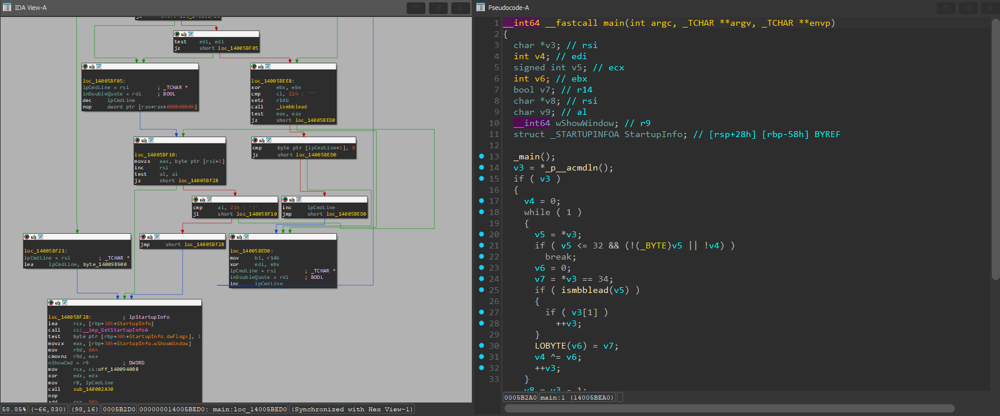
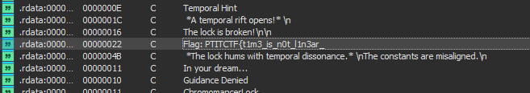
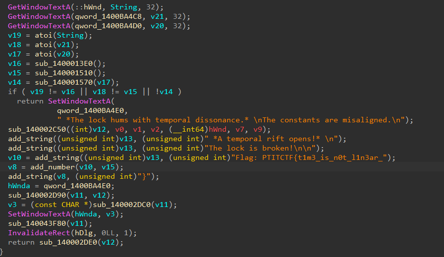

# Chronomancer


- Mình tiến hành mở IDA để xem code của bài này.


- Xem qua hàm `main` thì không có gì đặc biệt nên mình mở thử strings xem có gì đặc biệt không.


- Khá bất ngờ vì nó có một phần của flag ở đây.
- Mình mở nó để xem nơi nó được gọi.


- Sau khi phân tích và dọn lại code thì được như hình bên trên.
- Ở đây hàm này sẽ ghép các string lại với nhau, cuối flag sẽ là một số (v15) được trả về từ hàm `sub_140001510`.
- Từ đây ta sẽ có cách để giải được flag của bài này là tìm ra `v15` là gì.
  - Mình có viết lại 1 script python mô phỏng lại hàm `sub_140001510` để lấy giá trị của v15 và ghép vào mảnh flag đã có trước đó.
  ``` python
  v2 = -16657
  for i in range(100):
      v2 = 26125 * v2 - 3233

  flag = "PTITCTF{t1m3_is_n0t_l1n3ar_" + str(v2 & 0xFFFF) + "}"
  print(flag)
  ```
- Sau khi giải xong thì ta sẽ có được flag cho bài này.

<details>
<summary style="cursor: pointer">Flag</summary>

```
PTITCTF{t1m3_is_n0t_l1n3ar_15347}
```
</details>
