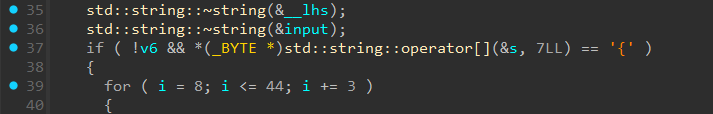

# R(everse)TIT


- Mình tiến hành mở IDA để dịch code của bài này.


- Trước tiên ở trong hàm main ta sẽ thấy được một đoạn để check flag ở đây.
- Trước mắt ta có thể biết được độ dài của flag là 48.
- Ta tiến hành debug để có thể xem được flag đã được check như nào.


- Ở đây ta thấy được nó đang check với 1 đoạn mã hóa nào đó.
- Tại sao lại có nó ở đây, ta cần phải check lại hàm `__security_check_` xem liệu nó đang làm gì với input của ta.
- Sau khi phân tích qua hàm `__security_check_` thì ta biết được nó đang sử dụng SHA-1 để mã hóa input ta nhập vào và rồi sẽ so sánh với các đoạn mã hóa có sẵn của bài.
- Trước mắt thì ta sẽ thấy chương trình đang lấy ra 7 ký tự đầu tiên trong flag sẽ đó qua 1 hàm hash SHA-1 và rồi so sánh với chuỗi `edadb1236fb6dfc71c58c701fc92607a584add9f`.


- Vì ở phần ngay dưới mình thấy chương trình check index 7 của flag với `{` nên mình nghĩ 7 ký tự đầu tiên sẽ là `PTITCTF`.
- Mình tiến hành tạo 1 hàm SHA-1 bằng python và check xem hash của PTITCTF có đúng là `edadb1236fb6dfc71c58c701fc92607a584add9f` không.

``` python
import hashlib
def sha1(text):
    return hashlib.sha1(text.encode()).hexdigest()

text = "PTITCTF"
print(sha1(text) == "edadb1236fb6dfc71c58c701fc92607a584add9f")

# True
```
- Vậy thì ta đã biết được phần nào chương trình đang làm gì rồi, ta sẽ tiếp tục phân tích các phần ở bên dưới.


- Ta thấy chương trình đang lấy từ từ từng 3 ký tự một trong flag ra để so sánh với các string SHA-1 có sẵn của chương trình.
- Ta sẽ giải từ từ từng 3 ký tự một của bài này, vì ở đây chỉ đang lấy 3 ký tự và hash nên ta có thể bruteforce nó một cách khá nhanh.
- Mình sẽ viết 1 đoạn script python để bruteforce từng 3 ký tự một cho flag của bài này (ở script này mình đã tổng hợp lại hết các mã hash và giải ra flag luôn).

``` python
import hashlib
import string
from itertools import product

def sha1(text):
    return hashlib.sha1(text.encode()).hexdigest()

hash_list = [
    "0a4d82caaf74346c40ca0ba69f89369724ca9035",
    "ea9259b4a6f43783cdf6aa523e9db3412963b31c",
    "156cc4c77e3bf1dcb387b189b56309dde6ef6220",
    "b5efa8eadf6f33f30d19468ebdf52d155526d2de",
    "987e2a2582fa4ddd068259c1ae224615e5062157",
    "6512cf6bb1044e3dc68030a8d6d669257dafa9bc",
    "44e5a6f66307595eae078a70dd059662aadfc43b",
    "7925a6c0d9b673bbdef61b8f4c45fe3e14ba9e03",
    "a7a3472af6383407428a85ed8062165fb2ca772f",
    "6fa550f5c70df6f3b67e3483ba841a2aa2a0a89e",
    "2ae7b876a4073754b71cc8501a3fc2b255c154ce",
    "542ec1a1f6d635ffa543cc877622854254d8e25f",
    "c1d5e47df628b6ca0f1f832e6dd29897e2b0b9fe"
]

flag = "PTITCTF{"
char = string.printable
for i in hash_list:
    for chars in product(char, repeat=3):
        hashed = sha1("".join(chars))
        if hashed == i:
            flag += "".join(chars)
            break

flag = flag.ljust(47, "?") + "}"
print(flag)
```
- Vì là bruteforce nên sẽ mất 1 chút thời gian để chạy code nhưng cũng khá nhanh và ta đã có được flag cho bài này.

<details>
<summary style="cursor: pointer">Flag</summary>

```
PTITCTF{7h47_15_7h3_W4Y_W3_50lv3_7h15_ch4ll3n93}
```
</details>
