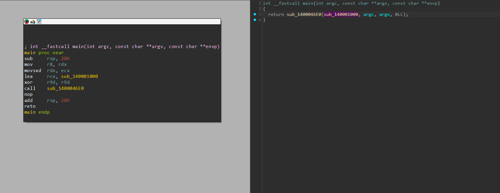
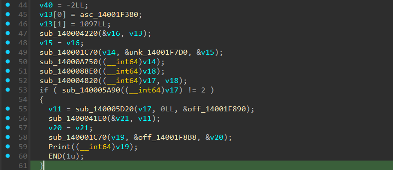
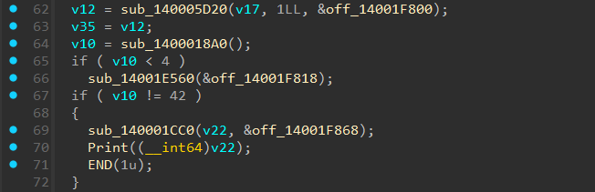
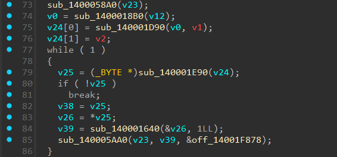
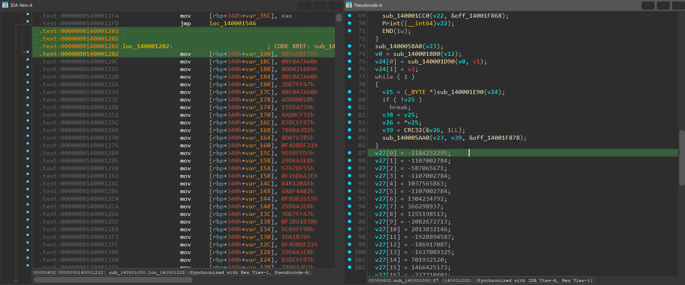
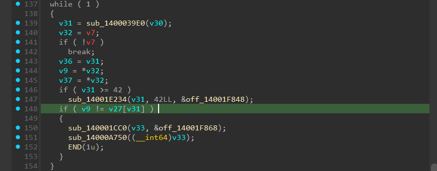

# R(ush)TIT


- Mình sử dụng IDA để đọc code của chương trình này.


- Đọc qua 2 hàm có trong main thì mình xác định được hàm xử lý logic chính là `sub_140001000`.
- Tiến hành phân tích nó.


- Ở phần đầu này thì chương trình đang xử lý dữ liệu vào.
- Dữ liệu được nhập vào dạng `file_name flag`.
- Vì thế ta sẽ thấy `sub_140005A90(v17) != 2` (chính là độ dài của mảng agrv) được so sánh với 2.
- Nếu không đúng sẽ in ra gợi ý và kết thúc chương trình luôn.


- Tiếp đến ngay phía dưới, ta thấy `v12` chính là argv[1] (tức là phần flag ta nhập vào) được so sánh với 42, ta biết được flag sẽ có độ dài 42 ký tự.


- Ngay phía dưới ta sẽ thấy flag được lấy từng ký tự ra và gán vào v25.
    ``` c
    v25 = sub_140001E90(v24)
    ```
- Sau đó sẽ đi qua 1 hàm xử lý và gán lại vào mảng v23.
    ``` c
    v39 = sub_140001640(&v26, 1LL);
    sub_140005AA0(v23, v39, &off_14001F878);
    ```
- Sau khi phân tích thì ta sẽ biết được hàm `sub_140001640` là dạng hàm tính CRC32.




- Sau đó các dữ liệu trả về từ hàm CRC32 sẽ được so sánh lần lượt với mảng `v27`, nếu sai thì sẽ thoát chương trình.
- Mình có viết một đoạn script python để bruteforce các ký tự đi qua hàm CRC32 và rồi so sánh với dữ liệu có sẵn trong `v27`, nếu đúng ta sẽ biết đó là ký tự có trong flag.

``` python
import string
import zlib

check = [
    0xB969BE79, 0xBE047A60, 0xDD0216B9, 0xBE047A60,
    0x3DD7FFA7, 0xBE047A60, 0x4DBD0B28, 0x15D54739,
    0x4AD0CF31, 0x83DCEFB7, 0x7808A3D2, 0x8D076785,
    0xF4DBDF21, 0x9E6BFFD3, 0x29D6A3E8, 0x5767DF55,
    0xF26D6A3E, 0x84B12BAE, 0x6ABF4A82, 0xFBDB2615,
    0x29D6A3E8, 0x3DD7FFA7, 0xF3B61B38, 0x6C09FF9D,
    0x01D41B76, 0xF4DBDF21, 0x29D6A3E8, 0x83DCEFB7,
    0x7808A3D2, 0x29D6A3E8, 0xBE047A60, 0x916B06E7,
    0x6DD28E9B, 0x29D6A3E8, 0x5767DF55, 0x6DD28E9B,
    0x6B643B84, 0x6DD28E9B, 0x6C09FF9D, 0x84B12BAE,
    0x6DD28E9B, 0xFCB6E20C
]

def crc32(data):
    return zlib.crc32(data) & 0xFFFFFFFF


char = string.printable
flag = ""
for i in range(42):
    for j in char:
        if crc32(j.encode("utf-8")) == check[i]:
            flag += j
print(flag)
```
- Và ta đã có được flag cho bài này.

<details>
<summary style="cursor: pointer">Flag</summary>

```
PTITCTF{B1n90!_Ru57y_C4rg0_1n_Th3_R3v3r53}
```
</details>
