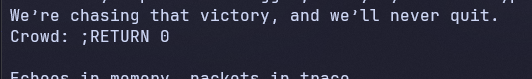

# [Flag Hunters](https://play.picoctf.org/practice/challenge/472?category=3&difficulty=1&page=1&solved=0)

- Sau khi đọc xong đoạn code của chương trình thì tôi thấy có vài điểm có thể khai thác được:
  - `for line in song_lines[lip].split(';'):` : ở đây các đoạn code sẽ được tách ra khi gặp dấu `;`
  - Khi gặp `RETURN` thì lời nhạc tiếp theo sẽ được phát tiếp tục từ dòng có số thứ tự phía sau `RETURN`, ví dụ: 'RETURN 0' thì lời nhạc sẽ phát tiếp từ dòng thứ 0
- Từ 2 ý trên => khi chương trình cho ta nhập vào phía sau "Crowd: ", ta sẽ nhập dấu `;` để ta sẽ có được 1 dòng mới, sau đó ta sẽ nhập `RETURN 0` để có thể phát tiếp bài nhạc từ đầu
- Tiến hành chạy netcat và thực hành


- Tôi nhập vào `;RETURN 0`


- Vào sau khi phát bài hát từ đầu tôi đã có được `flag`

<details>
<summary style="cursor: pointer">Flag</summary>

```
picoCTF{70637h3r_f0r3v3r_05182f4f}
```
</details>
