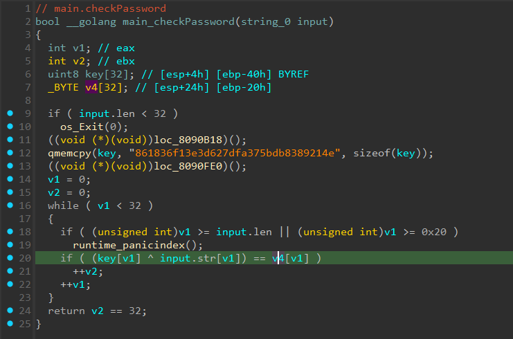
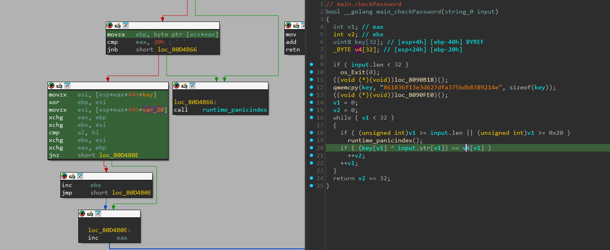
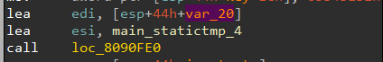
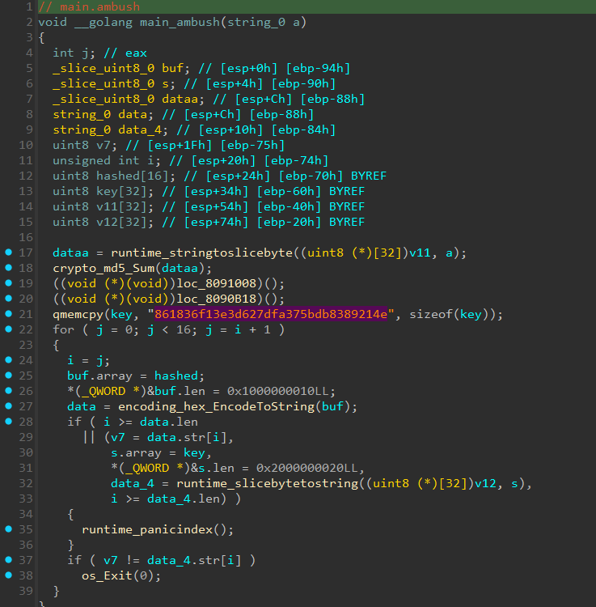
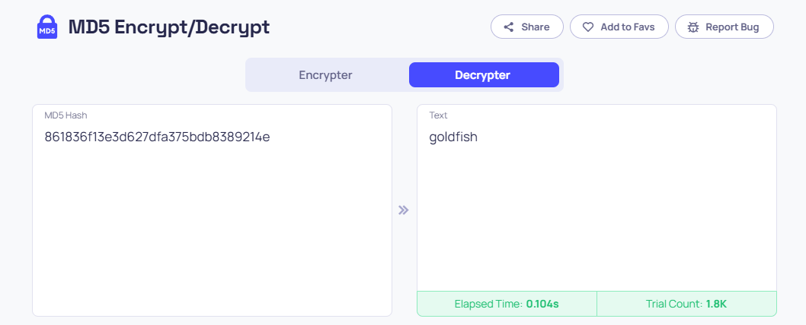

# [gogo](https://play.picoctf.org/practice/challenge/171?category=3&difficulty=3&page=1&solved=0)

- Tôi tiến hành dịch mã của file bằng IDA
- Đi theo mạch của chương trình thì tôi thấy vào sẽ vào `main_checkPassword` và sau đó vào `main_ambush`
- Tiến hành reverse 2 hàm này


- Phân tích hàm này thì tôi nếu nó chỉ đơn giản là xor giá trị nhập vào với cả key, sau đó so sánh với cả mảng v4
- Nhưng ở đây mã giả không hề cho ta biết v4 được gán giá trị như này, ta phải đọc mã asm của hàm


- Tôi thấy v4 tương ứng với var_20 ở mã asm


- Tôi lên trên tìm và thấy ở đoạn này var_20 đang được gán các giá trị từ `main_statictmp_4`
- Tôi tiến hành check giá trị của main_statictmp_4 và trích xuất nó
- Tôi viết lại một đoạn [`code python`](./solve.py) để xor lại giá trị của mảng v4 với key
- Sau khi chạy file python thì tôi đã có được đoạn input password cần phải nhập

- Tiếp đến, tôi tiến hành phân tích hàm main_ambush


- Phân tích xong thì tôi thấy nó chỉ đơn giản là đang so sánh input sau khi đã băm MD5 với key
- Từ đó suy ra key chính là giá trị sau khi MD5 input
- Tôi lên mạng tìm kiếm decrypt MD5 để xem có ký tự nào tương ứng với mã MD5 của key không


- Tôi đã tìm được nó
- Bây giờ ta tiến hành nhập các giá trị input và unhashed vào chương trình trên server để có được flag

<details>
<summary style="cursor: pointer">Flag</summary>

```
picoCTF{p1kap1ka_p1c02e7cc205}
```
</details>
