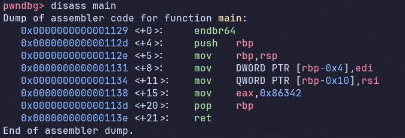

# [GDB baby step 1](https://play.picoctf.org/practice/challenge/395?category=3&difficulty=2&page=2&solved=0)

- Đề bài hỏi giá trị của eax cuối cùng
- Tôi tiến hành sử dụng GDB để mở file và phân tích nó


- Tôi thấy `mov eax, 0x86342` ở cuối hàm main, đây chính là giá trị cuối cùng của eax mà đề bài yêu cầu

<details>
<summary style="cursor: pointer">Flag</summary>

```
picoCTF{549698}
```
</details>