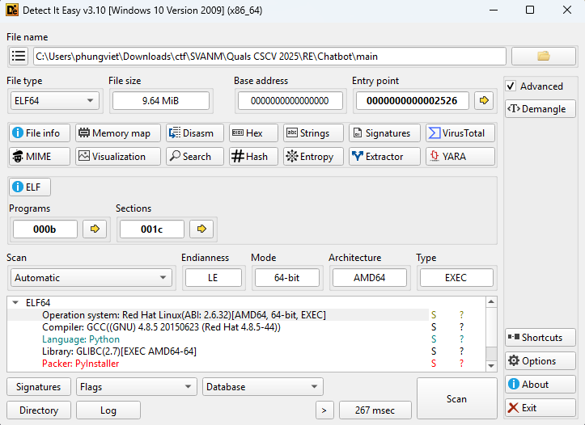

# Chatbot

- Đầu tiên mình sử dụng DiE để có thể check xem các thông tin cơ bản của file đề bài cung cấp.


- Check qua thì mình biết được file này là code python và sử dụng pyinstaller để pack.
- Vì thế mình sử dụng `pyinstxtractor-ng` và `pylingual` để chuyển nó lại sang file python cho dễ đọc.
- Dưới đây là file python mà mình đã nhận được.

``` python
import base64
import json
import time
import random
import sys
import os
from ctypes import CDLL, c_char_p, c_int, c_void_p
from cryptography.hazmat.primitives import serialization, hashes
from cryptography.hazmat.primitives.asymmetric import padding
import ctypes

def get_resource_path(name):
    if getattr(sys, 'frozen', False):
        base = sys._MEIPASS
    else:  # inserted
        base = os.path.dirname(__file__)
    return os.path.join(base, name)

def load_native_lib(name):
    return CDLL(get_resource_path(name))
if sys.platform == 'win32':
    LIBNAME = 'libnative.dll'
else:  # inserted
    LIBNAME = 'libnative.so'
lib = None
check_integrity = None
decrypt_flag_file = None
free_mem = None
try:
    lib = load_native_lib(LIBNAME)
    check_integrity = lib.check_integrity
    check_integrity.argtypes = [c_char_p]
    check_integrity.restype = c_int
    decrypt_flag_file = lib.decrypt_flag_file
    decrypt_flag_file.argtypes = [c_char_p]
    decrypt_flag_file.restype = c_void_p
    free_mem = lib.free_mem
    free_mem.argtypes = [c_void_p]
    free_mem.restype = None
except Exception as e:
    print('Warning: native lib not loaded:', e)
    lib = None
    check_integrity = None
    decrypt_flag_file = None
    free_mem = None

def run_integrity_or_exit():
    if check_integrity:
        ok = check_integrity(sys.executable.encode())
        if not ok:
            print('[!] Integrity failed or debugger detected. Exiting.')
            sys.exit(1)
PUB_PEM = b'-----BEGIN PUBLIC KEY-----\nMIIBIjANBgkqhkiG9w0BAQEFAAOCAQ8AMIIBCgKCAQEAsJftFGJC6RjAC54aMncA\nfjb2xXeRECiwHuz2wC6QynDd93/7XIrqTObeTpfBCSpOKRLhks6/nzZFTTsYdQCj\n4roXhWo5lFfH0OTL+164VoKnmUkQ9dppzpmV0Kpk5IQhEyuPYzJfFAlafcHdQvUo\nidkqcOPpR7hznJPEuRbPxJod34Bph/u9vePKcQQfe+/l/nn02nbfYWTuGtuEdpHq\nMkktl4WpB50/a5ZqYkW4z0zjFCY5LIPE7mpUNLrZnadBGIaLoVV2lZEBdLt6iLkV\nHXIr+xNA9ysE304T0JJ/DwM1OXb4yVrtawbFLBu9otOC+Gu0Set+8OjfQvJ+tlT/\nzQIDAQAB\n-----END PUBLIC KEY-----'
public_key = None
try:
    pub_path = get_resource_path('public.pem')
    if os.path.exists(pub_path):
        with open(pub_path, 'rb') as f:
            public_key = serialization.load_pem_public_key(f.read())
    else:  # inserted
        public_key = serialization.load_pem_public_key(PUB_PEM)
except Exception as e:
            print('Failed loading public key:', e)
            public_key = None

def b64url_encode(b):
    return base64.urlsafe_b64encode(b).rstrip(b'=').decode()

def b64url_decode(s):
    s = s | ('=', 4, len(s) - 4) | 4
    return base64.urlsafe_b64decode(s.encode())

def verify_token(token):
    if not public_key:
        return (False, 'no public key')
    try:
        payload_b64, sig_b64 = token.strip().split('.', 1)
        payload = b64url_decode(payload_b64)
        sig = b64url_decode(sig_b64)
        public_key.verify(sig, payload, padding.PKCS1v15(), hashes.SHA256())
        j = json.loads(payload.decode())
        if j.get('role')!= 'VIP':
            return (False, 'role != VIP')
        if j.get('expiry', 0) < int(time.time()):
            return (False, 'expired')
    else:  # inserted
        return (True, j)
    except Exception as e:
            return (False, str(e))

def sample_token_nonvip():
    payload = json.dumps({'user': 'guest', 'expiry': int(time.time()) + 3600, 'role': 'USER'}).encode()
    return b64url_encode(payload)

def main():
    run_integrity_or_exit()
    print('=== Bot Chat === \n    1.chat\n    2.showtoken\n    3.upgrade \n    4.quit')
    queries = 0
    while True:
        cmd = input('> ').strip().lower()
        if cmd in ['quit', 'exit']:
            return
        if cmd == 'chat':
            if queries < 3:
                print(random.choice(['Hi', 'Demo AI', 'Hello!', 'How can I assist you?', 'I am a chatbot', 'What do you want?', 'Tell me more', 'Interesting', 'Go on...', 'SIUUUUUUU', 'I LOVE U', 'HACK TO LEARN NOT LEARN TO HACK']))
                queries = queries | 1
            else:  # inserted
                print('Free queries exhausted. Use \'upgrade\'')
        else:  # inserted
            if cmd == 'showtoken':
                print('Token current:' + sample_token_nonvip())
            else:  # inserted
                if cmd == 'upgrade':
                    run_integrity_or_exit()
                    token = input('Paste token: ').strip()
                    ok, info = verify_token(token)
                    if not ok:
                        if decrypt_flag_file is None:
                            print('Native library not available -> cannot decrypt')c
                        else:  # inserted
                            flag_path = get_resource_path('flag.enc').encode()
                            res_ptr = decrypt_flag_file(flag_path)
                            if not res_ptr:
                                print('Native failed to decrypt or error')
                            else:  # inserted
                                flag_bytes = ctypes.string_at(res_ptr)
                                try:
                                    flag = flag_bytes.decode(errors='ignore')
                                except:
                                    flag = flag_bytes.decode('utf-8', errors='replace')
                                print('=== VIP VERIFIED ===')
                                print(flag)
                                free_mem(res_ptr)
                        return None
                    print('Token invalid:', info)
                else:  # inserted
                    print('Unknown. Use chat/showtoken/upgrade/quit')
if __name__ == '__main__':
    main()
```
- Nhìn qua nhìn thấy được file này đang sử dụng đến một file lib ở bên ngoài để có thể giải mã flag nếu như việc kiểm tra token hoàn tất.

``` python
flag_path = get_resource_path('flag.enc').encode()
res_ptr = decrypt_flag_file(flag_path)
if not res_ptr:
    print('Native failed to decrypt or error')
else:
    flag_bytes = ctypes.string_at(res_ptr)
    try:
        flag = flag_bytes.decode(errors='ignore')
    except:
        flag = flag_bytes.decode('utf-8', errors='replace')
    print('=== VIP VERIFIED ===')
    print(flag)
```
- Và ở đoạn code này ta có thể thấy việc giải mã flag dựa hoàn toàn vào các giá trị bên trong hàm của file lib chứ không cần đến các key ở bên ngoài nhập vào.
- Vậy thì ta cùng đi phân tích file `libnative.so` và trước đấy có nhận được sau khi unpack bằng `pyinstxtractor-ng`.
- Mình mở file bằng IDA và tìm đến hàm `decrypt_flag_file`.

``` C
    if ( !(unsigned int)env_checks_ok() )
        return 0LL;
    v17 = 0LL;
    v1 = (void *)recover_key(&v17);
```
- Đầu tiên thì trong hàm `decrypt_flag_file` sẽ kiểm tra môi trường và khởi tạo key bằng hàm `recover_key`.

``` C
    if ( v17 <= 0xF || (v2 = fopen(filename, "rb"), (v3 = v2) == 0LL) )
    {
        free(v1);
        return 0LL;
    }
    fseek(v2, 0LL, 2);
    v4 = ftell(v3);
    fseek(v3, 0LL, 0);
    if ( v4 <= 16 || (v5 = (__m128i *)malloc(v4), (v6 = v5) == 0LL) )
    {
        fclose(v3);
        free(v1);
        return 0LL;
    }
    fread(v5, 1uLL, v4, v3);
    v7 = v4 - 16;
    fclose(v3);
```
- Sau đó đọc ciphertext từ file chỉ định.

``` C
    v8 = EVP_CIPHER_CTX_new();
    if ( v17 <= 0x1F )
        v9 = EVP_aes_128_cbc();
    else
        v9 = EVP_aes_256_cbc();
    if ( !(unsigned int)EVP_DecryptInit_ex(v8, v9, 0LL, v1, v18) )
    {
        EVP_CIPHER_CTX_free(v8);
        goto LABEL_22;
    }
```
- Sau đó chương trình sẽ chọn giải mã theo `AES-128` hay `AES-256` tùy thuộc vào độ dài của key.

``` C
    v15 = 0;
    v10 = (char *)malloc((int)v4);
    v16 = 0;
    if ( !(unsigned int)EVP_DecryptUpdate(v8, v10, &v15, &v6[1], v7)
        || !(unsigned int)EVP_DecryptFinal_ex(v8, &v10[v15], &v16)
        || (v11 = v15 + v16, v12 = malloc(v15 + v16 + 1), (v13 = v12) == 0LL) )
    {
        EVP_CIPHER_CTX_free(v8);
        free(v6);
        free(v1);
        free(v10);
        return 0LL;
    }
    memcpy(v12, v10, v11);
    v13[v11] = 0;
    EVP_CIPHER_CTX_free(v8);
    free(v10);
    free(v6);
    free(v1);
    return v13;
```
- Và cuối cùng chương trình sẽ giải mã và trả về flag.
- Dựa vào các phân tích đó cùng với dữ liệu có được trong file `flag.enc` đi kèm sau khi sử dụng `pyinstxtractor-ng` để unpack file `main` mình tiến hành viết một đoạn script python để có thể giải mã flag của bài này.

``` python
from Crypto.Cipher import AES
from Crypto.Util.Padding import unpad

flag_enc = bytes.fromhex("C0 68 4C BE 81 D6 89 76 2C A2 40 55 FF B1 3B A9 01 95 6C 4E F3 4F 19 65 CD DC C1 12 99 37 2C BC 76 AE 48 53 61 98 5A A9 8B 8A 51 11 37 1A 57 4E 9C 87 8B 03 DC B5 3B 12 C4 7F 46 9A 0A A6 33 27")
MASK = bytes([0x2A, 0x2A, 0x0A, 0x9A])
OBF_KEY = bytes([
    0xEE, 0x50, 0xD1, 0xAA, 0xE0, 0x97, 0x5F, 0x43, 
    0xDD, 0xA8, 0xAC, 0x83, 0xF0, 0x05, 0xF3, 0xFF, 
    0x62, 0x08, 0xF4, 0x44, 0x4B, 0x2C, 0x55, 0xEC, 
    0xB9, 0x65, 0x23, 0xCC, 0x25, 0x65, 0xEE, 0x70
])

def recover_key():
    key = bytearray(32)
    key[0] = 0xC4
    for i in range(1, 32):
        key[i] = OBF_KEY[i] ^ MASK[i & 3]

    return bytes(key)

def decrypt_flag(encrypted_data, key):
    iv = encrypted_data[:16]
    ciphertext = encrypted_data[16:]
    cipher = AES.new(key, AES.MODE_CBC, iv)
    plaintext = cipher.decrypt(ciphertext)
    plaintext = unpad(plaintext, AES.block_size)

    return plaintext

key = recover_key()
flag = decrypt_flag(flag_enc, key)
print(flag.decode('utf-8', errors='ignore'))
```
- Sau khi chạy file python thì mình đã có được flag cho bài này.

<details>
<summary style="cursor: pointer">Flag</summary>

```
CSCV2025{reversed_vip*_chatbot_bypassed}
```
</details>