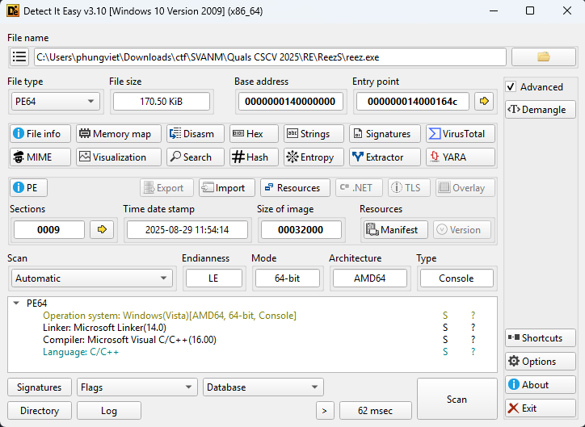
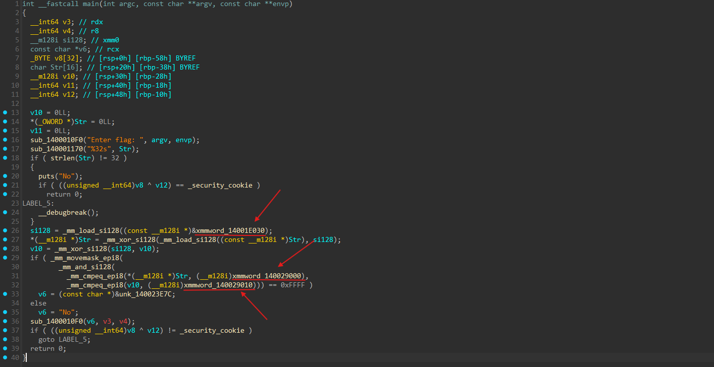
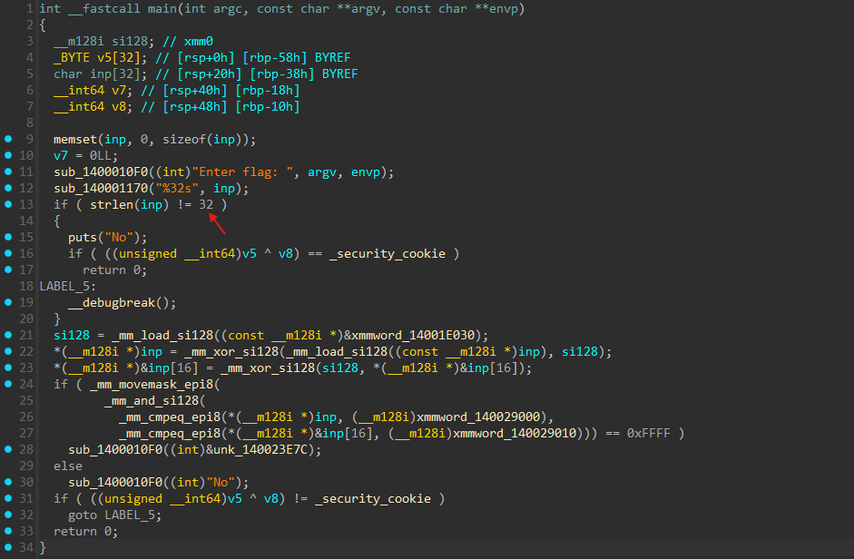
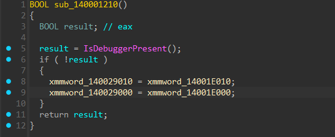

# ReezS

- Đầu tiên mình sẽ sử dụng DiE để có thể check các thông tin cơ bản của file mà đề bài cung cấp.


- Dựa vào các thông tin thì chúng ta có thể thấy đây là một file được biên dịch từ C/C++ và cũng không có gì đặc biệt lắm.
- Tiếp đến mình sử dụng IDA để xem mã code của chương trình.


- Sau khi phân tích qua code thì mình có tóm tắt như sau:
  - Đầu tiên chương trình yêu cầu người dùng nhập flag vào và kiểm tra độ dài có bằng 32 ký tự hay không, nhưng ở đây mình thấy mảng `Str` được IDA khai báo chỉ 16 phần tử nên mình chỉnh lại thành 32 và đổi tên `Str` thành `inp` để dễ dàng phân biệt hơn.
    
  - Tiếp đến chương trình sử dụng `_mm_xor_si128` để xor với lần lượt 16 byte trong `inp` với `xmmword_14001E030`.
  - Sau đó chương trình kiểm tra kết quả của `inp` sau khi xor ở bước trên với `xmmword_140029000` và `xmmword_140029010`, nếu đúng thì sẽ in ra `Yes`, còn sai thì là `No`.
- Từ tóm tắt đó thì ta sẽ kết luận được một điều là ta có thể lấy giá trị bên trong `xmmword_140029000` và `xmmword_140029010` ra để xor lại với `xmmword_14001E030` thì ta sẽ có được flag cho bài này.
- Mình tiến hành viết một đoạn script python để làm điều đó và lấy ra flag.

``` python
xmmword_140029000 = bytes.fromhex("D9C5D8D8D3F5DEC2C3D9F5C3D9F5CCCB")
xmmword_140029010 = bytes.fromhex("C1CFF5CCC6CBCD8B8B8B8B8B8B8B8B8B")

print(''.join(chr(i ^ 0xAA) for i in xmmword_140029000 + xmmword_140029010))
```
- Nhưng sau khi chạy thì kết quả lại trả về là `sorry_this_is_fake_flag!!!!!!!!!`, mình vẫn cố nhập thử thì thật sự nó đúng là fake flag thật.
- Nên mình lại tiếp tục mò tiếp trong hàm `main` xem có thể kiếm thêm được manh mối nào khác không.
- Ở đây mình nghi ngờ `xmmword_140029000` và `xmmword_140029010` có thể bị thay đổi giá trị nên mình đã thử view xem thì đúng là nó đang được sử dụng ở bên trong một hàm khác.


- Như vậy thì đã rõ rồi, các giá trị đang bị thay đổi, giờ thì mình sẽ lấy các giá trị mới này thay vào trong script python ở trên và chạy lại thử xem kết quả như nào.

``` python
xmmword_140029000 = bytes.fromhex("9ACBCF9E98C9C89DC998999B9CCF9F93")
xmmword_140029010 = bytes.fromhex("CFCFCF9DCF989A999B9A98CB9D9D9D9F")

print(''.join(chr(i ^ 0xAA) for i in xmmword_140029000 + xmmword_140029010))
```
- Sau khi chạy script python ở trên và lấy kết quả nộp vào chương trình thì mình đã có được kết quả trả ra báo chính xác.
- Bọc lại với format của flag thì mình đã có được flag đầy đủ cho bài này.

<details>
<summary style="cursor: pointer">Flag</summary>

```
CSCV2025{0ae42cb7c2316e59eee7e203102a7775}
```
</details>