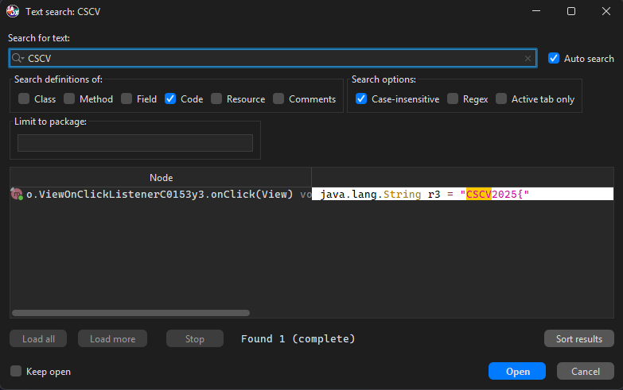
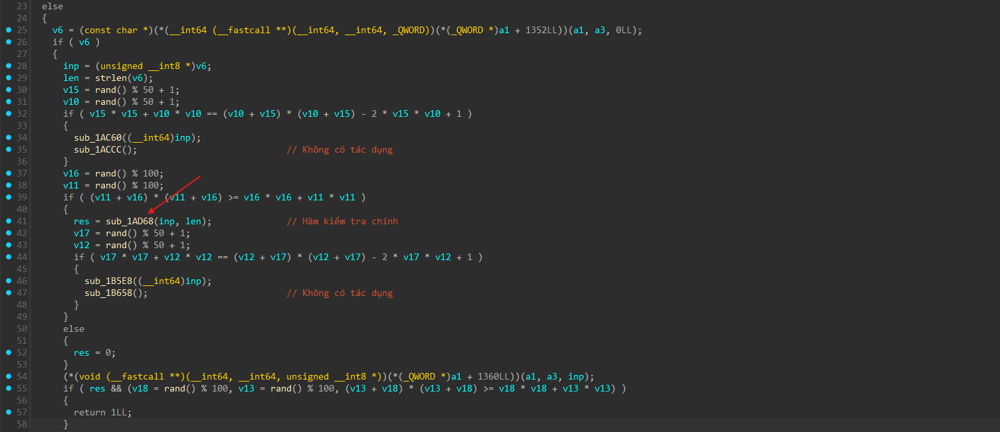
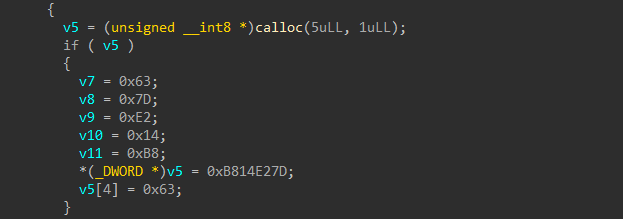
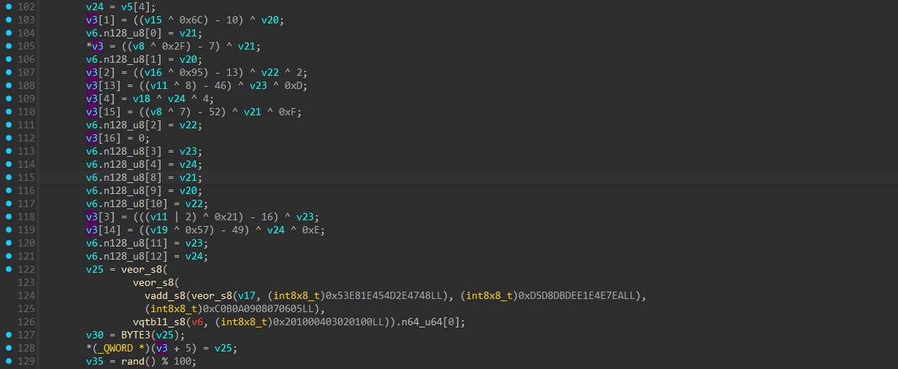

# Reverse Master

- Bài này cung cấp cho một file apk nên mình sẽ sử dụng JADX để có thể xem được code của file.
- Cũng không biết tại sao khi mình chạy file apk thì không có hiện ra gì nên vì thế chưa biết được mạch chương trình chạy như nào.
- Sau khi mở file bằng JADX thì mình tìm thử `CSCV2025` để xem có tìm được gì không.


- Tuyệt vời, mình có thể tìm được được phần đầu của flag luôn, cùng mở file đó ra xem như nào.

``` java
public final void onClick(android.view.View r13) {
    /*
        r12 = this;
        r13 = 16
        r0 = 1
        int r1 = com.ctf.challenge.MainActivity.b
        com.google.android.material.textfield.TextInputEditText r1 = com.google.android.material.textfield.TextInputEditText.this
        android.text.Editable r1 = r1.getText()
        java.lang.String r1 = java.lang.String.valueOf(r1)
        com.ctf.challenge.MainActivity r2 = r2
        java.lang.String r3 = "CSCV2025{"
        boolean r3 = r1.startsWith(r3)
        r4 = 0
        if (r3 != 0) goto L1c
    L1a:
        r13 = r4
        goto L6e
    L1c:
        java.lang.String r3 = "}"
        boolean r3 = r1.endsWith(r3)
        if (r3 != 0) goto L25
        goto L1a
    L25:
        int r3 = r1.length()
        int r3 = r3 - r0
        r5 = 9
        java.lang.String r1 = r1.substring(r5, r3)
        java.lang.String r3 = "substring(...)"
        o.F2.e(r1, r3)
        java.lang.String r5 = r1.substring(r4, r13)
        o.F2.e(r5, r3)
        byte[] r6 = new byte[r13]
        r6 = {x0090: FILL_ARRAY_DATA , data: [122, 86, 27, 22, 53, 35, 80, 77, 24, 98, 122, 7, 72, 21, 98, 114} // fill-array
        byte[] r7 = new byte[r13]
        r8 = r4
    L44:
        if (r8 >= r13) goto L55
        r9 = r6[r8]
        byte[] r10 = r2.a
        int r11 = r10.length
        int r11 = r8 % r11
        r10 = r10[r11]
        r9 = r9 ^ r10
        byte r9 = (byte) r9
        r7[r8] = r9
        int r8 = r8 + r0
        goto L44
    L55:
        java.lang.String r6 = new java.lang.String
        java.nio.charset.Charset r8 = o.X.a
        r6.<init>(r7, r8)
        boolean r5 = r5.equals(r6)
        if (r5 != 0) goto L63
        goto L1a
    L63:
        java.lang.String r13 = r1.substring(r13)
        o.F2.e(r13, r3)
        boolean r13 = r2.checkSecondHalf(r13)
    L6e:
        com.google.android.material.textfield.TextInputLayout r1 = r3
        if (r13 == 0) goto L80
        java.lang.String r13 = "🎉 Correct! Flag is valid!"
        android.widget.Toast r13 = android.widget.Toast.makeText(r2, r13, r0)
        r13.show()
        r13 = 0
        r1.setError(r13)
        return
    L80:
        java.lang.String r13 = "❌ Wrong flag! Try again!"
        android.widget.Toast r13 = android.widget.Toast.makeText(r2, r13, r4)
        r13.show()
        java.lang.String r13 = "Invalid flag"
        r1.setError(r13)
        return
    */
    throw new UnsupportedOperationException("Method not decompiled: o.ViewOnClickListenerC0153y3.onClick(android.view.View):void");
}
```

- Ở bên trong file đó, mình thấy có một đoạn code đã bị comment lại và khi nhìn qua thì có vẻ như nó chính là đoạn code check đoạn đầu của flag.
- Cùng dịch nó sang python để dễ nhìn hơn.

``` python
def onClick(flag: str):
    key = [66, 51, 122, 33, 86]
    r6 = [122, 86, 27, 22, 53, 35, 80, 77, 24, 98, 122, 7, 72, 21, 98, 114]

    if not (flag.startswith("CSCV2025{") and flag.endswith("}")):
        print("❌ Wrong flag! Try again!")
        return

    inner = flag[9:-1]
    first_half = inner[:16]
    second_half = inner[16:]

    r7 = []
    for i in range(16):
        r7.append(r6[i] ^ key[i % len(key)])

    expected_first_half = bytes(r7).decode("utf-8", errors="replace")

    if first_half != expected_first_half:
        print("❌ Wrong flag! Try again!")
        return

    if checkSecondHalf(second_half):
        print("🎉 Correct! Flag is valid!")
    else:
        print("❌ Wrong flag! Try again!")
```
- Ta có thể thấy nó đang xor `key` với `r6` sau đó so sánh với 16 ký tự đầu ở trong flag, nếu đúng là sẽ check đến 16 ký tự sau.
- Nhưng mà phần check sau ở đâu?

``` java
static {
    try {
        System.loadLibrary("native-lib");
    } catch (UnsatisfiedLinkError e) {
        Log.e("CTF", "❌ Native lib failed: " + e.getMessage());
    }
}
```
- Thì ở phần này ta thấy chương trình load thêm file `native-lib`, ta tiến hành export file `libnative-lib.so` ở trong lib ra để có thể xem được file này liệu đang làm gì.


- Sau khi phân tích qua thì mình thấy được hàm `sub_1AD68` chính là hàm xử lý logic chính để có thể check các ký tự của flag nhập vào.
- Cùng phân tích xem hàm đó đang làm gì.
- Nhìn qua thì hàm này đã bị làm rối khiến nó nhìn khá dài và rắc rối nhưng thật ra nó luôn chỉ hoạt động theo một hướng.


- Đầu tiên nó khởi tạo một mảng v5.


- Sau đó khởi tạo các giá trị cho mảng v3.


- Cuối cùng là dùng các giá trị trong v3 đó để xor với input nhập vào để kiểm tra và trả ra kết quả.
- Sau đây là script python của mình để có thể giải ngược lại flag cho bài này.

``` python
def first_half():
    key = [66, 51, 122, 33, 86]
    first = [122, 86, 27, 22, 53, 35, 80, 77, 24, 98, 122, 7, 72, 21, 98, 114]
    return "".join([chr(first[i] ^ key[i % len(key)]) for i in range(16)])

def second_half():
    v5 = [0x7D, 0xE2, 0x14, 0xB8, 0x63]
    v7 = 0x63
    v8 = 0x7D
    v9 = 0xE2
    v10 = 0x14
    v11 = 0xB8

    v15 = v9
    v16 = v10 | 1
    v17 = [
        v8 ^ 4,
        v9 | 5,
        v10 ^ 6,
        v11 | 7,
        v7 | 8,
        v8 ^ 9,
        v9 ^ 0xA,
        v10 | 0xB
    ]
    v18 = (v7 ^ 0x74) - 19
    v19 = v7 ^ 0xD
    v20 = v5[1]
    v21 = v5[0]
    v22 = v5[2]
    v23 = v5[3]
    v24 = v5[4]

    v3 = [0]*16
    v3[0]  = ((v8 ^ 0x2F) - 7) ^ v21
    v3[1]  = ((v15 ^ 0x6C) - 10) ^ v20
    v3[2]  = ((v16 ^ 0x95) - 13) ^ v22 ^ 2
    v3[3]  = (((v11 | 2) ^ 0x21) - 16) ^ v23
    v3[4]  = v18 ^ v24 ^ 4
    v3[13] = ((v11 ^ 8) - 46) ^ v23 ^ 0xD
    v3[14] = ((v19 ^ 0x57) - 49) ^ v24 ^ 0xE
    v3[15] = ((v8 ^ 7) - 52) ^ v21 ^ 0xF

    def to_bytes_le(val):
        return [(val >> (8*i)) & 0xFF for i in range(8)]

    b1 = to_bytes_le(0x53E81E454D2E4748)
    b2 = to_bytes_le(0xD5D8DBDEE1E4E7EA)
    b3 = to_bytes_le(0x0C0B0A0908070605)

    v6 = [v21, v20, v22, v23, v24, 0, 0, 0]

    tmp1 = [ v17[i] ^ b1[i] for i in range(8) ]
    tmp2 = [ (tmp1[i] + b2[i]) & 0xFF for i in range(8) ]
    tmp3 = [ tmp2[i] ^ b3[i] for i in range(8) ]

    table_val = 0x0201000403020100
    tbl = to_bytes_le(table_val)

    vqtbl = [ v6[tbl[i]] if tbl[i] < 8 else 0 for i in range(8) ]
    res = [ tmp3[i] ^ vqtbl[i] for i in range(8) ]
    for i in range(8):
        v3[5 + i] = res[i]

    return "".join(chr(i) for i in v3)


print("CSCV2025{" + first_half() + second_half() + "}")
```
- Sau khi chạy code thì mình đã có flag cho bài này.

<details>
<summary style="cursor: pointer">Flag</summary>

```
CSCV2025{8ea7cac7948424406fe3ccc3cf2197e4}
```
</details>