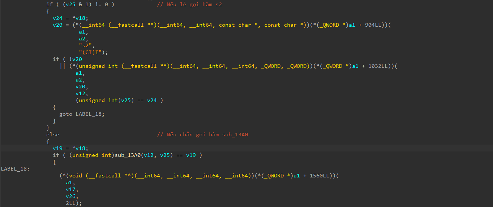

# ForeignDesign

- Tôi mở file jar bằng JD-GUI để xem code java.
- Sau khi xem qua hàm main thì tôi có thể tóm tắt logic chương trình như này.
``` java
public static native void initialize();
private static native void sc(char paramChar, int paramInt);

public static int s2(char c, int i) {
    int base = c + i % 7 * 2;
    if (i % 2 == 0) {
        base ^= 0x2C;
    } else {
        base ^= 0x13;
    } 
    return base + (i & 0x1);
}

public static void ck(String ws) {
    if (ws.length() == ll.length + lll.length) {
        for (int i = 0; i < ws.length(); i++) {
            int idx = (i * 5 + 3) % ws.length();
            char ch = ws.charAt(idx);
            sc(ch, i);
        } 
        System.out.println("Correct!");
    } else {
        System.out.println("Incorrect!");
    }
}
```
- Đơn giản hàm `s2` chỉ là hàm mã hóa đơn giản, còn `ck` chỉ là 1 hàm check.
- Cái chúng ta chưa biết ở đây là hàm `initialize` và `sc`, nó được lấy từ trong file `native` ra.
- Tôi unzip file jar ra để xem file `native` có gì bên trong.
- Tôi tiến hành mở file `native` bằng IDA để xem code.
- Sau khi đọc hiểu code và tóm tắt nó ta có:
  - Hàm `initialize` đơn giản là gán giá trị cho ll và lll, sau đó lấy dữ liệu nhập vào và gọi hàm `ck` với giá trị nhập vào.
  - Hàm `sc` sẽ duyệt từng ký tự của input nhập vào, nếu ký tự đấy ở vị trí lẻ (i & 1 != 0) thì sẽ gọi hàm `s2`, còn không thì gọi `sub_13A0` như hình bên dưới.


- Vì dữ liệu nhập vào sẽ được so sánh với từng giá trị trong ll rồi đến lll, nên ta sẽ gộp ll và lll vào và đặt tên là mảng check.
- Tôi viết 1 mã python để bruteforce các ký tự nhập vào để kiểm tra với mảng check, nếu với ký tự đó kiểm tra đúng thì ký tự đó là của flag.

``` python
check = [
    0x20, 0x5C, 0x04, 0x68, 0x6A, 0x4C, 0x60, 0x71,
    0x2A, 0x41, 0x16, 0x2B, 0xCB, 0x54, 0xDC, 0x62,
    0xD2, 0x47, 0x1D, 0x7B, 0x14, 0x7D, 0xC7, 0x4C,
    0xE6, 0x75, 0xF3, 0x54, 0x36, 0x67, 0xC5, 0x68,
    0xFB, 0x53, 0xFD, 0x80, 0x9F
]

def s2(c, i):
    base = ord(c) + (i % 7) * 2
    if (i % 2 == 0):
        base ^= 0x2C
    else:
        base ^= 0x13
    return base + (i & 0x1)

def sub_13A0(c, i):
    return ((ord(c) ^ (i + 19)) + 3 * i) ^ 0x5A

def sc(c, i):
    if (i & 1):
        return s2(c, i)
    else:
        return sub_13A0(c, i)

len_flag = 37
flag = [""] * len_flag

for i in range(len_flag):
    for c in range(32, 127):
        if sc(chr(c), i) == check[i]:
            flag[(i * 5 + 3) % len_flag] = chr(c)
            break

print(''.join(flag))
```
- Và tôi đã có được flag.

<details>
<summary style="cursor: pointer">Flag</summary>

```
scriptCTF{nO_MOr3_n471v3_tr4N5l471on}
```
</details>