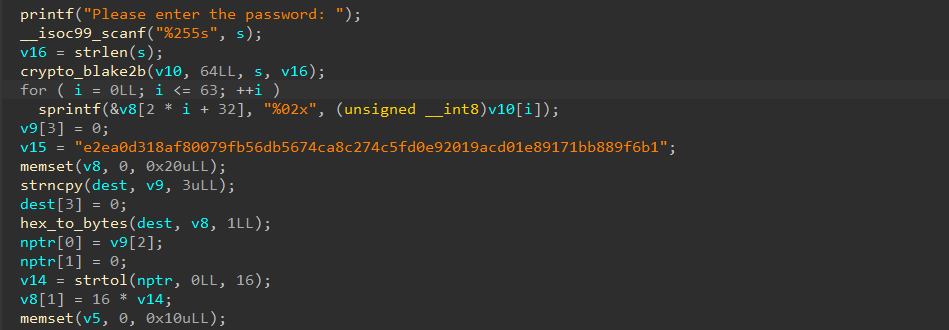

# Plastic Shield 2

- Tôi mở file bằng IDA để xem mã code.


- Sau khi xem qua hàm main thì tôi thấy ở hàm for có một chút vấn đề.
``` c
for ( i = 0LL; i <= 63; ++i )
    sprintf(&v8[2 * i + 32], "%02x", (unsigned __int8)v10[i]);
v9[3] = 0;
```
- Vòng for chạy 64 lần, tức là sẽ ghi đến vị trí (2 * 64 + 32) = 160, mà ở đây mảng v8 chỉ được khai báo 157 phần tử, tức là v8 sẽ tràn 3 ký tự cuối của mã hex sang v9.
- Vậy nên ta chỉ cần bruteforce 3 ký tự đó (000 -> fff, 16 ^ 3 = 4096), với 4096 thì bruteforce là khả thi.
- Tôi tiến hành viết mã python để giải flag.
``` python
from binascii import unhexlify
from Crypto.Cipher import AES
import string
import re

ciphertext = unhexlify("e2ea0d318af80079fb56db5674ca8c274c5fd0e92019acd01e89171bb889f6b1")

for i in range(4096):
    hex_string = f"{i:03x}"
    
    byte0 = int(hex_string[:2], 16)
    byte1 = (int(hex_string[2], 16) << 4) & 0xFF
    key = bytes([byte0, byte1] + [0] * 14)
    
    cipher = AES.new(key, AES.MODE_CBC, key)
    decrypted = cipher.decrypt(ciphertext)
    
    padding_length = decrypted[-1]
    if padding_length <= 16:
        expected_padding = bytes([padding_length]) * padding_length
        if decrypted[-padding_length:] == expected_padding:
            plaintext = decrypted[:-padding_length]
            
            try:
                text = plaintext.decode('utf-8')
                is_printable = all(ch in string.printable for ch in text)
                has_flag = re.search(r'scriptCTF\{', text)
                
                if is_printable and has_flag:
                    print(text)
                    break
            except:
                continue
```
- Sau khi chạy thì tôi đã có được flag

<details>
<summary style="cursor: pointer">Flag</summary>

```
scriptCTF{00p513_n07_4641n!}
```
</details>