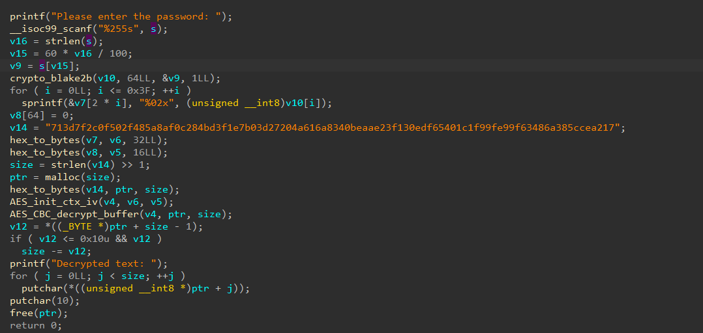

# Plastic Shield

- Tôi mở file bằng IDA để xem mã code.


- Nói qua về logic thì chỉ là cho người dùng nhập vào sau đó lấy tính lại độ dài bằng cách chia cho 100 và nhân 60, `v15 = 60 * v16 / 100;`.
- Sau đó, biến `v9` chỉ lấy ra một ký tự từ đoạn nhập vào, từ đó ta biết được chương trình chỉ sử dụng 1 ký tự nhập vào để làm key giải mã.
- Tôi viết ra một đoạn script python bruteforce từng ký tự để giải mã flag.

``` python
from pwn import *

exe = ELF("./plastic-shield", checksec = False)

flag = ""
for i in range(33, 127):
    p = process([exe.path])
    p.sendline(chr(i).encode())
    flag = p.recvline().decode(errors="ignore").strip()
    if "scriptCTF" in flag:
        flag = flag.split(": ")[-1]
        p.close()
        break
    p.close()

print(flag)
```
- Và tôi đã có được flag.

<details>
<summary style="cursor: pointer">Flag</summary>

```
scriptCTF{20_cau541i71e5_d3f3n5es_d0wn}
```
</details>