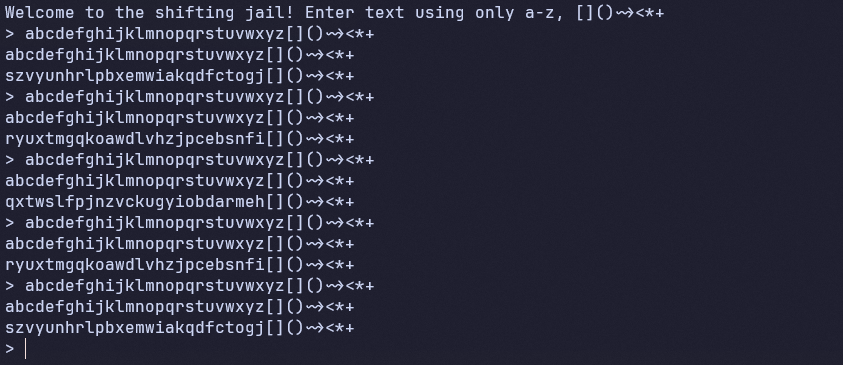
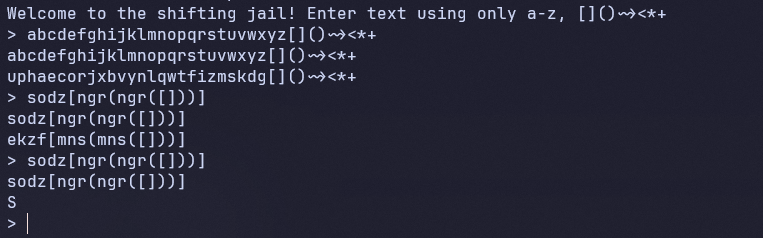

# Easy Jail

- Trước hết chúng ta sẽ cùng đi vào phân tích sơ qua file python được đề bài cung cấp cho.

``` python
seed = random.randint(0, 2**20)
shift_rng = random.Random(seed)

class ProtectedFlag:
    def __init__(self, value):
        self._value = value

    def __str__(self):
        return "variable protected, sryy"

    def __repr__(self):
        return "variable protected, sryy"

    def __getitem__(self, index):
        try:
            return self._value[index]
        except Exception:
            return "variable protected, sryy"

# Example flag
flag = ProtectedFlag("flag{dummy_flag}")

def shift_mapping(mapping):
    # well guess how it was done >_<

def make_initial_mapping():
    letters = list(string.ascii_lowercase)
    shuffled = letters[:]
    random.shuffle(shuffled)
    return dict(zip(letters, shuffled))
```
- Đầu tiên thì flag sẽ được lưu vào biến flag với class `ProtectedFlag` như một lớp bảo vệ, nó không thể được gọi như bình thường mà chỉ có thể lấy ra từng ký tự một (đây cũng chính là mấu chốt của chương trình này).
- Tiếp đó là 2 hàm `shift_mapping` và `make_initial_mapping`, trong đó có một thuật toán nào đó được ẩn đi để làm khó trong quá trình giải và các chữ cái được shuffle một cách random.

``` python
def main():
    valid_chars = set(string.ascii_lowercase + "[]()~><*+")
    mapping = make_initial_mapping()
    print("Welcome to the shifting jail! Enter text using only a-z, []()~><*+")

    try:
        while True:
            user_in = input("> ").strip()
            if len(user_in) > 150:
                raise ValueError(f"Input exceeds 150 characters")

            if not all(c in valid_chars for c in user_in):
                print("Invalid input. Only [a-z] and []()~><*+ are allowed.")
                continue

            encoded = "".join(mapping[c] if c in mapping else c for c in user_in)

            mapping = shift_mapping(mapping)
            try:
                result = eval(encoded, {"__builtins__": None}, {"flag": flag})
                print(result)
            except Exception:
                print(encoded)

    except KeyboardInterrupt:
        print("\nGoodbye!")
```
- Tiếp đó là hàm `main`, hàm này cho ta biết việc chỉ có thể sử dụng các ký tự `a-z và []()~><*+` và độ dài của chuỗi nhập vào chỉ được giới hạn trong khoản 150 ký tự.
- Cùng với đó là chặn hết tất cả các hàm `__builtins__` nên ta không thể gọi được các hàm in để lấy flag được.
- Sau quá trình phân tích thì ta sẽ tổng hợp được các ý nhỏ như sau:
    - Không thể sử dụng các hàm `__builtins__` để in flag.
    - Chỉ có thể gọi từng ký tự trong flag ra một.
    - Dữ liệu nhập vào bị giới hạn trong các ký tự `a-z và []()~><*+` và độ dài tối đa là 150 ký tự.
- Với các ý đó thì ta có thể rút ra được việc nên sử dụng `not([])` để có thể thay thế cho các chữ số, từ đó mà có thể lấy ra được các ký tự ở trong flag và ghép lại thành flag.


- Có một điều đặc biệt ở đây là khi mình test với các ký tự cho phép thì có thể thấy được có một khả năng ngẫu nhiên nào đó các dữ liệu được lặp lại, đây cũng sẽ là một dữ kiện quan trọng để ta khai thác được bài này.
- Ở đây mình có một đoạn code nho nhỏ để có thể test trước các ý tưởng của bản thân sau khi phân tích logic của chương trình.

``` python
alphabet = """
abcdefghijklmnopqrstuvwxyz[]()~><*+
"""
shuffer = """
qdtzwshgoxlbamvneykcprujfi[]()~><*+
"""
payload = "flag[not(not([]))]"

for i in payload:
    idx = shuffer.index(i)
    print(alphabet[idx], end="")
```
- Biến shuffer ở đây sẽ thay thế bằng các ký tự mà server trả về khi mình gửi alphabet vào.
- Nếu như các phán đoán của mình đúng thì đoạn shuffer của biến payload sẽ lấy được chữ cái đầu tiên trong flag.
- Giờ cùng test thử với server xem như nào.


- Tuyệt vời rồi, giờ thì ta có thể chắc chắn được ta đang đi đúng hướng.
- Cứ tiếp tục như vậy, ta cần tính toán các phép tính làm sao để được liên tục các chữ số để thay cho index.
- Dưới đây là đoạn code python của mình để tự động sinh các payload và gửi đi để có thể lấy được flag cho bài này.

``` python
from pwn import *

def genlist():
    ZERO = "not(not([]))"
    ONE = "(not([]))"

    def make_pow2_expr(k):
        if k == 0:
            return ONE
        def build_count_expr(t):
            if t == 0:
                return ZERO
            if t == 1:
                return ONE
            parts = []
            b = 0
            while t:
                if t & 1:
                    if b == 0:
                        parts.append(ONE)
                    else:
                        parts.append(f"({ONE}<<{build_count_expr(b)})")
                t >>= 1
                b += 1
            return "+".join(parts)
        return f"({ONE}<<{build_count_expr(k)})"

    def decompose_to_powers(n):
        ks = []
        k = 0
        while n:
            if n & 1:
                ks.append(k)
            n >>= 1
            k += 1
        return ks

    def make_expr_for_n(n):
        if n == 0:
            return ZERO
        ks = decompose_to_powers(n)
        parts = []
        for k in reversed(ks):
            parts.append(make_pow2_expr(k))
        if len(parts) == 1:
            return parts[0]
        return "(" + "+".join(parts) + ")"

    lst = []
    for n in range(11, 29):
        expr = make_expr_for_n(n)
        flag_like = f"flag[{expr}]"
        lst.append(flag_like)
    return lst


p = remote("misc-b6c94dd8.p1.securinets.tn", 7000)

abc = "abcdefghijklmnopqrstuvwxyz[]()~><*+"
p.sendlineafter(b"> ", f"{abc}".encode())
p.recvline()
shuffer = p.recvline().strip().decode()

lst = genlist()
flag = "Securinets{"

for i in lst:
    payload = ""
    for j in i:
        idx = shuffer.index(j)
        payload += abc[idx]
    while True:
        p.sendlineafter(b"> ", f'{payload}'.encode())
        p.recvline()
        rev = p.recvline().strip().decode()
        if (len(rev) == 1):
            flag += rev
            print(flag)
            break
```
- Vì xác suất là ngẫu nhiên nên sẽ phải mất 1 chút thời gian để có thể lấy được toàn bộ flag nhưng cuối cùng khi chạy xong thì mình đã lấy được flag cho bài này.

<details>
<summary style="cursor: pointer">Flag</summary>

```
Securinets{H0p3_Y0u_L0ST_1t!}
```
</details>