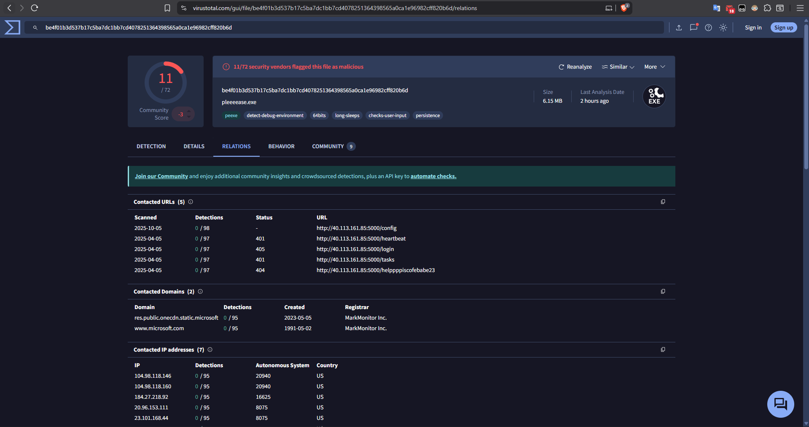

# Silent Visitor

#### What is the SHA256 hash of the disk image provided?

- Với câu hỏi này mình dùng web trên mạng để có thể check sha256 của file này và đã có được kết quả.

#### Identify the OS build number of the victim\xe2\x80\x99s system?

- Đầu tiên trong FTK Imager mình tìm đến file `\Windows\System32\config\SOFTWARE` và export nó ra.
- Sau đó sử dụng Registry Editor để xem registry của file đấy.


- Sau đó tìm đến `Microsoft\Windows NT\CurrentVersion`, nhìn vào `CurrentBuildNumber` và đã có kết quả cho câu hỏi này.

#### What is the ip of the victim's machine?

- Tương tự như câu hỏi 2, tìm đến `\Windows\System32\config\SYSTEM` và export file đó ra, sau đó sử mở file vừa export bằng `Registry Editor`.


- Tìm đến `ControlSet001\services\Tcpip\Parameters\Interfaces\`, ở đây mình tìm từng folder một và sau đó đã tìm được kết quả ở `DhcpIPAddress`.

#### What is the name of the email application used by the victim?

- Mình tìm ở trong `Program Files` và thấy có một ứng dụng để gửi mail là `Thunderbird` và đó chính là kết quả cho câu hỏi.

#### What is the email of the victim?

- Với câu hỏi này vì đã biết người này dùng Thunderbird nên mình đã tìm đến phần `\AppData\Roaming\thunderbird\Profiles\`, mở từng folder một tìm đến file `prefs.js` tìm đến `mail.identity.id1.useremail` và đã có đáp án cho câu hỏi này.

#### What is the email of the attacker?

- Ở câu hỏi này mình cũng tìm đến `\AppData\Roaming\thunderbird\Profiles\`, tìm vào các folder và mở `ImapMail\INBOX` và thấy có một mail gửi đến và nó chính là đáp án của câu hỏi này.

#### What is the URL that the attacker used to deliver the malware to the victim?

- Ở cùng file với câu hỏi trên tôi thấy có một link github.


- Truy cập vào link đó tôi thấy có một file đang thực hiện tải một file gì đó về, giải mã hóa đó ra tôi được một đường link `https://tmpfiles.org/dl/23860773/sys.exe` và đó chính là đáp án của câu hỏi này.

#### What is the SHA256 hash of the malware file?

- Sau khi tải file malware này về thì nó được lưu ở folder Documents.


- mình export nó ra và cho vào virustotal thì có được sha265 của file đó và đó chính là đáp án của câu hỏi này.

#### What is the IP address of the C2 server that the malware communicates with?

- Ở trong virustotal mình cũng tìm được các địa chỉ IP và đó cũng chính là đáp án cho câu hỏi.

#### What port does the malware use to communicate with its Command & Control (C2) server?
- Cùng với câu hỏi trước thì đáp án cho câu hỏi này là `5000`.

#### What is the url if the first Request made by the malware to the c2 server?
- Cũng như 2 câu hỏi trước thì đây chính là đáp án của câu hỏi này `http://40.113.161.85:5000/helppppiscofebabe23`

#### The malware created a file to identify itself. What is the content of that file?

- Cũng ở virustotal, mình mở sang tab BEHAVIOR và thấy có một file txt được tạo.


- Tìm đến file đấy và mình đã có được đáp án cho câu hỏi này.

#### Which registry key did the malware modify or add to maintain persistence?

- Cũng trong tab ở câu hỏi trên mình thấy có một registry key được sử dụng và đó chính là đáp án cho câu hỏi này.

#### What is the content of this registry?

- Đầu tiên mình tìm đến file `Users\ammar\NTUSER.DAT`, export nó ra và mở bằng Registry Editor.


- Sau đó trong Registry Editor tìm đến `SOFTWARE\Microsoft\Windows\CurrentVersion\Run\MyApp`, và ở đây mình đã có đáp án cho câu hỏi này.

#### The malware uses a secret token to communicate with the C2 server. What is the value of this key?

- Với câu hỏi này mình mở file `sys.exe` bằng IDA và mở vào hàm `main_main`.
- Tìm một lúc thì mình thấy có một đoạn key như trên hình.
- Và đó cũng chính là kết quả cho câu hỏi này.

#### Result
- Và sau khi trả lời hết tất cả các câu hỏi thì mình đã có cho mình flag của bài này.

<details>
<summary style="cursor: pointer">Flag</summary>

```
Securinets{de2eef165b401a2d89e7df0f5522ab4f}
```
</details>