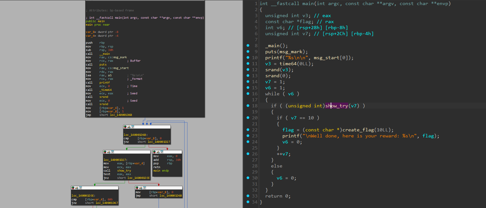
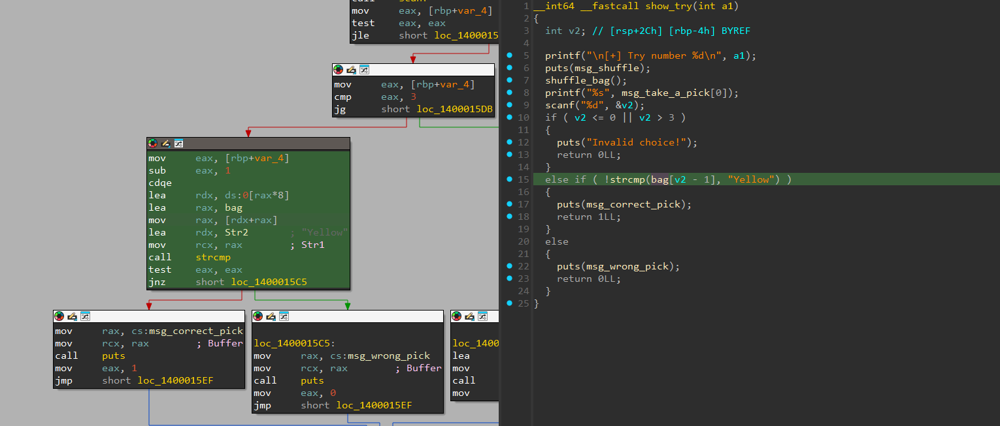
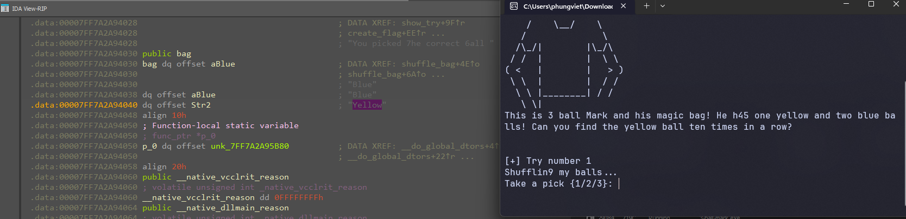

# 3 Ball Mark

- Tôi mở file bằng IDA để thực xem mã code của bài này.


- Tiến hành đọc code ở hàm main thì tôi thấy chỉ có hàm `show_try` là hàm cần check, chỉ cần hàm này trả về đúng 10 lần tương ứng v7 == 10 thì sẽ pass bài này.


- Phân tích hàm này thì chỉ là nó đang so sánh giá trị nhập vào (1/2/3) tương ứng là vị trí của các giá trị bên trong `bag` có phải là `Yellow` hay không thôi.
- Tôi tiến hành debug để xem các giá trị của `bag` thay đổi như nào.


- Ở mỗi lần nhập giá trị của bag lại thay đổi, và ta chỉ cần check đúng bị trí của `Yellow` rồi nhập vào như thế 10 lần là ta sẽ có flag.

<details>
<summary style="cursor: pointer">Flag</summary>

```
flag{742856a9af6264c3eed88587f09ed03b}
```
</details>