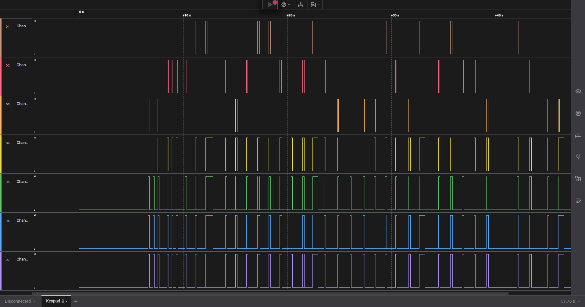
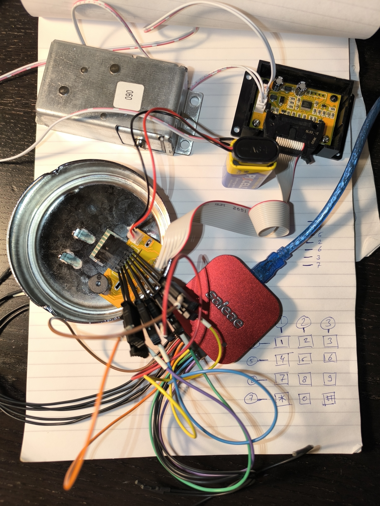

# Keypad

- Tôi mở file sal bằng Logic 2 của Saleae để xem bên trong nó có gì.


- Nó gồm các đường sóng nhìn khá rối.


- Dựa vào ảnh gợi ý của đề bài ở trên, tôi đoán 3 Channel (1, 2, 3) sẽ tương ứng với 3 cột của bàn phím số, và 4 Channel (4, 5, 6, 7) sẽ tương ứng với 4 hàng của bàn phím số.
- Bắt đầu phân tích, tôi thấy ở 3 nhịp đầu ở Channel 3 được kích hoạt, với Channel 4, 5, 6, 7 thì có Channel 4 là cột đơn còn lại Channel 5, 6, 7 thì là cột nối nhau nên tôi nghĩ nó là giấu hiện để nhận biết Channel nào đang được kích hoạt.
- Dựa vào đó ta có 3 nhịp đầu tương ứng với phím được ấn là `3 3 3`.
- Tôi tiến hành check 9 nhịp đầu thì thấy thứ tự các phím được ấn là `333 555 2 4 *`, dựa vào tấm ảnh gợi ý còn lại của bài thì tôi biết được ấn 3 lần phím 3 sẽ được chữ `f`, 3 lần phím 5 là `l`, 1 lần phím 2 là `a`, 1 lần phimms 4 là `g` và tại sao lại có phím `*`, tôi xem lại đề bài thì biết được ký tự `*` sẽ là ký tự thay thế cho `{` và `}` vì phím số không có ký tự ngoặc này.
- Từ đó đã có đủ dữ liệu của bài này nên tôi tiến hành giải nốt các ký tự còn lại và đã có được flag của bài này.

<details>
<summary style="cursor: pointer">Flag</summary>

```
flag{26841590753139726481256783695801}
```
</details>