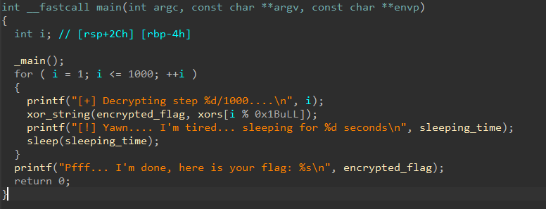

# lazycode1.0

- Tôi mở file exe bài cho bằng IDA để xem mã chương trình.


- Tôi nhận thấy bài này chỉ đơn giản là thực hiện xor `encrypted_flag` và `xors` thôi.
- Tôi lấy dữ liệu của 2 mảng đó ra và tạo một script python để xor nó lấy flag.

``` python
encrypted_flag = [
    0x15, 0x1F, 0x12, 0x14, 0x08, 0x10, 0x4A, 0x45,
    0x43, 0x15, 0x46, 0x46, 0x46, 0x46, 0x47, 0x4B,
    0x44, 0x42, 0x15, 0x16, 0x16, 0x17, 0x17, 0x44,
    0x10, 0x40, 0x40, 0x12, 0x41, 0x43, 0x15, 0x11,
    0x44, 0x40, 0x4A, 0x42, 0x4A, 0x0E, 0x73
]

xors = [
    0x12, 0x2B, 0x47, 0x76, 0x66, 0x04, 0x0B, 0x36,
    0x21, 0x6C, 0x37, 0x31, 0x1B, 0x5B, 0x13, 0x67,
    0x43, 0x1E, 0x09, 0x27, 0x08, 0x79, 0x4B, 0x0D,
    0x3D, 0x52, 0x5B
]

for i in range(1, 1001):
    encrypted_flag = [x ^ xors[i % len(xors)] for x in encrypted_flag]

print("".join(chr(x) for x in encrypted_flag if x != 0))
```
- Và tôi đã có được flag.

<details>
<summary style="cursor: pointer">Flag</summary>

```
flag{c960f55554871feedd7c33a20fb73919}
```
</details>
