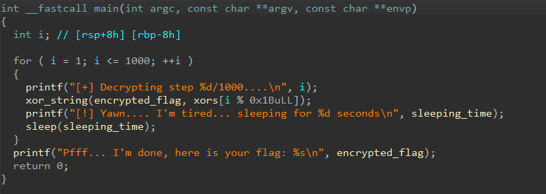

# lazycode2.0

- Tôi mở file bài cho bằng IDA để xem mã chương trình.


- Tôi nhận thấy bài này chỉ đơn giản là thực hiện xor `encrypted_flag` và `xors` giống như lazycode1.0.
- Tôi lấy dữ liệu của 2 mảng đó ra và tạo một script python để xor nó lấy flag.

``` python
encrypted_flag = [
    0x2A, 0x20, 0x2D, 0x2B, 0x37, 0x2E, 0x7F, 0x2A,
    0x28, 0x2D, 0x78, 0x7D, 0x7A, 0x28, 0x2D, 0x29,
    0x2E, 0x28, 0x29, 0x2A, 0x7B, 0x2D, 0x79, 0x28,
    0x7B, 0x75, 0x28, 0x29, 0x2E, 0x7C, 0x7B, 0x2F,
    0x78, 0x7F, 0x7F, 0x7B, 0x79, 0x31, 0x4C
]

xors = [
    0x17, 0x2B, 0x57, 0x6F, 0x7A, 0x00, 0x21, 0x2D,
    0x1D, 0x67, 0x2B, 0x56, 0x16, 0x63, 0x5B, 0x67,
    0x38, 0x1D, 0x0B, 0x0A, 0x03, 0x70, 0x47, 0x12,
    0x36, 0x0C, 0x63
]

for i in range(1, 1001):
    encrypted_flag = [x ^ xors[i % len(xors)] for x in encrypted_flag]

print("".join(chr(x) for x in encrypted_flag if x != 0))
```
- Và tôi đã có được flag.

<details>
<summary style="cursor: pointer">Flag</summary>

```
flag{b3fda416daebdef7a5d79deb07c43375}
```
</details>